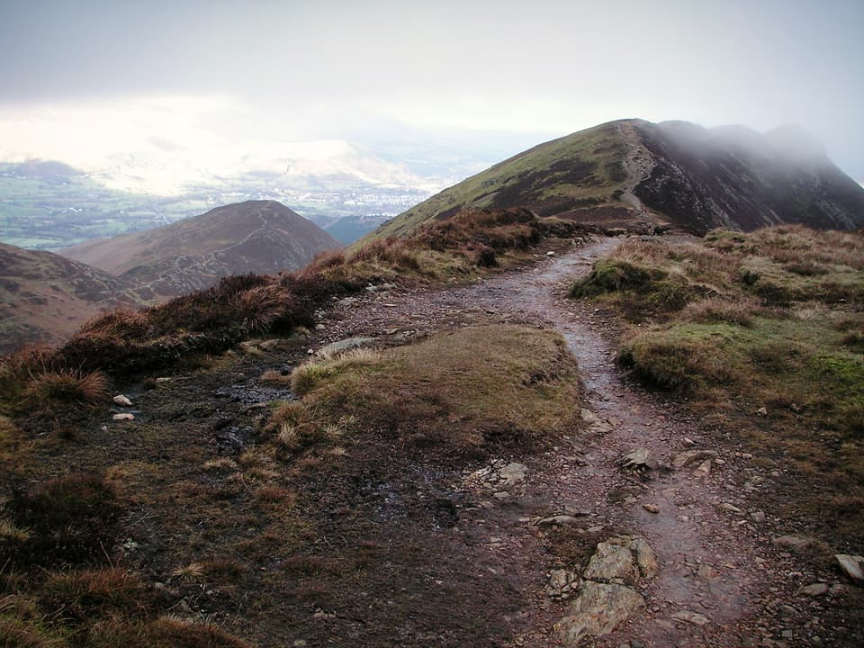
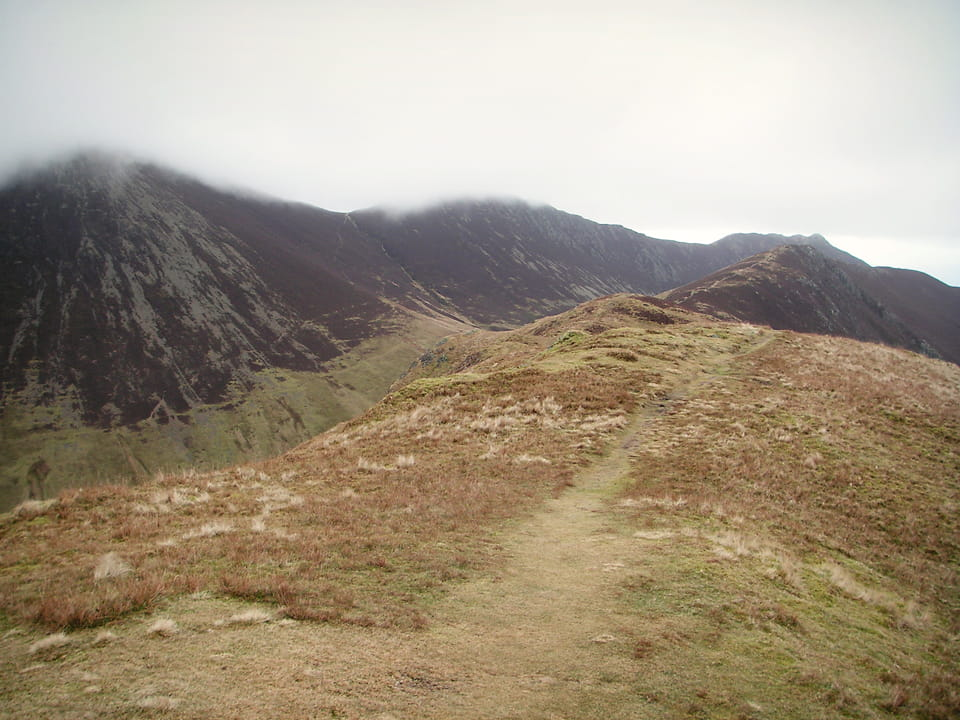
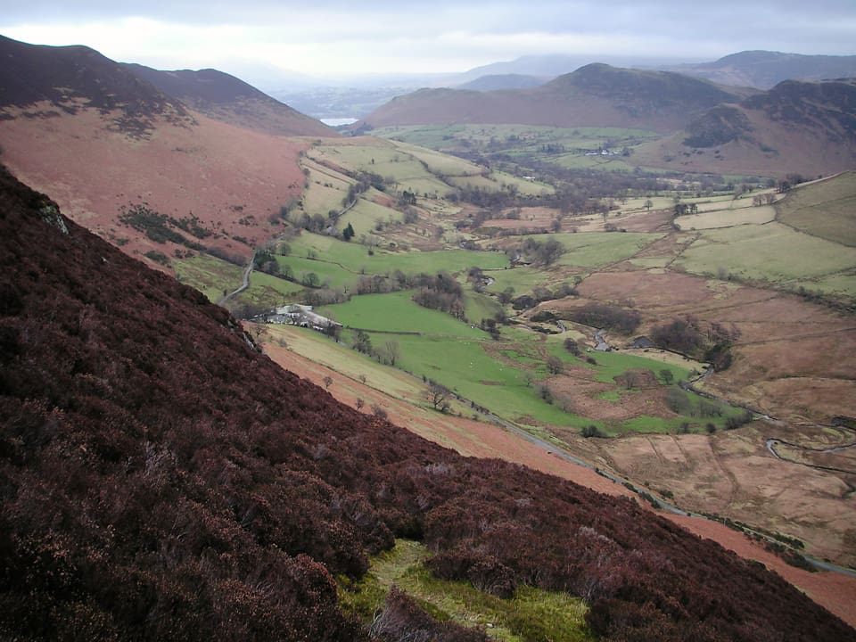

I chose another short route for this walk on Wednesday 26th January. Next one might need to be a bit longer to avoid developing a reputation for being the wrong type of lightweight!

!!!! A 12km circular route, starting at the Uzzicar car park. (_Wainwright Book 6: The North Western Fells_)

===

The route plan was a bit of a compromise involving a 5km walk in along road to get to my chosen start point; the advantage being that the car was parked right at the bottom of Causey Pike. It set me off on a route covering four Wainwrights of the North Western Fells, from Knott Rigg (556m) to Ard Crags (581m), a short descent to a col between Sail Beck and Rigg Beck, before climbing back up to Scar Crags (672m) and Causey Pike (637m).

Wainwright bagging count now stands at 51...

### Route Summary

Park at the large layby below Causey Pike and Barrow, marked "Uzzicar" on the OS map. Head south along the road towards Buttermere. At "Keskadale Farm" take the path up the south side of the ridge between Knott Rigg and Ard Crags. It's an easy path through heather covered slopes. The path leads directly to the summit of Knott Rigg and it's a short walk along the ridge to Ard Crags. The drop to the south is precipitous, but there's a gentle gradient to the north - so although there's no marked path, it's an easy climb down to the col, and another gentle climb up to Scar Crags. This second section of ridge leads to Causey Pike. Bear in mind there's a bit of a steep scramble down from the summit and it could be slippery when wet, but there's no exposure if you stick to the main path.

This is an easy 12km walk, around 950 metres of total ascent. Allow between 4 and 5 hours.

Map: ?

### Carpark to Knott Rigg and Ard Crags

In planning routes, I try and avoid too much walking on roads at the end of the day; always seems nicer to come off the fell and be somewhere close to the car. Unfortunately, today this meant a long initial walk along road to reach the start point, at Keskadale Farm.

The path stays below the peak of the ridge, offering a nice easy gradient through deep heather. You emerge from the heather onto a gentle grassy area (image below left) before gaining the ridge. There are some steep cliffs to the south, with mostly grassy slopes to the north; although here too it's steep in places.

> An advantage of solitary travel on the fells, greatly appreciated by all lone walkers, is the freedom to perform a certain function as and where one wishes, without any of the consultations and subterfuges necessitated by party travel. The narrow crest of the Knott Rigg ridge is no place for indulging in the practice...

View from Knott Rigg towards Haystacks and Pillar      Summit of Ard Crags
View from Knott Rigg towards Haystacks (left) and summit of Ard Crags (right).

The wind was picking up when I reached Knott Rigg! It's a short and picturesque section of ridge, and on a clear day should afford some excellent views of the Northern Fells, and towards Robinson, Dale Head, High Spy, and along the ridge down to Maiden Moor and Catbells. From Ard Crags, there's no marked path to the north, but it's easy to pick out a line of descent north-westwards to the head of Rigg Beck. After a brief climb up a grassy slope, you'll find yourself on the well marked path that leads to the col between Sail and Scar Crags.

> The highlight of the view is the beautiful detail of Newlands, a picture of bright pastures intermingled with heathery ridges, backed by the Helvellyn range, which is seen end to end in the distance.

### Scar Crags

This was the highest point on the day's route, at a modest 672m. Despite the cloud there were some good views down into the Coledale Valley, but it's not the most interesting of summits. (See earlier trip report, The Coledale Round-about, for more details of an excellent route to the north of today's walk.) But, I think it's worth noting that this approach from the south of Scar Crags presents it's more interesting aspect.

> There is a regular and recurring pattern of arete and gully on this southern face, as though the fellside had been scraped by a giant comb: an effect best seen from Ard Crags directly opposite.

Looking at Scar Crags on route to Causey Pike
Looking back to Scar Crags from route to Causey Pike.

Whilst it's hardly precipitous, the route begins to feel like a proper ridge walk as you head for Causey Pike. Again, very easy going and some excellent views. The character of the path is that you find yourself picking your way between a succession of mini-summits.
Causey Pike to Carpark

The summit of Causey Pike marked the day's fourth and final Wainwright. However, the descent to the east involves an unexpected (but very welcome!) scramble down a rocky path. Worth bearing in mind anyway, and probably easier to reverse the route if you're trying to take it easy on your knees.

> Rock is in evidence here and must be handled to attain the summit.

View from Causey Pike towards High Spy and Dale Head
View from Causey Pike towards High Spy and Dale Head.

Once the initial steep descent is over, it's an easy walk back down to the valley, bearing north around Sleet Hause, and joining the road near the bridge of Stonycroft Gill.

> Deservedly this is a popular climb [...] the route being quite charming, the views superlative, the finish a bit of real mountaineering, and the summit a place of distinctive character.

### Summary

In conclusion, this is a pleasant, easy route, but the long walk in along road detracted slightly from my enjoyment. It's difficult to see how you could avoid it, although if you were in the mood for a long summer day-walk, you could use the same car park and take an elongated route as follows: Catbells, Maiden Moor, High Spy, Dale Head, Hindscarth, Robinson, Knott Rigg, Ard Crags, Scar Crags, and Causey Pike. It's a perfectly realistic 25km, but I'd suggest it would be worth making an early start!

A raised zig-zag path to Sail      Pacer Poles on the climb to Knott Rigg
Zig-zag path to Sail (left) and Pacer Poles on climb to Knott Rigg (right).

In the two images above, you see the strangely elevated zig-zag paths, which seem to be something of a trademark between Sail and Scar Crags. In the right image, my new Pacer Poles - which will be the subject of a future post. An excellent product (originally recommended by Steven Horner) and I would encourage anyone to give them a try.

> "To those who travel alone, the solitary wanderers on the fells, who find contentment in the companionship of the mountains."
> 
A. Wainwright &nbsp;
