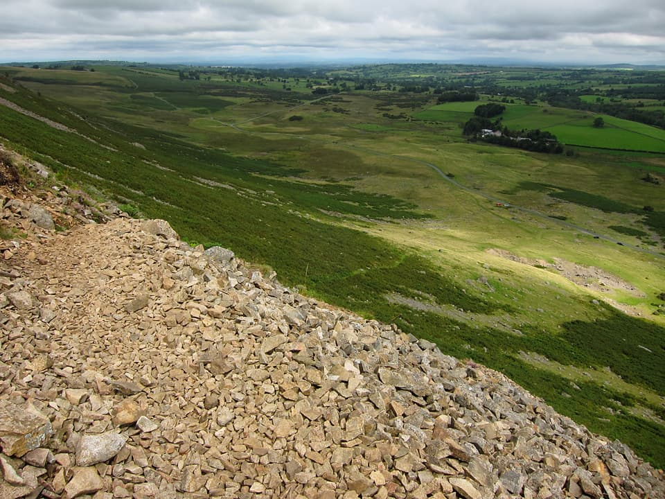
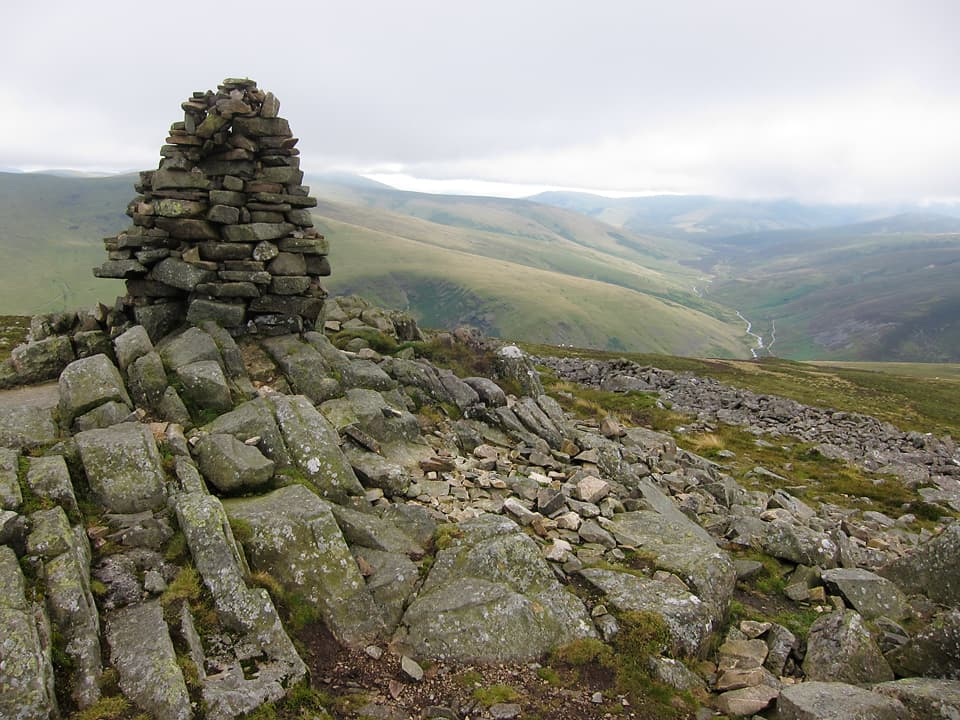
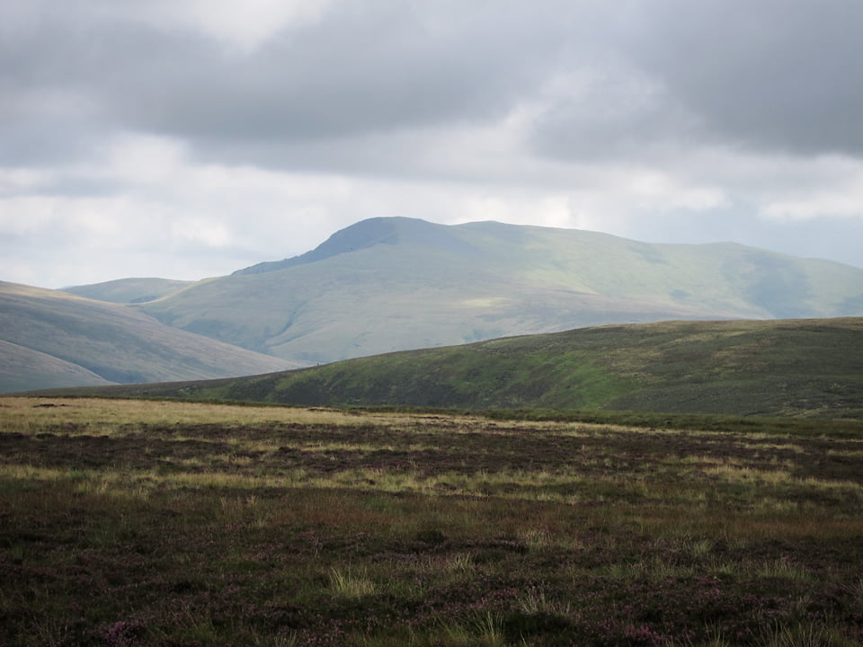
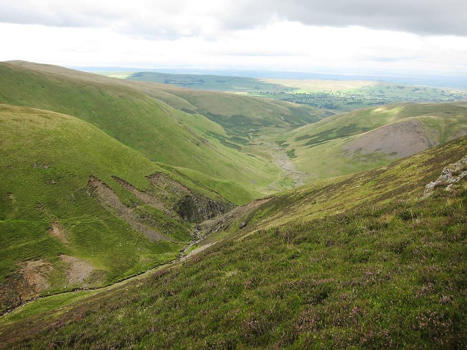
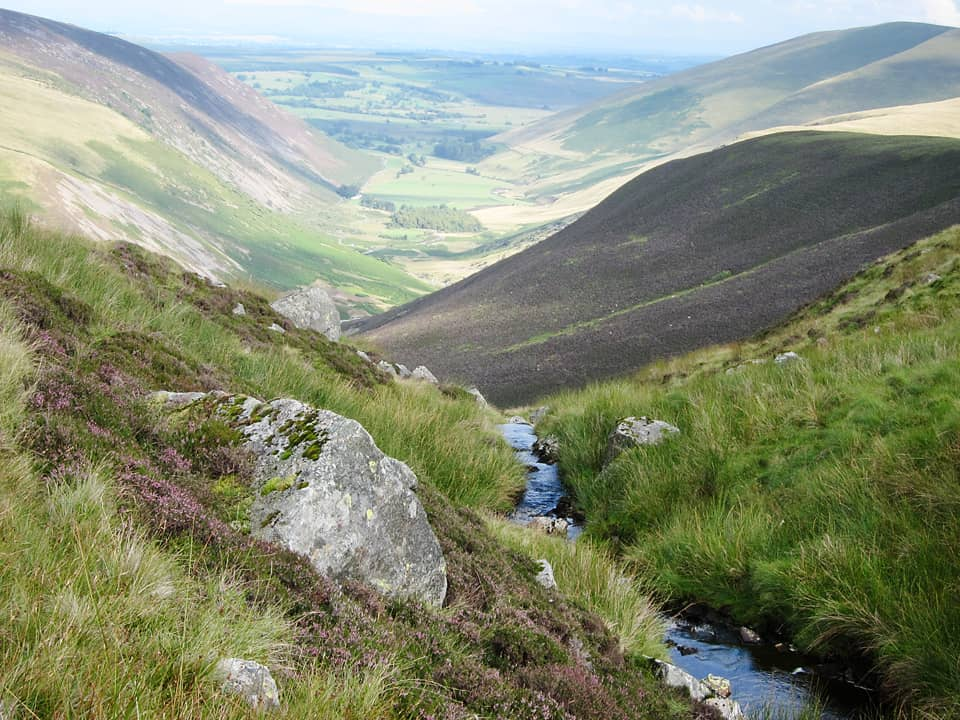
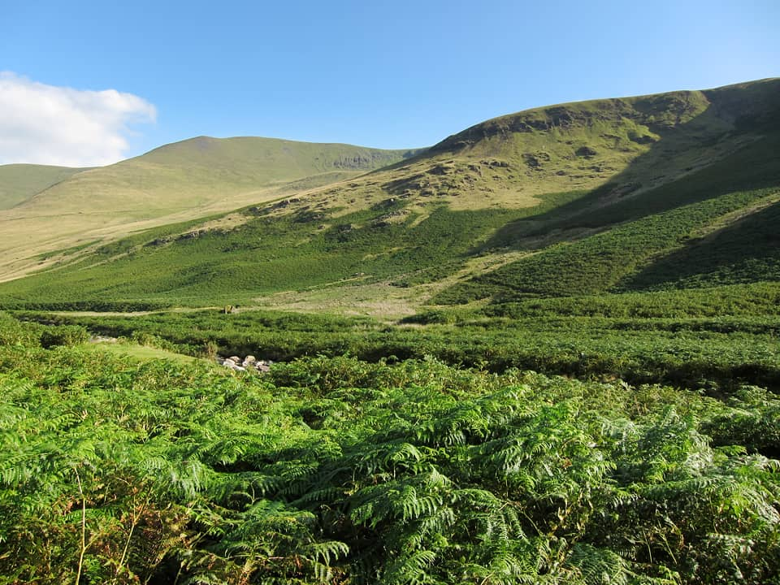

If I could keep up a rate of 8 Wainwrights per week, this process will not take long! Saturday 14th added four more to the total, those being Carrock Fell, High Pike, Great Sca Fell, and Knott. According to the GPS track, this is 20km and took about 6 hours. Main downside to the route is my choice of parking, which meant the walk ended with about 5km along tarmac.

!!!! An easy 20km circular route, starting north of Mosedale village. (_Wainwright Book 5: The Northern Fells_)

===

The finish on tarmac was a bit of an anti-climax, although I did pass a convoy of three old style gypsy caravans on the way. I said hello, and the guy on the middle caravan asked me if there was anyone at the swimming hole. Couldn't honestly say I'd seen a swimming hole, so I just said no - seemed a fairly safe assumption - so hopefully I wasn't proved wrong when they arrived at wherever it was.

[View Full Screen](https://map.mootparadox.com/full/carrock-20k-loop) | [GPX](https://map.mootparadox.com/gpx/carrock-20k-loop)  

<iframe src="https://map.mootparadox.com/embed/carrock-20k-loop" height="500" width="100%" style="border:none; margin-top:-1.2em;"></iframe>

My plan was to climb Carrock Fell from the east and follow the ridge to High Pike. Then, dropping down to Great Lingly Hill and working my way around to Knott, via Great Sca Fell. Being a fairly elongated loop, it could have been easily cut short at several points.

My car is visible in the picture above, as a tiny blue dot middle right of the photo. I had a quick glance back to make sure I'd locked the passenger door (yes, the button was pushed down) before making my way across some rocky scree and into Further Gill Sike. It was steep, but fairly easy path, taking care where the path edges were giving way.

It was worth a slight detour to the North which provided some nice views down towards Carrock Beck, then an easy walk to a well constructed summit cairn. It sits on a rocky outcrop, and to the southerly side, someone had laid a couple of flat rocks to form a sheltered seat. A good spot for lunch with views of Bowscale and the clouds that were still hiding the summit of Blencathra.

Squelching along through wet peat was the main order of the day. It was a trifle moist underfoot. Passed a couple of people on the way towards High Pike, and there were six people at the summit, although they seemed to take one look at my hat and promptly departed. View above is from the summit cairn. Skiddaw in the distance, looking across Great (and Little) Lingly Hill, Knott, and I think top of Great Calva is just visible at the left.

From Little Lingley Hill, you have views into the deceptively steep sided gully that is Roughton Gill. It's not very clear in these photos, but there were reasonable view throughout the day down to the Solway Firth, although a bit hazy with the cloud. This could be a nice ascent, and one to add on the to-do list for another time.

From the cairn at the summit of Great Sca Fell, this is the view of Knott. Not the most exciting mountain in the world, but great views of Blencathra and Skiddaw. Along the way I passed someone else who said "I'm on my way to Knott. Is that the summit?" I checked my GPS and said "It's Knott". He looked a bit disappointed and walked off. Was it something I said?

The weather was really starting to improve as I descended from Knott back down towards Mosedale. I followed the course of Grainsgill Beck, stopping for a rest on a large boulder, watching a yellow helicopter flying back and forth. Hopefully they were keeping an eye out for the paragliders that were everywhere as I climbed down. Blended paraglider can't be a pretty sight!

Bowscale Tarn is just out of sight in the picture above, seen on the side of the valley above the River Caldew. Another one for the to-do list and would make a nice easy stroll if you parked up in Mosedale, or along the valley road.

All in all, another very enjoyable day in the Northern Fells.

Kit was the same as previous walk, except didn't need waterproofs, or even the Lightspeed for that matter. Wore a much lighter cotton t-shirt, which was better than the heavy Weird Fish t-shirt that I wore last time. Better, but could still do with a decent merino base layer. Also, although it was warm at times, it was still fairly windy. The buff was great for keeping my ears warm (tend to get sore ears in cold wind) but could really have done with some lightweight gloves.

> "...to those who travel alone, the solitary wanderers on the fells, who find contentment in the companionship of the mountains."
> 
> 
