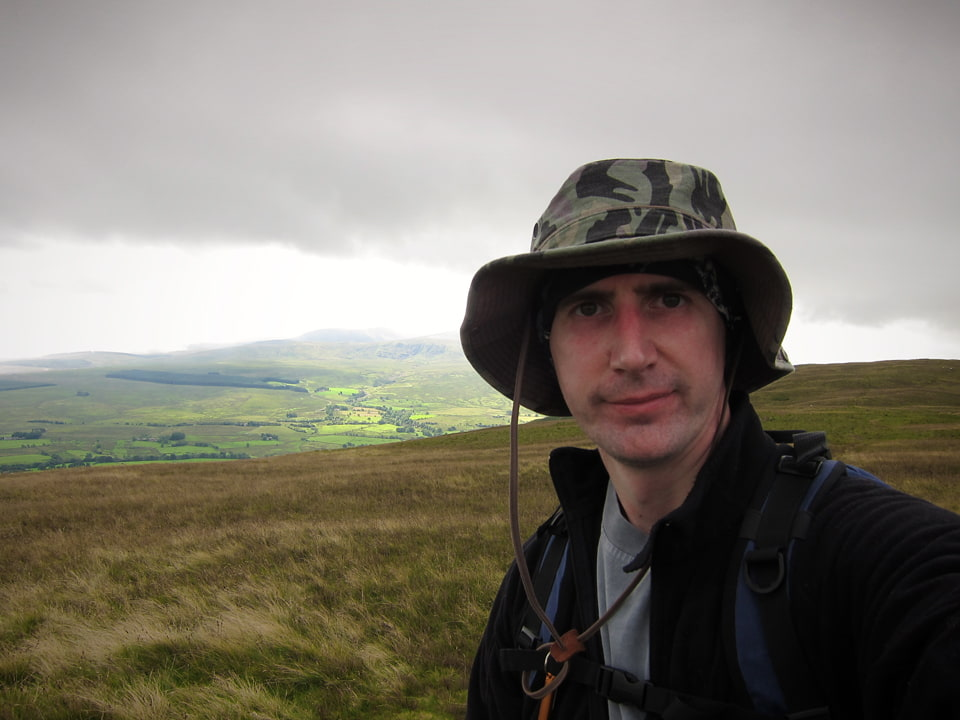

> "To those who travel alone, the solitary wanderers on the fells, who find contentment in the companionship of the mountains."
> 
A. Wainwright &nbsp;

Monday 9th August, 2010, marked my return to the Lake District fells after an absence of about 19 years. Half a lifetime ago, my Duke of Edinburgh expedition for the Gold award, marked my last hill walking of any significance. Under the relentless barage of Steven Horner's tales from the mountains, and the revelations that you don't need to carry a 20kg pack any more, I finally succumbed to the lure of the hills.

To give it some purpose, I intend to embark on some Wainwright bagging, with a view to clocking up all 214. I'm ignoring the few dozen I'll have done in the past, starting with a clean slate. As of Monday, the total stands at 4. These being Souther Fell, Blencathra, Bannerdale Crags and Bowscale Fell.

The mountain forecast was 10 degrees on the tops, a 50% chance of rain, and gusty south-easterly winds. I soon began to think that this was a somewhat optimistic appraisal of the conditions. I parked at Mungrisdale village (2 in the honesty box) and began walking in a very light drizzle. My route up Souther Fell was a mistake. I chose possibly the least interesting route though boggy ground, waist deep in bracken. If I do this again, I'd try to get higher up and walk more along the ridge of the fell. But in any event, after a bit of a slog, got up to the top and ticked off Wainwright number 1. That's probably why I was looking so cheerful at this point; although wind and holding the camera at arms length didn't help!