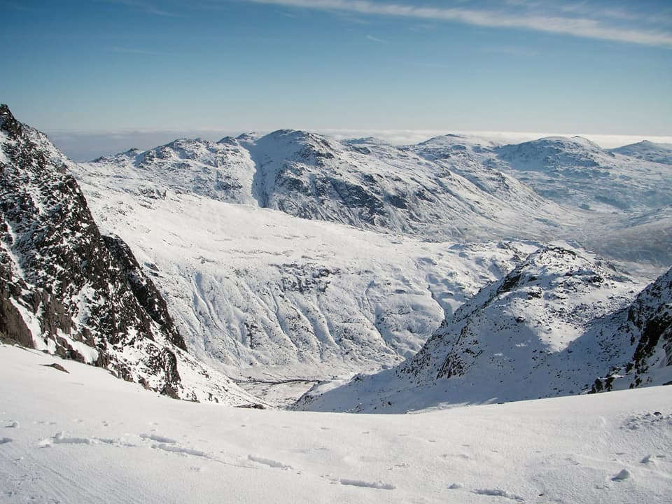
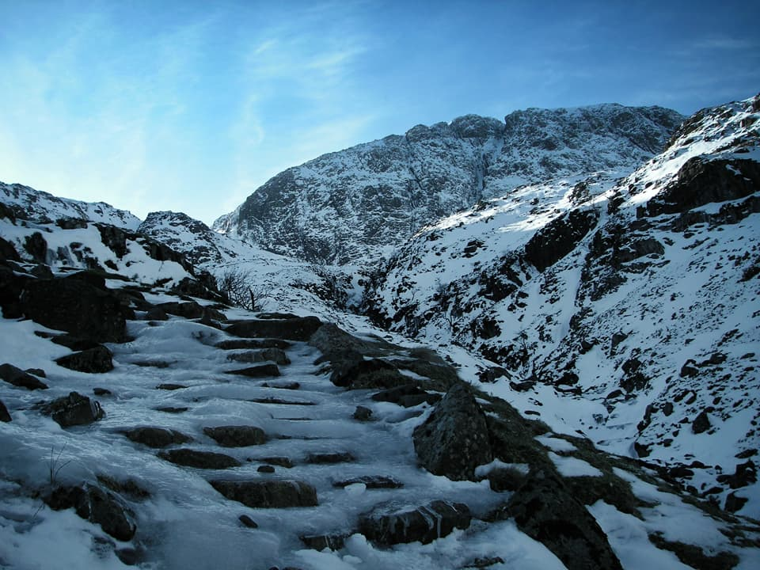
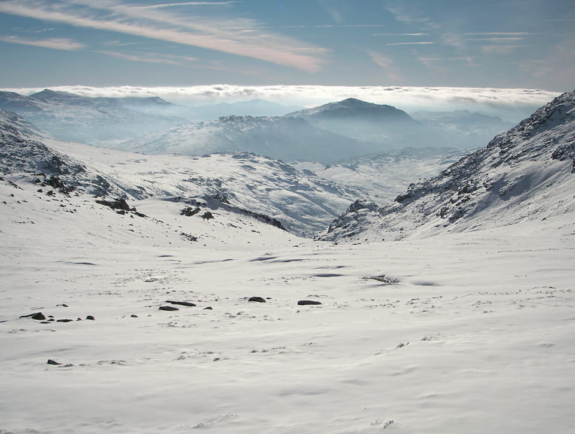
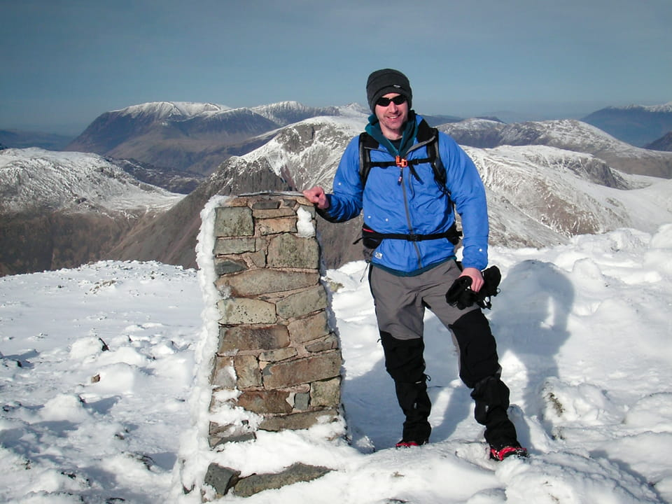
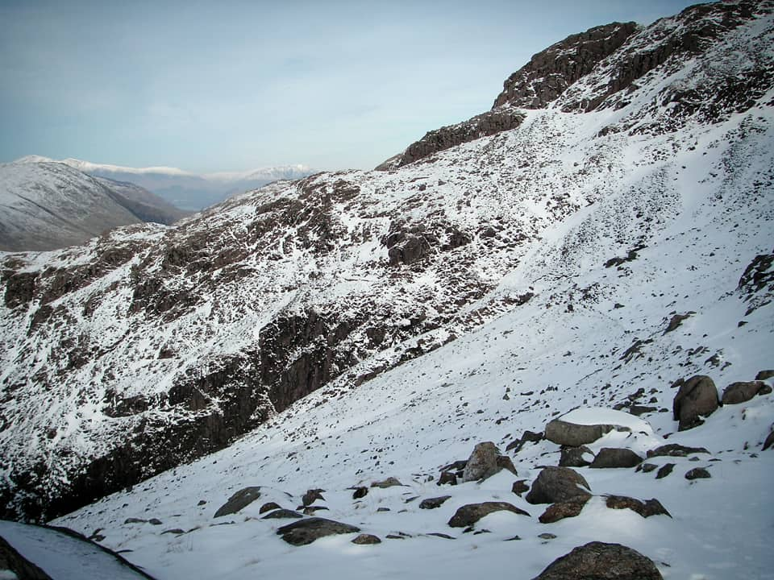
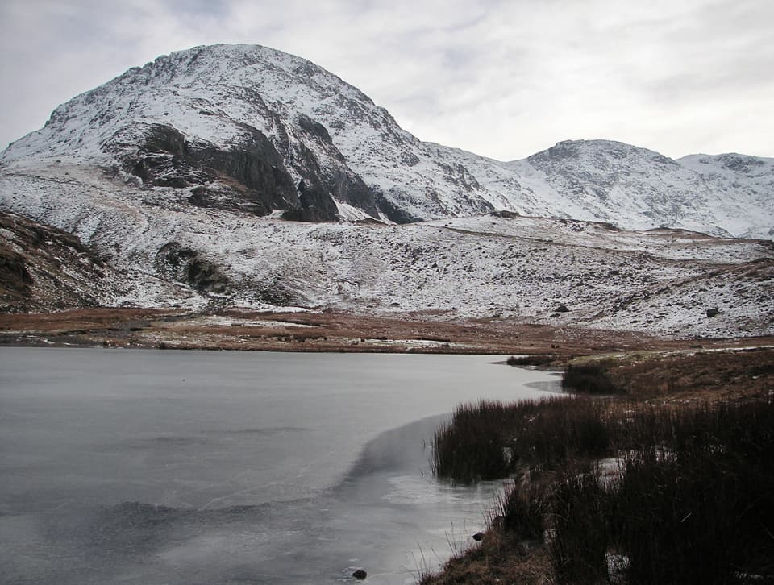
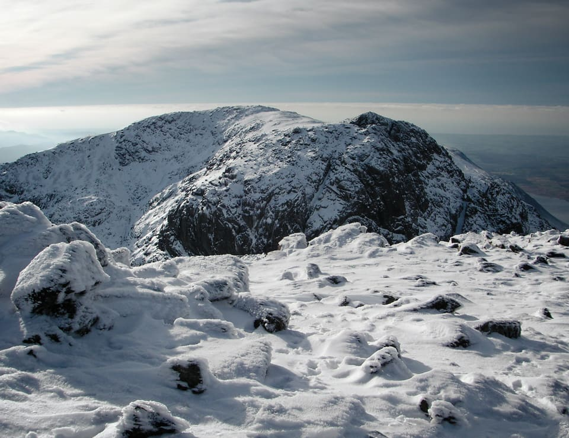

February 8th 2012 was undoubtedly a perfect Lakeland winter day. Beautiful sunshine, but plenty of snow and ice above about 400m, and the forecast for a temperature inversion at around 750m. I wanted to be high, and so I headed for Scafell Pike, setting off from Seathwaite Farm. I emerged onto the plateau above Sprinkling Tarn, in the shadow of Great End, into a winter wonderland, and the beginning of what I am confidently declaring to be my favourite walk so far!

!!!! A 16km winter circular route, starting at Seathwaite Farm. (_Wainwright Book 4: The Southern Fells_)

===

> Of the many routes of approach to Scafell Pike, this, from Borrowdale via Esk Hause, is the finest. The transition from the quiet beauty of the valley pastures and woods to the rugged wilderness of the mountain top is complete, but comes gradually as height is gained...

### Route Summary

Park for free along the road to Seathwaite Farm. Follow the path through the farm and at Stockley Bridge, take the path that branches up Grains Gill, and at the head of Ruddy Gill, take the path for Esk Hause. Head for the distinctive X shaped shelter in Calf Cove and follow the ridge of Ill Crag, Broad Crag and Scafell Pike. Under a smooth cover of frozen snow, I presume this is somewhat different to the usual conditions; lots of rocky boulder hopping by the sounds of it! However, it looked pretty easy, and the only steep section is the drop into Broad Crag col and the subsequent short climb up to Scafell Pike.

[View Full Screen](https://map.mootparadox.com/full/scafell-pike-seathwaite) | [GPX](https://map.mootparadox.com/gpx/scafell-pike-seathwaite)  

<iframe src="https://map.mootparadox.com/embed/scafell-pike-seathwaite" height="500" width="100%" style="border:none; margin-top:-1.2em;"></iframe>

Some care needs to be taken in your navigation down from the summit, and the easiest option in these conditions seemed to be returning to Broad Crag col and following the gully down to the north-west, joining the Corridor Route east of Piers Gill. This was a fairly steep descent in mostly 30-40cm of snow - I guess might be a bit of a scree slope in summer. I'd definitely not appreciated how good the Corridor Route actually is. It's easy going, contouring around the flanks of Broad Crag and Great End, and offers fantastic views in every direction. I think it might also be the easiest route back to Sty Head.

In these conditions, crampons (or Pogu Spikes, which proved fine for my purposes) were extremely helpful from around Ruddy Gill, and I did not remove them until about 1km from Sty Head on the descent.

### Seathwaite Farm to Ruddy Gill

For such fantastic conditions, the road to Seathwaite Farm was almost empty, with only about a dozen cars parked. Not being a natural early riser, this is probably the closest parking spot I'll ever find at this location. Great End seems to be a popular destination for winter climbing, it's northern face holding the ice, but keep in mind this virtue also applies to some of the approach routes, and you may encounter icy conditions on the path along Grains Gill; see photo below. Remember the scouting motto, and "be prepared".

Might also be worth a note that the toilets at Seathwaite Farm close for the winter.

> The towering precipice of Great End increasingly dominates this section of the walk and, by the time Ruddy Gill is reached, assumes awe-inspiring proportions.

This section of the walk, along Grains Gill before emerging into the sunshine was surprisingly cold. I don't think it was much below zero, so I attribute it purely to the effect of wind-chill. I caught up with a couple of climbers struggling with a jammed crampon bar, and found that I could barely speak to them due to my face being frozen. (Only a slight exaggeration!)

It was around Ruddy Gill that the ice became more extensive. Up until that point boots were fine and it was easy to navigate around any icy sections. Even at this fairly low level, probably due to the shady aspect, the path was not safe without spikes or crampons.

### Esk Hause to Broad Crag

The Grains Gill path joins the main Esk Hause to Sty Head route on a fairly level plateau below the north-face of Great End. Here the snow became deeper and more powdery on the surface. It made for some slow going most of the way to Ill Crag. I'd originally contemplated a detour up to Esk Pike, but wisely decided to head directly along the Scafell ridge.

> ...wishful thinkers will assume Ill Crag to be the summit - until the pike itself is finally revealed, indisputably higher and still farther distant across a waste of stones.

Once onto the ridge, the going was considerably easier, with snow deep enough to completely smooth out the usually rocky terrain and, despite the lack of any companions on the mountain, the path appeared to be fairly well trodden. Having reached Ill Crag, the Scafell Pike summit is obvious and the hard work is over. It became an easy walk to the summit, with only a short climb following the drop down into the Broad Crag col.

At this point I was finding that snow cover within patches of almost black rock creates a bit of an optical illusion. From Broad Crag the climb on the Scafell Pike side looked almost impossibly steep, but is actually not very steep once you're onto it.

### Scafell Pike

I'm delighted to have visited Scafell Pike on such a perfect day and in relative solitude. There were a couple of people at the summit, and later a man on skis (with dog) arrived, looking rather warm.

> This is it: the Mecca of all weary pilgrims in Lakeland...

The summit photo above was taken by Richard from the Keswick YHA, who it transpired was also planning a descent via the Corridor Route. It's not a route I was at all familiar with, in any conditions, and we ended up walking back to Seathwaite together - his extensive knowledge of the area and willingness to do a bit of impromptu guiding was much appreciated.

### The Corridor Route

I'd highly recommend this route. I don't know why, but for some reason I had the impression it was just a convenient and easy alternative route over to Lingmell Col. I'm happy to say this is altogether wrong - it's an excellent route through some great mountain scenery. Personally I think better for descent than if I had reversed this route, but either way is probably good.

> The Corridor Route links grassy shelves on the very rough western flanks of Great End and Broad Crag and is, in fact, the one and only easy passage along this flank, which is deeply cut by ravines.

The path is secure, but becomes narrow as you traverse around and over Stand Crag - due to the ravines below. So whilst it's not difficult, it might not be an ideal route if you dislike the sensation of having a steep drop-off to one side.

### Styhead Tarn to Seathwaite Farm

I've used this same descent on two previous routes: Great Gable and Great End. There's little to add, but it's worth noting that the path became very icy as you progress down Styhead Gill, and the reputed more "interesting" path on the west side of the gill, via Taylorgill Force, looked treacherous in these conditions.

> The ascent of Scafell Pike from Borrowdale is pre-eminent, because not only is the scenery excellent throughout, but there is the advantage of two interesting and well contrasted routes, so that one may be used in ascent and the alternative in descent, the whole round, in settled weather, being perhaps the finest mountain walk in the district.

### Summary

A little snow transforms the mountain landscape, and in these ideal conditions, my message - get out and enjoy it, but be equipped to deal with icy paths and choose a sensible route. Even on this short and easy route, you still get to feel like an Alpiniste for the day!

I was very pleased with the kit I was wearing, including a new pair of bamboo leggings under my Montane Terra trousers. Fantastic combination in the cold wind, and extremely comfortable. I was wearing a merino top, a Montane Fury fleece, and kept my Montane Lightspeed on for most of the day until it got a bit warmer, down near Sty Head col.

Judging by the change in the weather now, as we approach the end of February, I suspect this is going to be my only winter walk of the season, so I'm delighted it was a good one! Great fun, and I can highly recommend this route.

> "To those who travel alone, the solitary wanderers on the fells, who find contentment in the companionship of the mountains."
> 