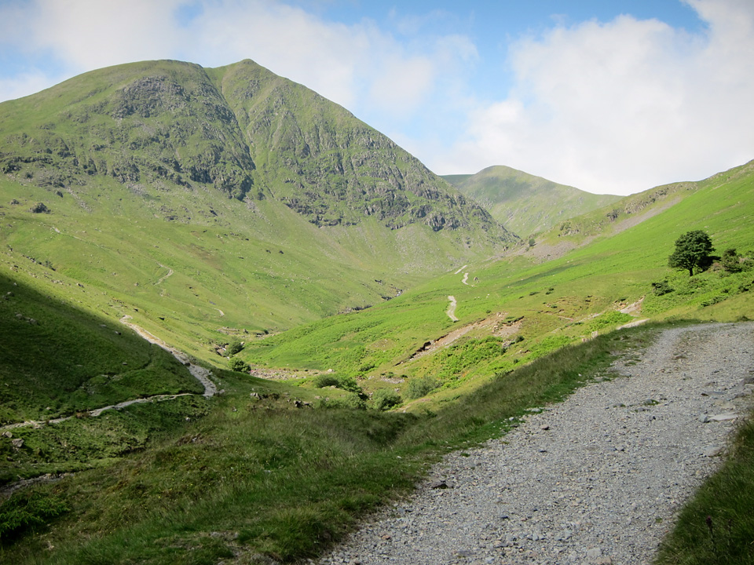
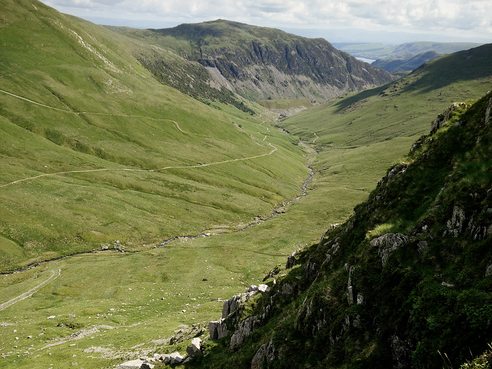
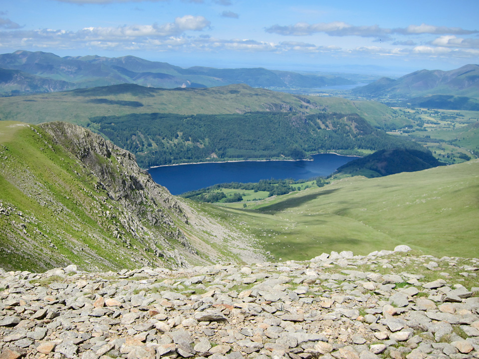
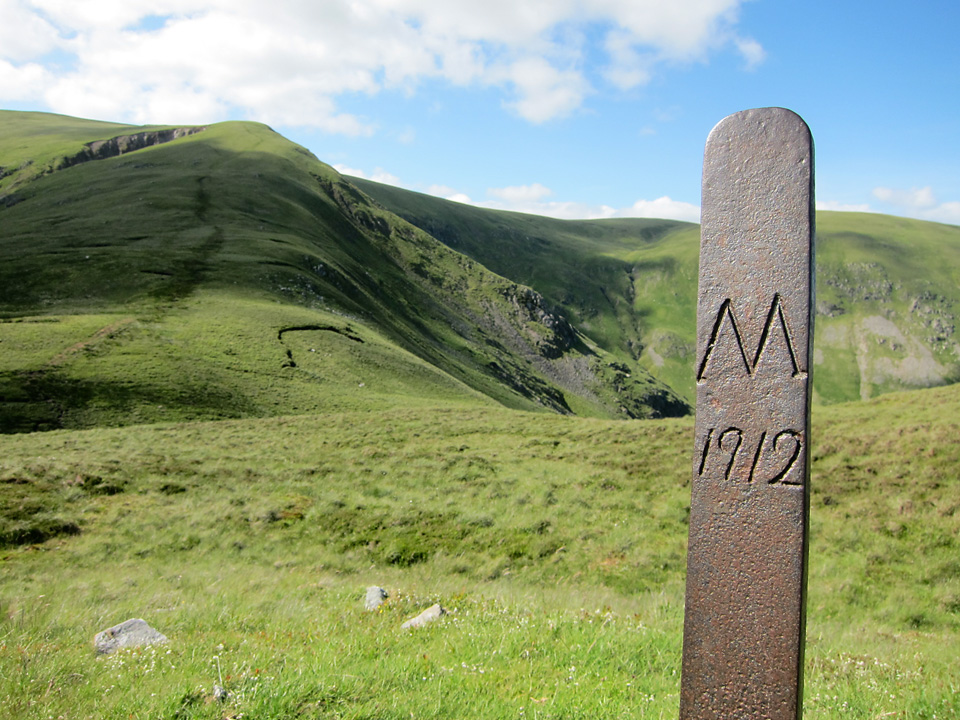
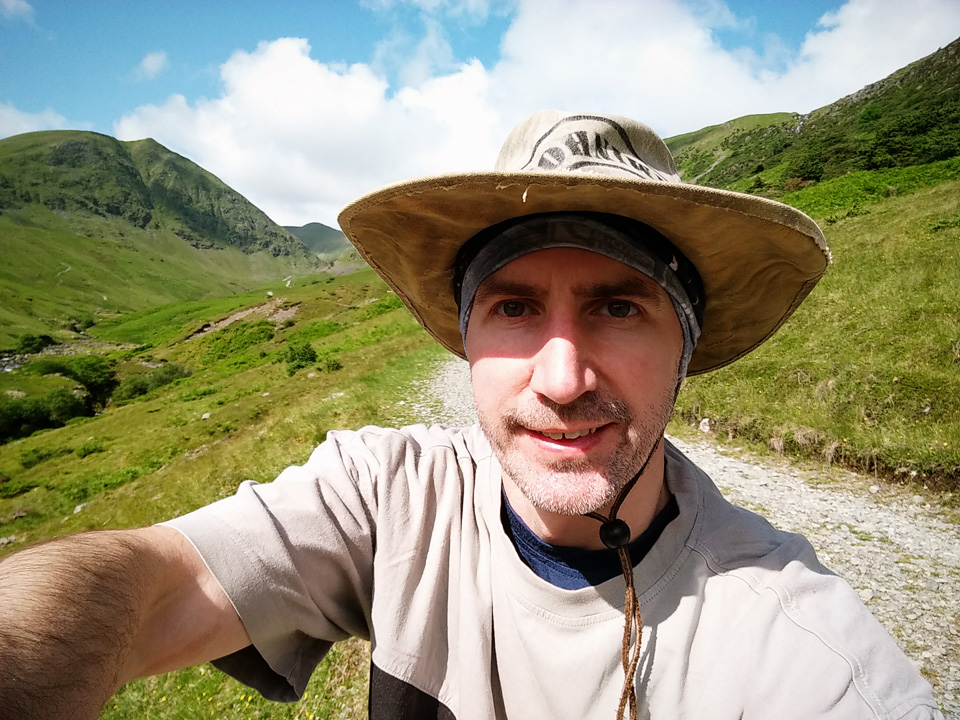

This route from 9th July 2015 made for a longish day-walk, from Catstycam to Sheffield Pike. The distance is 20km (with 1.6km of ascent) and it takes in the summit of 9 Wainwrights.

!!!! A 20km circular route, starting from Glenridding. (_Wainwright Book 1: The Eastern Fells_)

===

I camped overnight at Gillside, just outside of Glenridding.

Many years before, if memory serves, I also camped here with the Cadets. On that occasion we climbed Helvellyn, via Swirral Edge, and on our second day we climbed High Street. Today though, I was heading back to Helvellyn, again via Swirral Edge, but I wanted to climb Catstycam's northern ridge; that's from the Brown Cove side.

*Dramatic views of Catstycam from the Glenridding valley.*

My camera lens went faulty somewhere along the route (some very odd blurring and lens-flaring) so the photos may be somewhat sporadic. Luckily I also took a few on my mobile.

[View Full Screen](https://map.mootparadox.com/full/catstycam) | [GPX](https://map.mootparadox.com/gpx/catstycam)  

<iframe src="https://map.mootparadox.com/embed/catstycam" height="500" width="100%" style="border:none; margin-top:-1.2em;"></iframe>

The route begins with a gentle climb along gravel tracks as far as the disused dam at Brown Cove. From here it becomes a rather steep climb.

*Steep, but fairly easy climbing on the north ridge of Catstycam.*

From the summit you head towards Helvellyn via Swirral Edge. Lesser known than its "striding" opposite number, Swirral Edge is an enjoyable climb and leads you to the north side of Helvellyn's actual summit.

Helvellyn summit...

Browncove crags...

Traverse...

Sheffield Pike...

Glenridding...

Summary...

> "...to those who travel alone, the solitary wanderers on the fells, who find contentment in the companionship of the mountains."
> 
> 