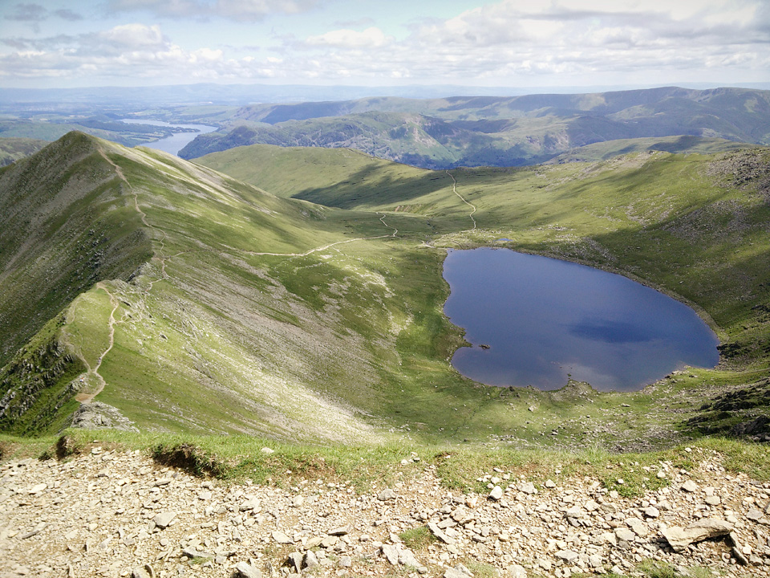

This route on 9th July 2015 made for a longish day-walk, from Catstycam looping around to Sheffield Pike. The distance is 20km (with 1.6km of ascent) and it takes in the summit of 9 Wainwrights.

!!!! A 20km circular route, starting from Glenridding. (_Wainwright Book 1: The Eastern Fells_)

===

I camped overnight at Gillside, just outside of Glenridding.

Many years before, if memory serves, I camped here with the Cadets. On that occasion we climbed Helvellyn, via Swirral Edge, and on our second day we climbed High Street. Today though, I was heading back to Helvellyn, again via Swirral Edge, but I wanted to climb Catstycam's northern ridge, from the Brown Cove side, which was a route I'd never tried before.

*Dramatic views of Catstycam from the Glenridding valley.*

> "If Catstycam stood alone, remote from its fellows, it would be one of the finest peaks in Lakeland."

After an amazing day out, I was disappointed to find my camera lens went faulty somewhere along the route, resulting in some very odd blurring and lens-flaring. Most of the photos were unusable, but luckily I also took a few on my mobile.

[View Full Screen](https://map.mootparadox.com/full/catstycam) | [GPX](https://map.mootparadox.com/gpx/catstycam)  

<iframe src="https://map.mootparadox.com/embed/catstycam" height="500" width="100%" style="border:none; margin-top:-1.2em;"></iframe>

The route began with a gentle climb along gravel tracks as far as the disused dam at Brown Cove, although from there it became a rather steep climb. In Wainwright's *Eastern Fells* I believe this is referred to as the old Glenridding pony route, but where that path would branch right towards White Side, bear left and follow Glenridding Beck towards Brown Cove.

It will come as zero surprise to anyone who knows me to learn that I am not a natural early-riser! But, it was great to be out walking around 8am, and I will freely admit the only way I could manage that was by driving down the night before and camping at the start of the route. This was 2015, things may be different now, but at £6 for a one-man tent pitch, you could barely get a day's car parking at that price. 

*Steep, but fairly easy climbing on the north ridge of Catstycam.*

From the summit I was heading towards Helvellyn via Swirral Edge. Lesser known than its "striding" counterpart, Swirral Edge is an enjoyable climb, and leads you slightly north of Helvellyn's actual summit. Neither route is difficult, but the consensus seems to be that in normal conditions (not winter) then Swirall Edge is easier and slightly less exposed than Striding Edge. Both get rather steep towards the end.

*Red Tarn with Swirral Edge to the left.*

The approach via either edge is arguably more impressive than the summit itself, but there is no denying the quality of the views. Ullswater to the east, Thirlmere to the west. 

Red Tarn is reputed to offer some stunning wild swimming, with cold clear water that displays a feint green tint. As well as being the highest "substantial body of water" in England, it is also one of four UK lakes that is home to [the schelly](https://en.wikipedia.org/wiki/Schelly), an ancient variety of freshwater salmon.

On this mid-July Thursday, Helvellyn's summit was very peaceful; avoid it like the plague at weekends, unless you love crowds. I took a brief detour over to the summit shelter, before heading onward to Lower Man and Whiteside.

> "The smooth slopes curving up from the west break abruptly along the ridge, where, in complete contrast, a shattered cliff of crag and scree falls away precipitously eastwards..."

Approaches to Helvellyn from the Thirlmere side have a less exciting reputation, but this view across Browncove Crags to Thirlmere, with Bassenthwaite visible in the distance, shows there is still some grandeur from the west. The mountains in the middle distance are High Seat and Bleaberry Fell. Derwent Water is hidden behind them.

*Browncove Crags, with Thirlmere in the background.*

I consider myself to be of a disposition that enjoys height and exposure, but in this instance I wanted to avoid the grassy, high-level ridges, and try the traverse below the head of the Glengoyne valley. It's an easy path from Hartside to Sheffield Pike, via Nick Head, and there are excellent views into the valley below.

*M1912 marker post, Sheffield Pike is behind me.*

> "*Sheffield Crag* soars abruptly between the valleys of Glenridding and Glengoyne and it presents to each a continuous fringe of steep crags."

At the marker post (M-1912) head east to the summit of Sheffield Pike. It forms part of a natural ridge that will lead you across Heron Pike to Glenridding Dodd.

*Mandatory selfie near the start of my route.*

The path back to Glenridding was made up of slippery gravel, and it was within a kilometer of my destination that I slid on some soft gravel and wrenched my knee. So near, and yet so far! Had to take my time after that, and thankfully my pair of Pacer Poles earned their keep.

This was a fabulous single day route, but probably requires at least a moderate level of fitness. The walk could be cut short at Raise, omitting Stybarrow and Hartside, and heading directly for Sheffield Pike. Still a very worthy loop, but that change would cut the effort quite considerably. Whichever path you follow, take a day off work, and do it in the middle of the week!

> "...to those who travel alone, the solitary wanderers on the fells, who find contentment in the companionship of the mountains."
> 
> 