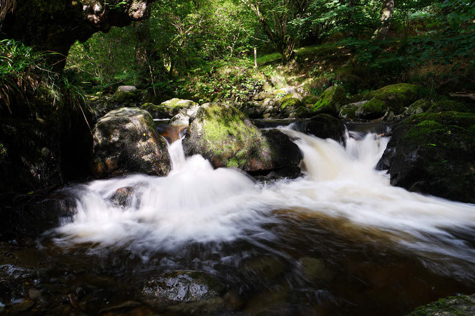

This was to be a short warm-up on the afternoon of 8th July 2015, prior to a night's camping at Glenridding, and [Catstycam](/blog/catstycam-to-sheffield-pike) the following day.

!!!! A short 7.5km circular route, starting at the Brunt Crag car park. (*Wainwright Book 1: The Eastern Fells*)

===

Brunt Crag is a National Trust car park, free to members, and is a popular starting point for visits to Aira Force. It's located just south of Dockray, not far from Ullswater. With this as my starting point, the route would naturally follow the course of Aira Beck before tuning to Gowbarrow itself.

[View Full Screen](https://map.mootparadox.com/full/gowbarrow) | [GPX](https://map.mootparadox.com/gpx/gowbarrow)  

<iframe src="https://map.mootparadox.com/embed/gowbarrow" height="500" width="100%" style="border:none; margin-top:-1.2em;"></iframe>

This is not exactly hardcore mountaineering, and the gentle, rolling summit is not particularly inspiring. The beauty of this route lies in the views across Ullswater as the path traverses its course up and around the southern and eastern flanks.

> "Gowbarrow Fell faces up Ullswater into the throat of the deep valley of Patterdale..."

Using Aira Force as a point of reference, that is where you need to divert south-east and the path begins to climb. At the lower levels you are walking alongside trees and ferns, but as you gain height the views begin to open up.

*Yew Crag, looking across Ullswater towards Hallin Fell.*

The photo above is representetive of the paths. Clearly marked, easy gradients - sometimes the drop-off is a little steeper. The area of Yew Crag is a useful milestone, and there is also a stone memorial bench. This is where the path turns around the eastern side of the fell, traversing gently for a while, before a steeper final climb to the summit trig point.

*View of the Ullswater steamer.*

The [Ullswater Steamers](https://www.ullswater-steamers.co.uk/) have been operating for over 160 years, although technically steamers they are no longer "steamers". One-way, the fare is £12/adult and Glenridding to Pooley Bridge takes about an hour.

*Crags above the path.*

There are small crags here and there above the path, and plenty of picturesque spots if you fancy a picnic!

*Gowbarrow Fell summit trig point.*

From the summit there are several easy routes back down, some of the popular ones heading back in the direction of Aira Force. I was aiming for the village of Dockray. Occasionally steep, this path makes navigation easy because it follows a wall all the way down. From Dockray it was a short stroll downhill to the car park.

All in all, this makes an easy but worthy walk, especially when combined with a visit to Aira Force.

*Obviously not Aira Force... I just liked this photo!*

> "...to those who travel alone, the solitary wanderers on the fells, who find contentment in the companionship of the mountains."
> 
> 