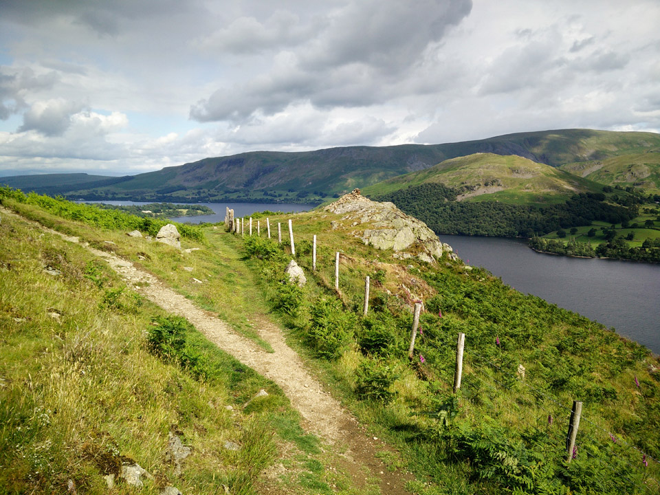
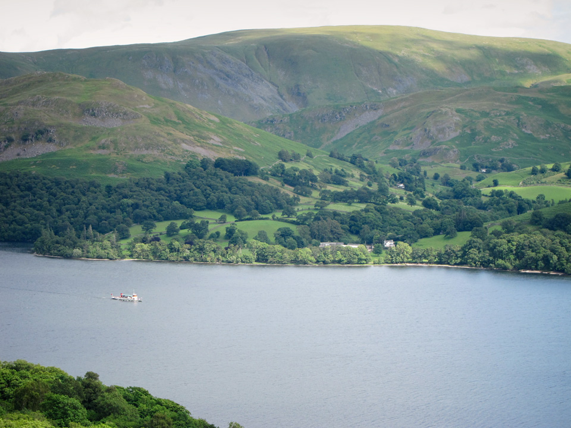
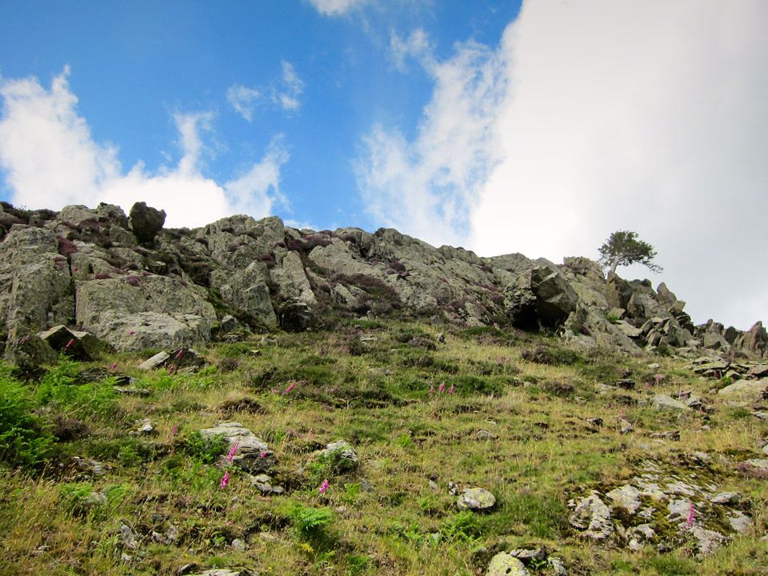
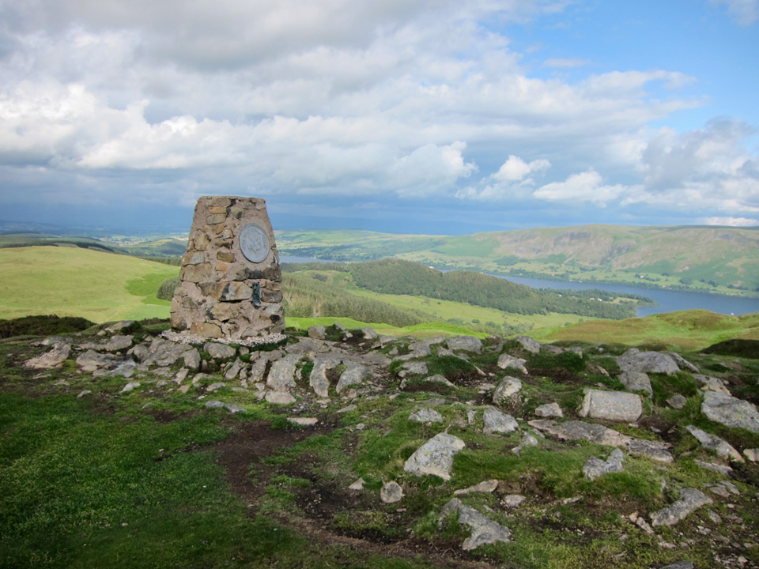

This was to be a short warm-up on the afternoon of 8th July 2015, prior to a night's camping at Glenridding, and [Catstycam](/blog/catstycam-to-sheffield-pike) the following day.

!!!! A short 7.5km circular route, starting at the Brunt Crag car park. (_Wainwright Book 5: The Northern Fells_)

===

Brunt Crag is a National Trust car park, free to members, and is a popular starting point for visits to Aira Force. It's located just south of Dockray, not far from Ullswater. With this as my starting point, the route would naturally follow the course of Aira Beck before tuning to Gowbarrow itself.

[View Full Screen](https://map.mootparadox.com/full/gowbarrow) | [GPX](https://map.mootparadox.com/gpx/gowbarrow)  

<iframe src="https://map.mootparadox.com/embed/gowbarrow" height="500" width="100%" style="border:none; margin-top:-1.2em;"></iframe>

This is not exactly hardcore mountaineering, and the summit is not particularly inspiring. The beuty of this route lies in the views across Ullswater as the path traverses its course up and around its southern and eastern flanks.

> "Gowbarrow Fell faces up Ullswater into the throat of the deep valley of Patterdale..."

*Yew Crag, looking across Ullswater towards Hallin Fell.*

Abc...

Abc...

Abc...

Abc...

> "...to those who travel alone, the solitary wanderers on the fells, who find contentment in the companionship of the mountains."
> 
> 