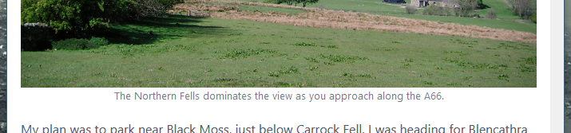

I was looking for a simple way to add a visible "caption" to an image, using Markdown, but without introducing any HTML markup, or resorting to Javascript. The following may be bending the syntax slightly, but it works!

===

Unless I'm missing something obvious, I can't see that standard flavour Markdown has any simple mechanism for adding a text caption below an image. You could add a snippet of HTML, or just write a bit of Javascript to pull the ALT text and use that as the caption. I didn't particularly like either solution.



Presumably this isn't a new idea, and I don't suppose it's "proper" use of the syntax, but my thought was simply style the text after the image. Can't just be a regular paragraph, so I'm using an `<em>` tag, and it has to follow immediately - so that the Markdown parser writes it into the same paragraph tag as the image. The Markdown is typically as follows:

```markdown


*The Northern Fells dominates the view as you approach along the A66.*

```

There will always be a blank line in the source, separating the image from its surrounding paragraphs. The caption follows immediately, and without a blank line. So you get:

```html
<p>
  
  <em>The Northern Fells dominates the view as you approach along the A66.</em>
</p>
```

It then becomes easy to target an `<em>` that follows an `` within a paragraph:

```css
/* Use <em> after image as a caption */
p > img + em {
    font-size: small;
    margin-top: -.25em;
    display: block;
    text-align: center;
    font-style: normal;
    opacity: 0.8;
}
```

If a regular paragraph happens to begin with some *emphasised text*, that's no problem because there is an intervening `<p>` and so the CSS doesn't target that text.