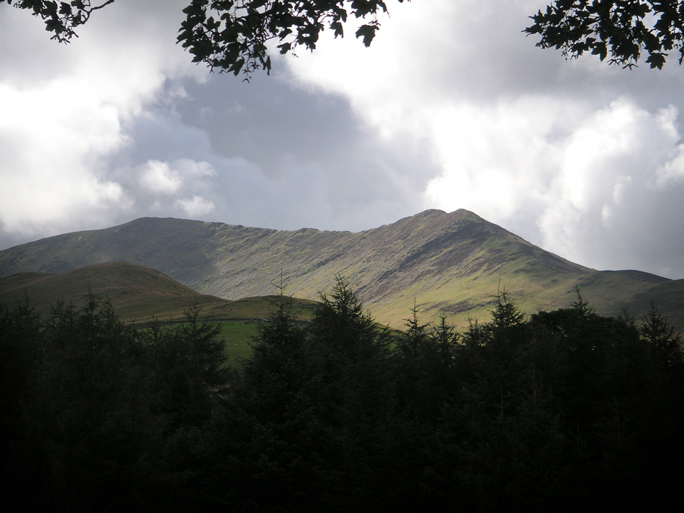

Even when I was seriously into backpacking (or, for the "first" time, as I'd prefer to think!) for some reason I'd never visited Skiddaw. There's a lot of negativity about it, but not sure it's entirely justified. This route took in a fine ridge walk along Ullock Pike, Long Side, and a short detour to Carl Side. There was a nice scramble up a scree slope (if such a thing is possible) to the shoulder of Broad End and then a bit of a detour to visit Little Man. Then back over Skiddaw and descending via Bakestall.

===

I was also trying out my new Bridgedale Comfort Trekker socks, which are a midweight sock in a merino and coolmax blend. Very nice socks, extremely soft and comfortable, but will have to see how they stand up after a few washes... not literally of course!

*Long Side Edge looking towards Ullock Pike.*

I parked up at Peter House Farm, next to the access road that leads to Skiddaw Forest, wanting to have the car a bit more convenient for the end of the walk. This meant a couple of miles walk to Barkbeth Farm where you begin to get onto the ridge. The path was a little indistinct in places, disappearing in a field for 100 yards or so, but kept on in the same direction and it suddenly became a clear farm track again. Couple of fords to cross too, but managed to step across without the water getting over the top of my Moabs.

*Ullock Pike Ridge.*

The path to Ullock Pike was a highlight of the route, steep in places and the opportunity for a couple of little scrambles where the path passed around some steep rocky patches. It was also the best weather of the day and excellent views down to Bassenthwaite Lake. It was also around here that I caught a first, and unfortunately final, glimpse of Skiddaw's summit.

*Skiddaw, without (many) clouds.*

From Ullock Pike I followed the ridge a short way to Long Side, second Wainwright of the day, before pushing on to Carl Side. It's a fairly rounded summit, but with good views into the valley and of Little Man. While the skies were clear, there are fantastic views across Bassenthwaite and Derwent Water, from here and more especially from Little Man.

Skiddaw Little Man

Spent a while on Carl Side, trying to decide on a sensible route to Skiddaw Little Man. I didn't want to take the main path to the Summit of Skiddaw as it felt like too much doubling back on myself. It looked like there was some sort of track horizontally across the scree below the south summit, but when I got up close, it was far too indistinct.

Path to Skiddaw south summit

I avoided the main path anyway, taking a more direct route straight to the south summit. Trekking pole was essential and crampons would have been useful! This aspect of my route was a bit contrived - I just didn't want to miss out Little Man when I was so close, but if you were looking for a proper circular walk, it's a detour that perhaps doesn't make a lot of sense, involving a fair bit of descent before retracing your steps later.

View from Little Man

Fantastic views from Skiddaw Little Man, but the clouds were closing in again and the wind was getting ridiculous! The path from here to Skiddaw is admitedly a bit dull, and I suppose this is where some of it's "not interesting" bad rap comes from. As above, approach via Ullock Pike and I think it's a very enjoyable climb.

Skiddaw Trig Point

Had to take shelter below a small cairne so I could hold the camera steady to get this shot of the trig point at the summit of Skiddaw. There was no let up in the cloud, unfortunately, until I started dropping down towards Bakestall. It was an interesting time at the summit. Had a snack and a drink in one of the stone shelters and talked to a few people who were sheltering or passing by. Every few minutes you'd hear the relentless whipping rattle of waterproofs and you'd know someone else was on their way!

Dead Crags below Bakestall

Bakestall was not a Wainwright I was familiar with, but it consists of some impressive cliffs high above the Whitewater Dash falls. This had been my sixth and final Wainwright of the day, before the short walk back to the car.

Whitewater Dash Falls

Final look back along the valley towards Whitewater Dash. From here it was a short walk back the car; maybe a mile. It had been a day of six Wainwrights, bringing me up to 14 in total. All very enjoyable, although it was a pity about the wind and lack of visibility from Skiddaw. In the picture below, the cloud started to roll down over the cliffs of Bakestall as if they were being poured from above.

Cloud over Bakestall

One thing I probably do need to find is a better Mountain Forecast. I've been using Accuweather which are generally excellent. I'm not a metorologist, but if the mountain forcast for 2900 feet says that the cloud-base is at 30,000 feet, that sort of suggests to me that a 3000 foot peak should not be shrouded in low cloud. Clearly this data requires some sort of weather forecasting logic that I haven't quite grasped!

Next decision, whether to stick with the Northern Fells and mop up the remaining 10 fells. I bought the "Eastern Fells" second edition last week, so might go there for a bit of variety! Watch this space...