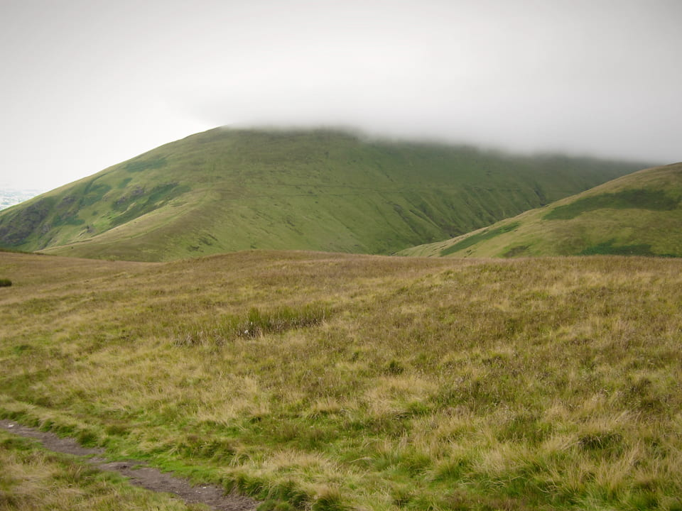
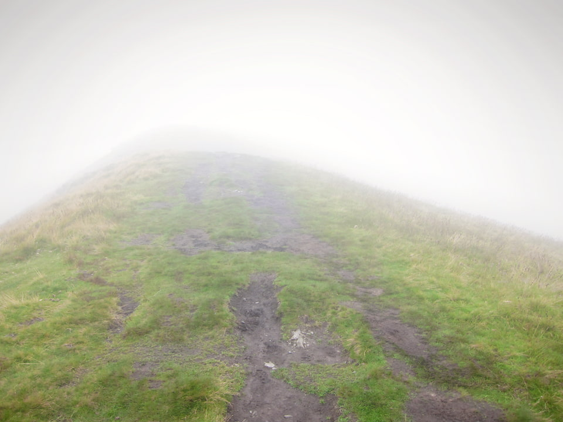
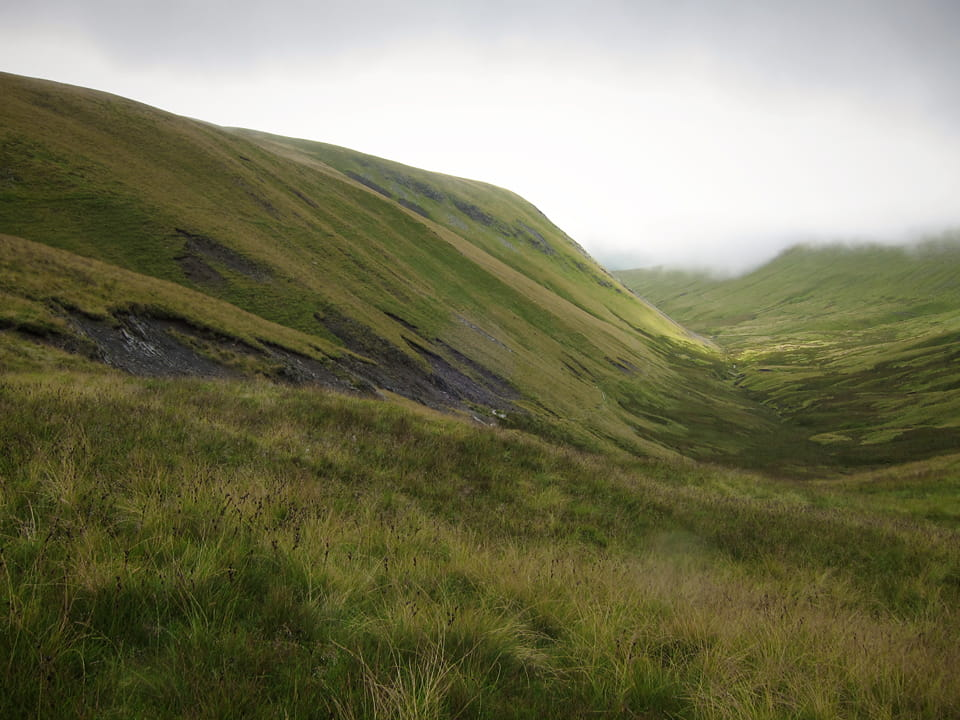
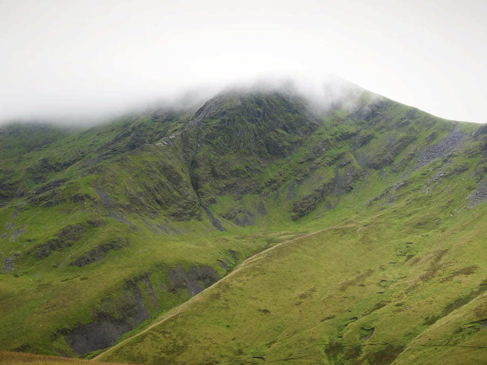
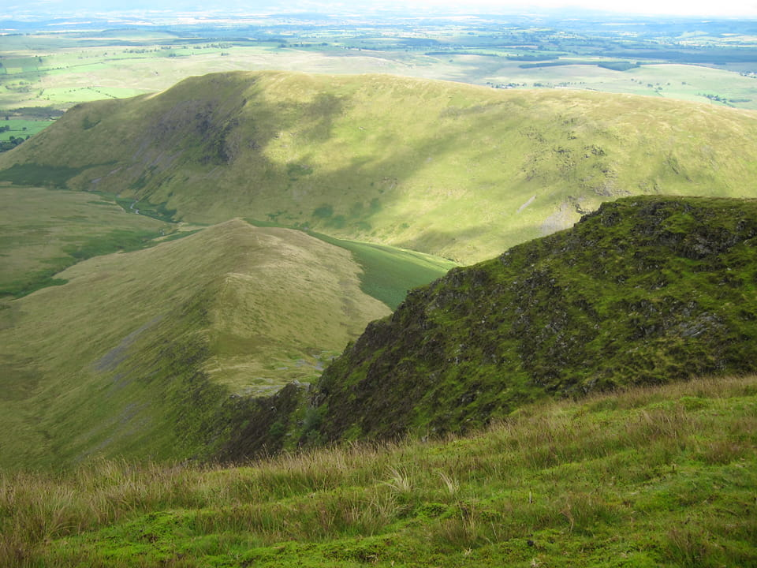
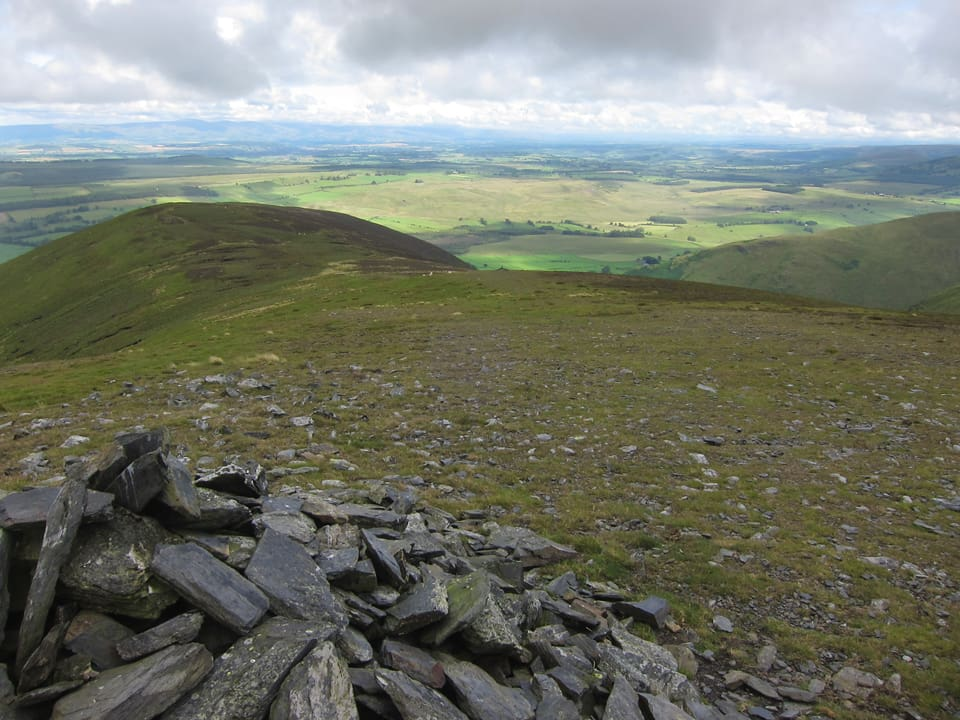
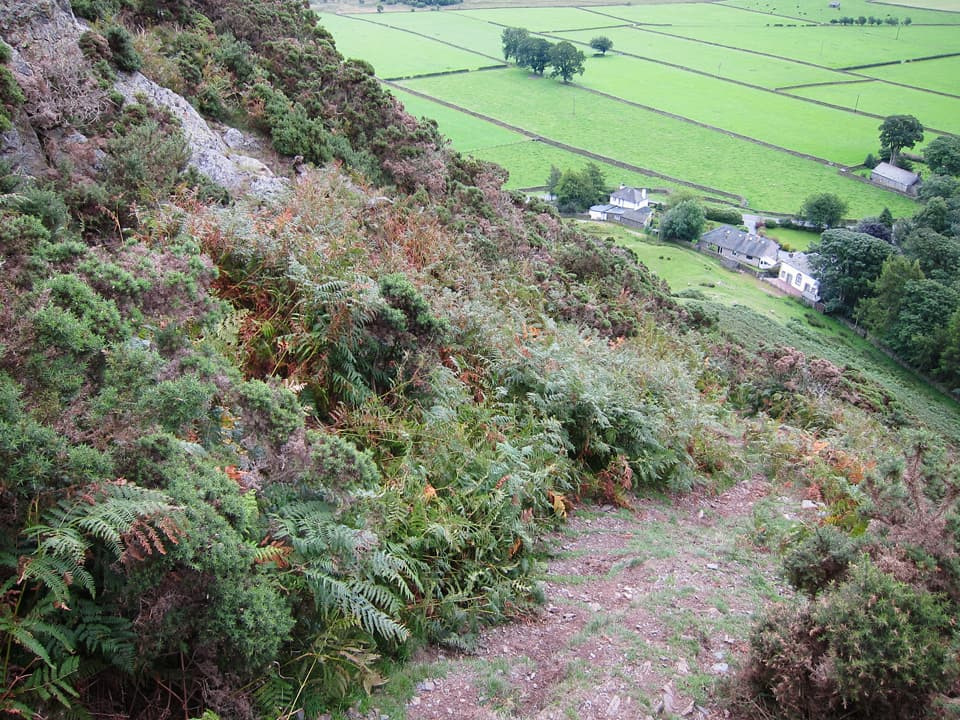
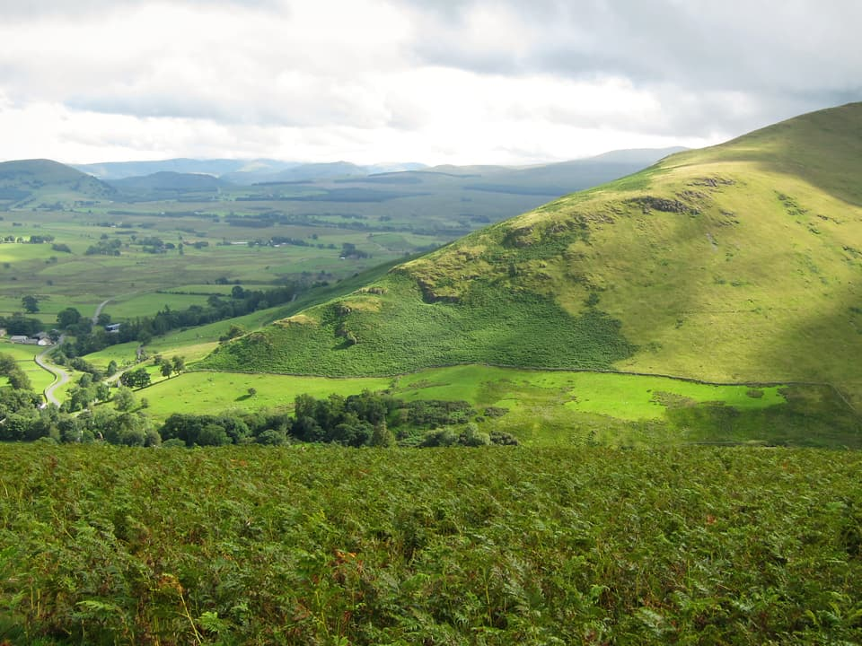

Monday 9th August, 2010, marked my return to the Lake District fells after an absence of about 19 years. Half a lifetime ago, my Duke of Edinburgh expedition for the Gold award, marked my last hill walking of any significance. It was a revelation to me that you don't need to carry a 20kg pack any more and I finally succumbed to the lure of the hills.

!!!! A 16km circular route, starting from Mungrisdale village. (_Wainwright Book 5: The Northern Fells_)

===

[View Full Screen](https://map.mootparadox.com/full/blencathra01) | [GPX](https://map.mootparadox.com/gpx/blencathra01)  

<iframe src="https://map.mootparadox.com/embed/blencathra01" height="500" width="100%" style="border:none; margin-top:-1.2em;"></iframe>

To give it some purpose, I intend to embark on some Wainwright bagging, with a view to clocking up all 214. I'm ignoring the few dozen I'll have done in the past, starting with a clean slate. As of Monday, the total stands at four. These being Souther Fell, Blencathra, Bannerdale Crags and Bowscale Fell.

*At the summit of Souther Fell.*

The mountain forecast was 10 degrees on the tops, a 50% chance of rain, and gusty south-easterly winds. I soon began to think that this was a somewhat optimistic appraisal of the conditions. I parked at Mungrisdale village (2 in the honesty box) and began walking in a very light drizzle. My route up Souther Fell was a mistake. I chose possibly the least interesting route though boggy ground, waist deep in bracken. If I do this again, I'd try to get higher up and walk more along the ridge of the fell. But in any event, after a bit of a slog, got up to the top and ticked off Wainwright number 1. That's probably why I was looking so cheerful at this point; although wind and holding the camera at arms length didn't help!

> Souther Fell [...] occupies an important position as a cornerstone of the northern fells, having an extensive view out of proportion to its modest height.

The photos don't do much justice to the views, which were very nice, looking over in the direction of Ullswater, seeing the distinctive shape of Great Mell Fell and the jagged edge of Wolf Crags in the direction of Great Dodd. To the west there would have been great views into Bannerdale Crags and later towards Blencathra itself. Sadly these were mostly hidden by low cloud, but at this stage I was seeing some brightness and had a feeling the cloud might lift.

*Blencathra "seen" from Souther Fell.*

I'd planned to drop down from Souther Fell to Scales Farm and then climb Blencathra via Hall's Fell Ridge. Two things put me off. Mainly because it would have involved a descent of between 200 to 300 metres, only to come straight back up again, and conditions being as they were, Scales Fell seemed like a more sensible option.

Hall's Fell Ridge comes highly recommended by Wainwright, and looks a fantastic route in the photos I've seen, but it's a grade 1 scramble and is probably best saved for when the views can be appreciated in safety, and when you can be planning your route more than half a dozen steps ahead!

*Approaching the top of Scales Fell.*

What you see above is the view from about half way up Scales Fell. From this point on it got so wet that I didn't dare to take the camera out of my pocket. I get the impression there might have been a bit of a drop either side, but who can tell? These are ideal climbing conditions for Acrophobics! I relied on my GPS to find the summit cairn and sat for 20 minutes hoping for a glimpse of blue sky. Sadly not!

Needless to say, it was at about this time, 800m up a cliff and in zero visibility that my GPS decided to abandon its vocation in life and dropped its pre-planned route. Deciding that discretion was the better part of valour, I went old school with map and compass, setting a bearing down onto Mungrisdale common, staying well clear of Foule Crag, and descended to meet Roughten Gill at about the 650m mark. From there, I followed the contour around to the col between Atkinson Pike and Bannerdale Crags, via a distictive P shaped sheep fold.

> This is a mountain that compels attention, even from those dull people whose eyes are not habitually lifted to the hills.

On the verge of calling it a day and following the River Glenderamakin back to the car, finally there was a glimpse of daylight! I reset my GPS (if in doubt, switch it off and back on again) and decided to press on towards Bannerdale Crags.

*Valley view, with the River Glenderamackin.*

The cloud never lifted from the summit of Blencathra throughout the entire journey, but there were some great views up towards Sharp Edge. In spite of the cloud cover, it's still a fantastic looking mountain.

*Blancathra and Sharp Edge, almost emerging from the cloud.*

> ...a rocky spur goes off to the east, this latter being the well know Sharp Edge, second in fame to Striding Edge on Helvellyn as a test for walkers.

Bannerdale Crags was the next Wainwright en route. After the slightly surreal and yet strangely distubing sight of watching a sheep plummet to a presumably certain death, I was imbued with a healthy respect for the edge of the crags and took ample care while taking some photographs down into the valley. The views were fascinating down into a classic glacial valley; wide and flat, the sun picking out the summit of Souther Fell below.

*Bannerdale Crags east ridge.*

The photo above shows the East ridge of Bannerdale Crags and looks like a nice ascent for another day.

> Bannerdale Crads, to be appreciated fully, should be approached from the pleasant village of Mungrisdale, for only in this direction, eastwards, is revealed the mile-long rim of cliffs that gives the fell a name...

It was an easy walk to Bowscale Fell over wet ground. A mile or so of squelching along saw me to the summit cairn. Even more significantly, my first view of a fellow human being! There were three of them, a couple of miles away, but it was the closest I came to having company on the fells throughout the entire day.

*Bowscale Fell.*

I'd conquered my first four Wainwrights, and will be happy to return to Blencathra again in better conditions. It was harder than I remembered. I hate to say it, but age may be a factor, so my fitness will need to improve. But also, fell-walking it seems, is not using exactly the same muscles as mountain biking. The descent down Bowscale's east ridge is very steep in places and you can certainly feel it in your knees.

*Steep descent from Bowscale Fell.*

The final drop back to Mungrisdale is particularly steep, down a crumbling gravel path. A good trekking pole will come in handy!

> Best of all is the east ridge. Climbing starts at once over a pleasant alp of gorse and bracken and grey rock, after which there is a gentle rise to the heathery ridge.

And so to gear. This was my first walk in a long time and I'd bought new waterproofs; a Rab Latok Alpine jacket and Berghaus Paclite overtrousers. Both were excellent, no trace of condensation, apart from the camera and GPS in the inside mesh pockets. GPS is waterproof but the camera issue is going to need a better solution. The Paclite pants were light and allowed for plenty of movement. I ended up wearing them most of the day, with no real need to remove them.

With all other kit I improvised. Three-quarter length cotton shorts, t-shirt and a Berghaus micro-fleece top. (Note to self, need a better base layer; cotton t-shirt is no good!) Had great service from my Montane Lightspeed 'windproof' which I wore most of the way up Scales fell, and was fine until the rain got really heavy. A lightweight buff, rolled as a headband and combined with a bush hat was perfect for keeping the wind out of my ears - would highly recommend these.

No boots, so wore my Merrell Moab Mid walking shoes, which are a mid-height shoe, Gore-Tex lined. They were fine, and my feet were dry(ish) but this is going to be another item to look at. The grip just didn't feel quite sure enough in these wet conditions.

*Souther Fell seen from Bowscale.*

And, this final image above is the view from Bowscale's East Ridge towards Souther Fell. I think this is definitely it's better side.

I can't say exactly where my next excursion will take me, but am probably going to stick with "The Northern Fells" for the time being, especially as that's the only Wainwright book I currently have! May as well be systematic. So far, four down, two-hundred and ten to go...

> "...to those who travel alone, the solitary wanderers on the fells, who find contentment in the companionship of the mountains."
> 
> 