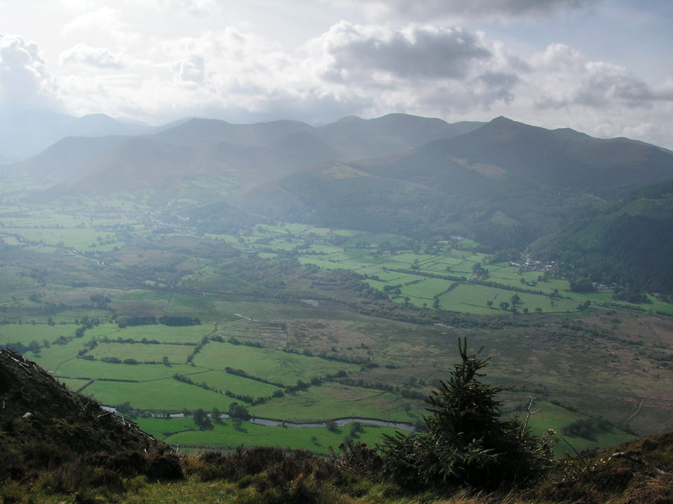
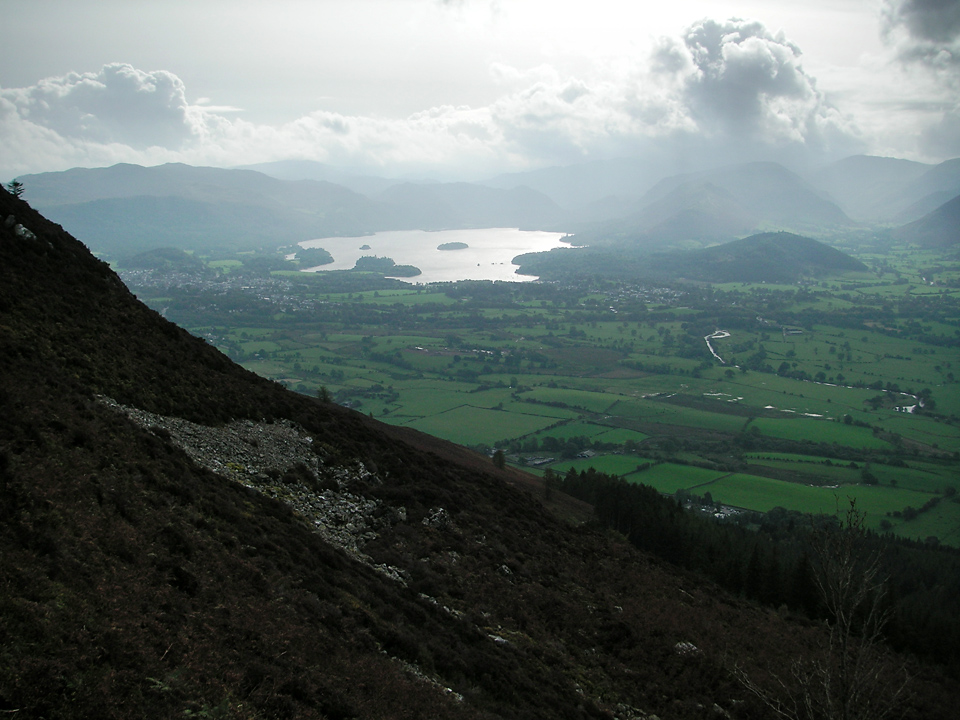
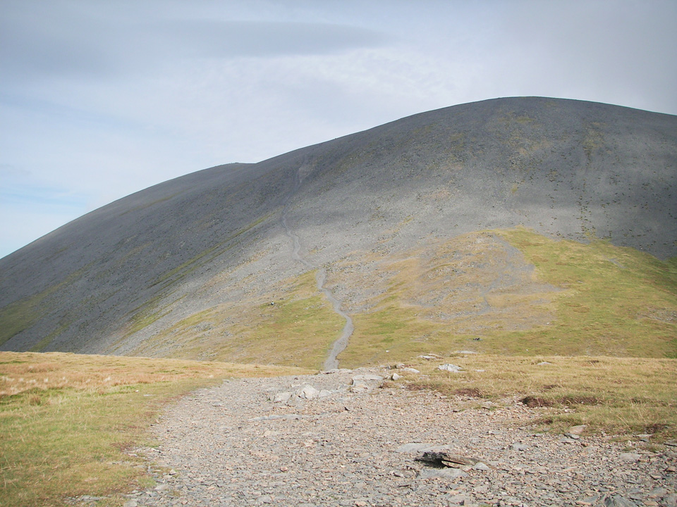
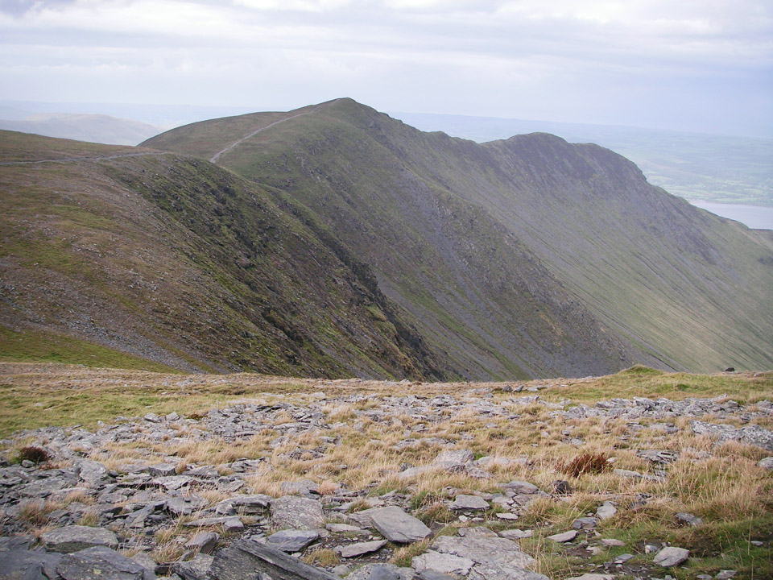
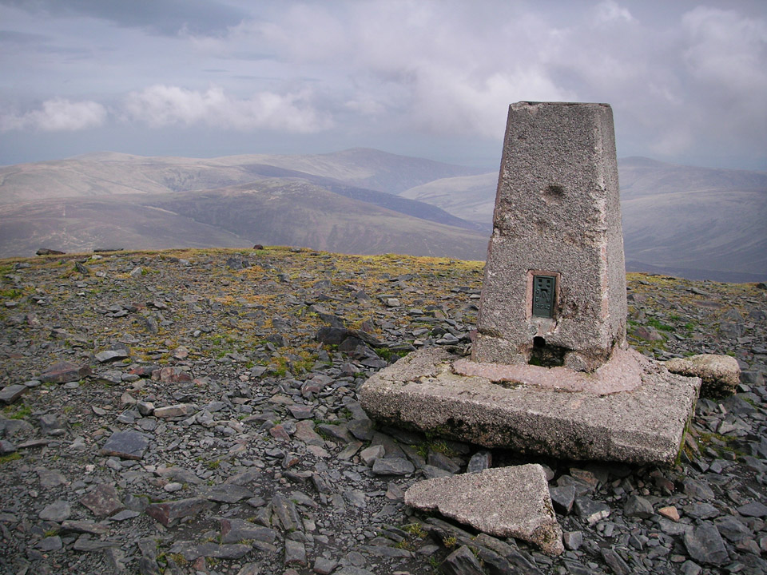
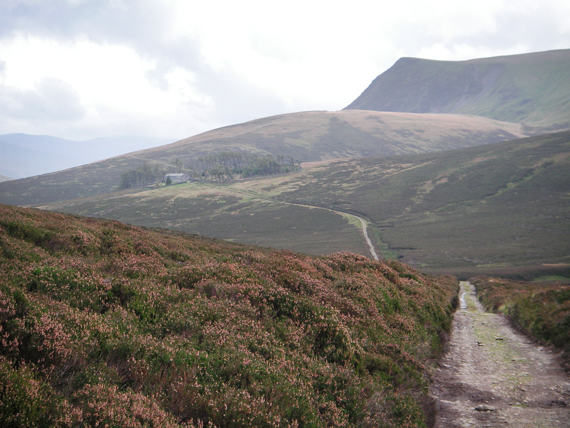
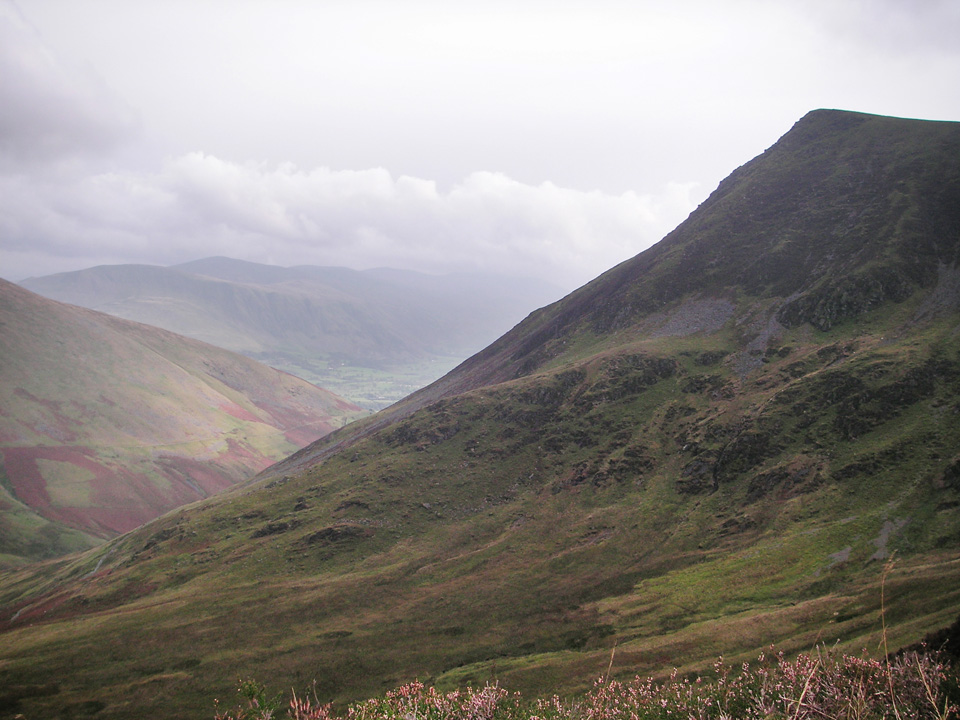
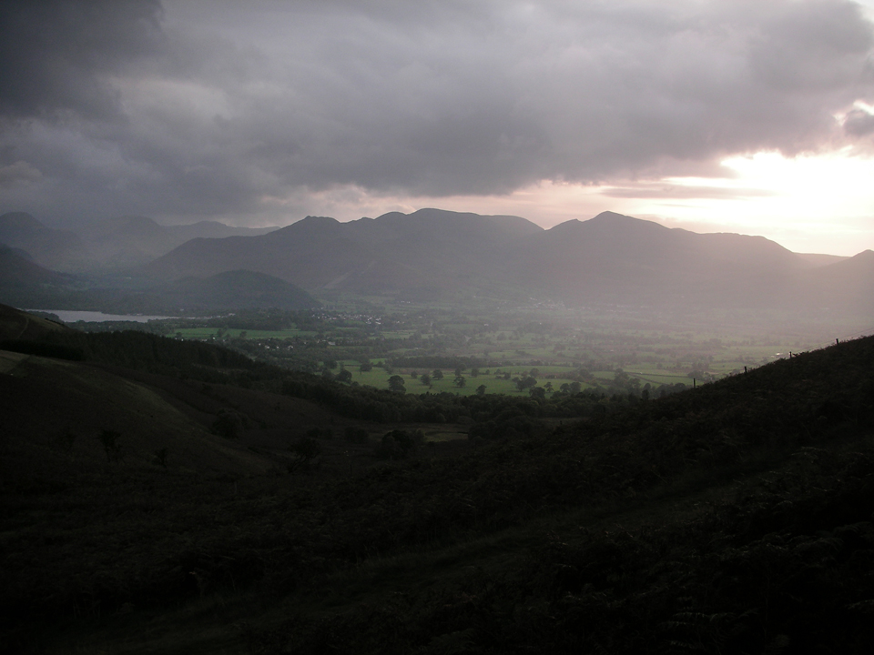

The title **Dodd to Latrigg** probably doesn't do full justice to this circular walk of approximately 16 miles and 5882 feet of total ascent; more than a mile upwards! On this fifth outing to the Northern Fells I was very pleased to bump into @stevenhorner and we walked as far as Carl Side before I departed on my circuitous route around Bakestall and Lonscale Fell.

!!!! A 25km circuit of Skiddaw, starting at Latrigg. (*Wainwright Book 5: The Northern Fells*)

===

*North Western Fells, seen from near the summit of Dodd.*

> "Dodd, like Latrigg, can be described as a whelp of Skiddaw crouched at the feet of his parent."

#### Route Summary

Follow the road (if 'road' is a word you can reasonably use in this instance) from Ormthwaite and park at the Latrigg car park.

[View Full Screen](https://map.mootparadox.com/full/dodd-latrigg) | [GPX](https://map.mootparadox.com/gpx/dodd-latrigg)  

<iframe src="https://map.mootparadox.com/embed/dodd-latrigg" height="500" width="100%" style="border:none; margin-top:-1.2em;"></iframe>

The route to Dodd begins on road. After the summit of Dodd, take the direct route up to Carl Side and up the western side of Skiddaw. Descend via Bakestall and join the track near Dash Beck, following it to Skiddaw House. (I had planned to take in Great Calva at this point, but it was going to make me late back to the car park, so I skipped it on this occasion.) After that, ascend Lonscale Fell via the Burnt Horse ridge and descend back to the Latrigg car park. But, before departing, head up to Latrigg and enjoy the views!

#### Dodd

If I had to provide a single tip for the ascent of Dodd, throw away your map, because the paths shown bear no resemblance to the real thing! The map above comes straight from my GPS tracklog and, so far as I could see, represents the only sensible route when approaching from the south; unless you happen to enjoy machete work through dense undergrowth. To the right is the view from the summit, towards Derwent Water.

*From Dodd, looking towards Derwent Water.*

At barely more than half the height of Skiddaw, Dodd looks insignificant on the map, but it's actually a very enjoyable walk through woodland and along gently graded footpaths. It feels more exposed at the summit, with no trees to break the wind, so I swapped my sun hat for a thinsulate beanie! There are very nice views to the south-west and towards Derwent Water, while the northerly aspect is dominated by the rounded mass of Carl Side.

#### Carl Side & Skiddaw

This was my second visit to Carl Side.

*From Carl Side, the path up the western side of Skiddaw looks ridiculous, but feel assured it's not as steep as it looks. Not quite!*

Last time I approached from the north-west, via Ullock Pike, Long Side Edge and Long Side. This route up from Dodd affords good views across to Skiddaw Little Man and Lesser Man, but insofar as I'm qualified to judge, the aforementiond ridge route from Ullock Pike is better.

*Long Side Edge seen from the ascent of Skiddaw.*

The summit of Skiddaw feels quite barren and rocky. Nevertheless, it's the fourth highest summit in the region, and personally I enjoyed the approach up through the bare and broken rocks.

*Skiddaw summit trig point.*

It feels like a long descent from Skiddaw, around Bakestall and down to Dash Beck. I would think that an ascent in this direction would be a bit of a slog.

*Skiddaw House, with Lonscale Fell behind.*

#### Lonscale Fell & Latrigg

From the direction of Skiddaw, Lonscale Fell is nothing more exciting than a field with a cairn. It presents an entirely different face to the Blencathra side and so the approach from Skiddaw House and along the valley is much more interesting.

*Lonscale Fell.*

I took the route up the Burnt Horse ridge, and then up to the lower (and much more interesting) summit, which is the pointy bit in the picture above. The true summit is the aforementioned "cairn in a field", which I passed later en route to Latrigg.

#### Summary

This is a route that was cut slightly short at the last minute, when I realised I wasn't going to have time to get up Great Calva, and still get back to the car park at a reasonable hour. With hindsight, it would have been better to realise this while still up on the Skiddaw summit, then descend directly to Skiddaw House, before climbing back up Lonscale Fell. It would have been easier and would also have cut a few kilometers off the route.

*From Latrigg, with the sun setting over the North Western Fells.*

Things I learned from this route? Don't ignore Dodd because of its modest size. If you want to climb Skiddaw, come at it via Ullock Pike and Long Side Edge. And finally, climb Lonscale Fell from the east, starting near the River Caldew.

> "...to those who travel alone, the solitary wanderers on the fells, who find contentment in the companionship of the mountains."
> 
> 