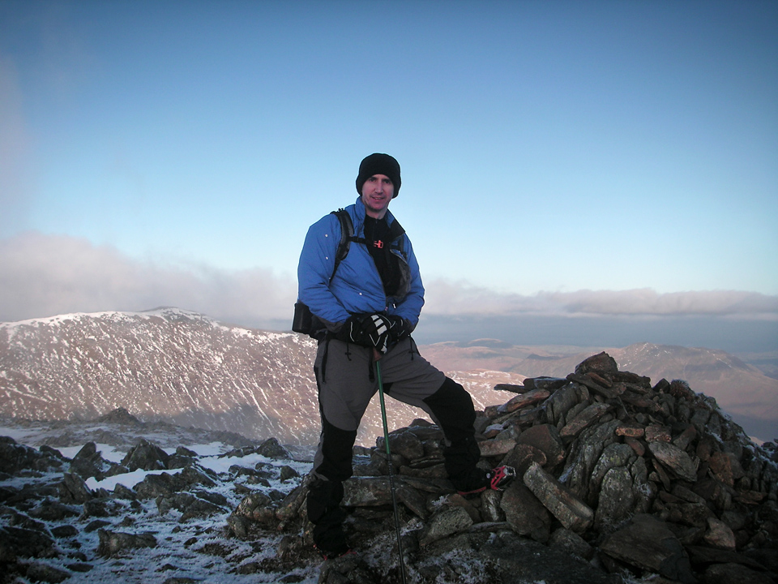
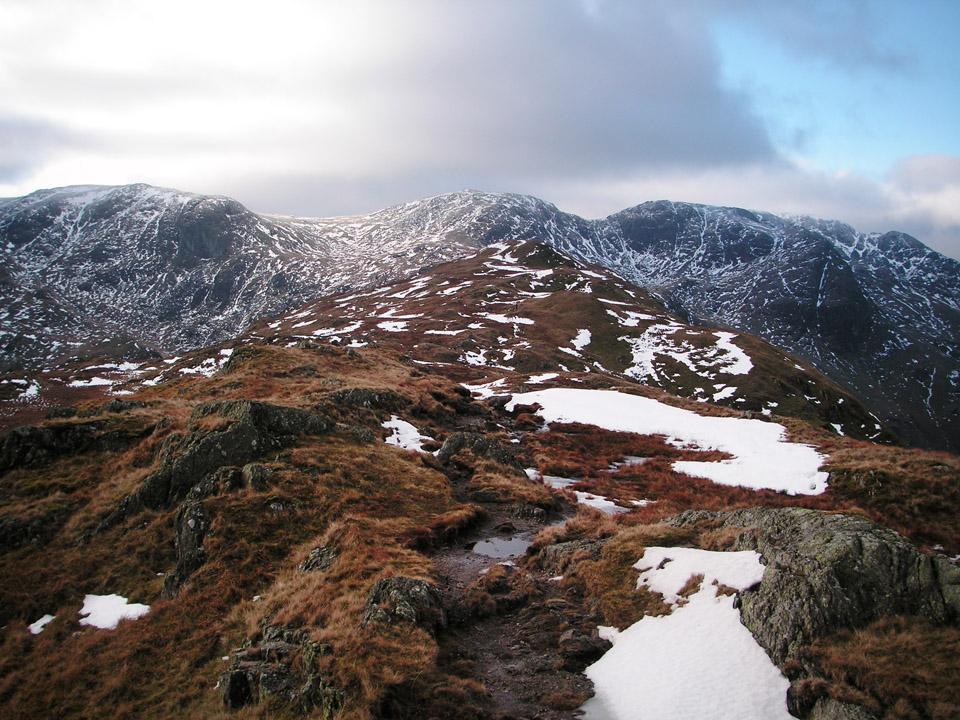
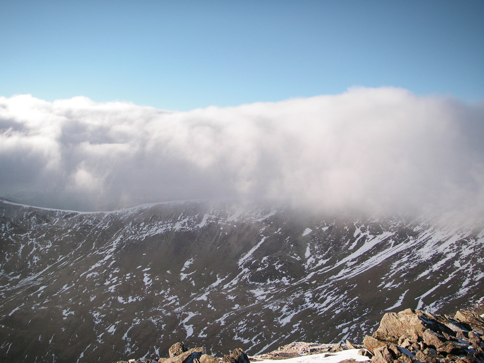
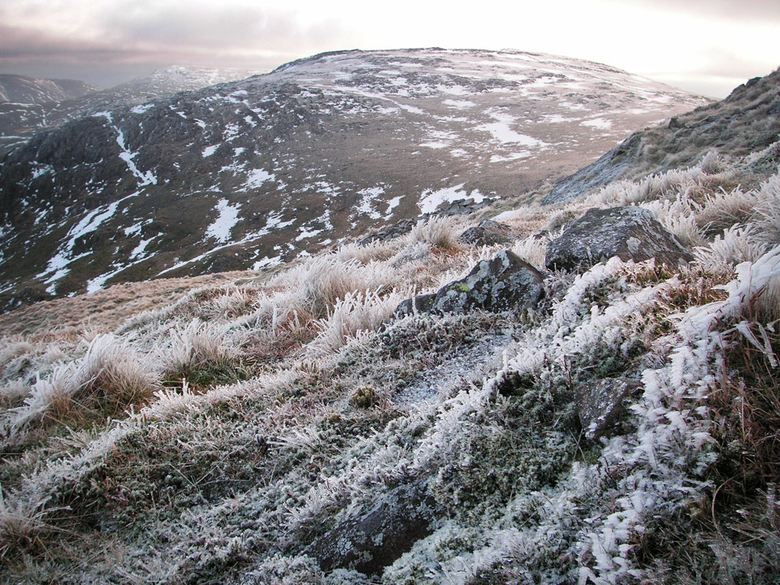
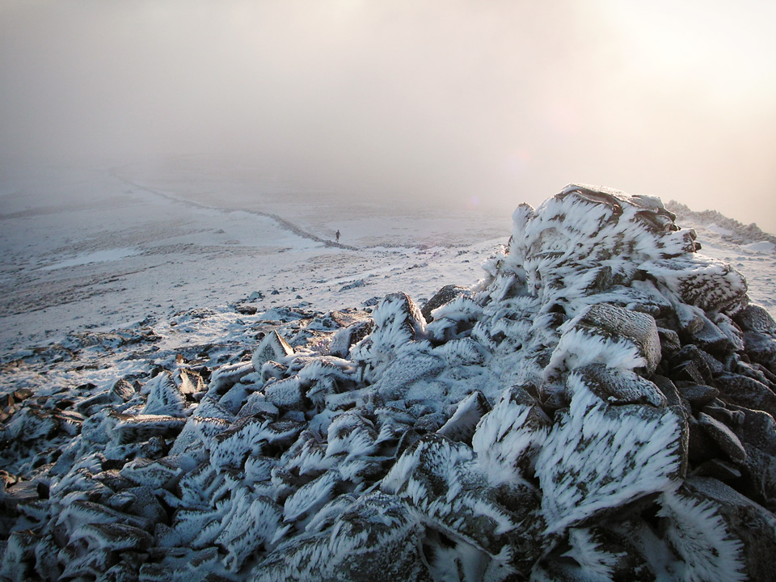
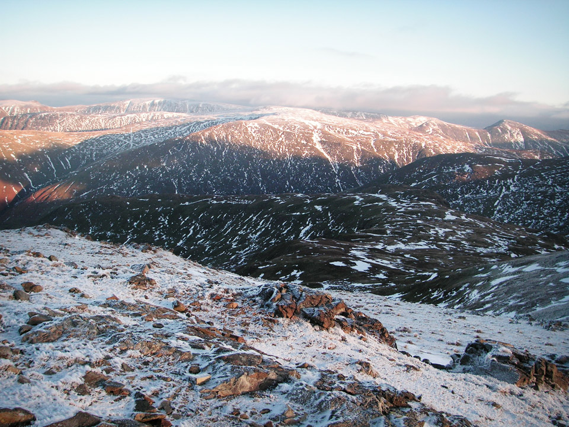
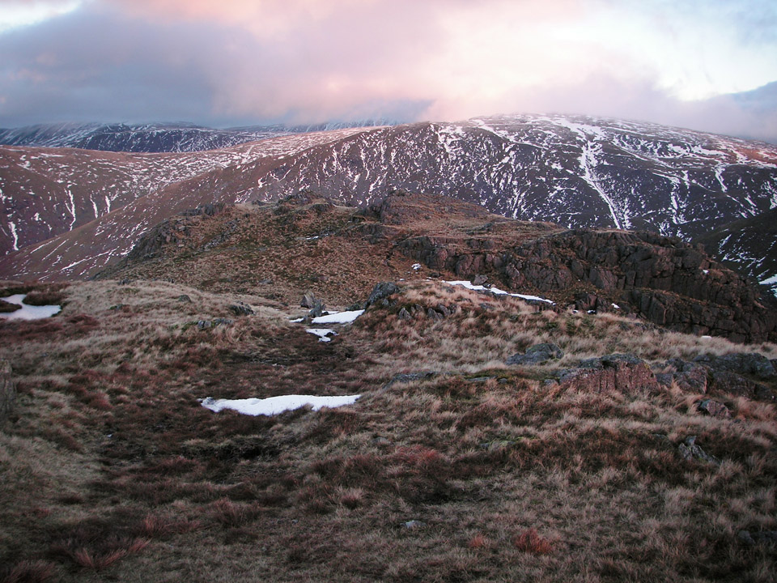
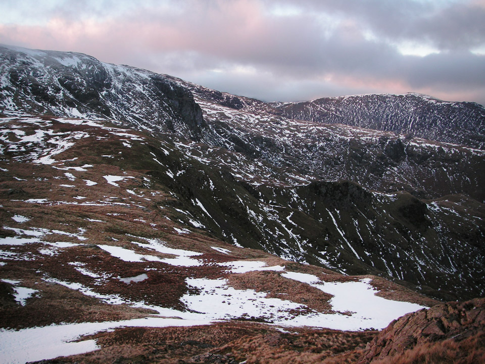
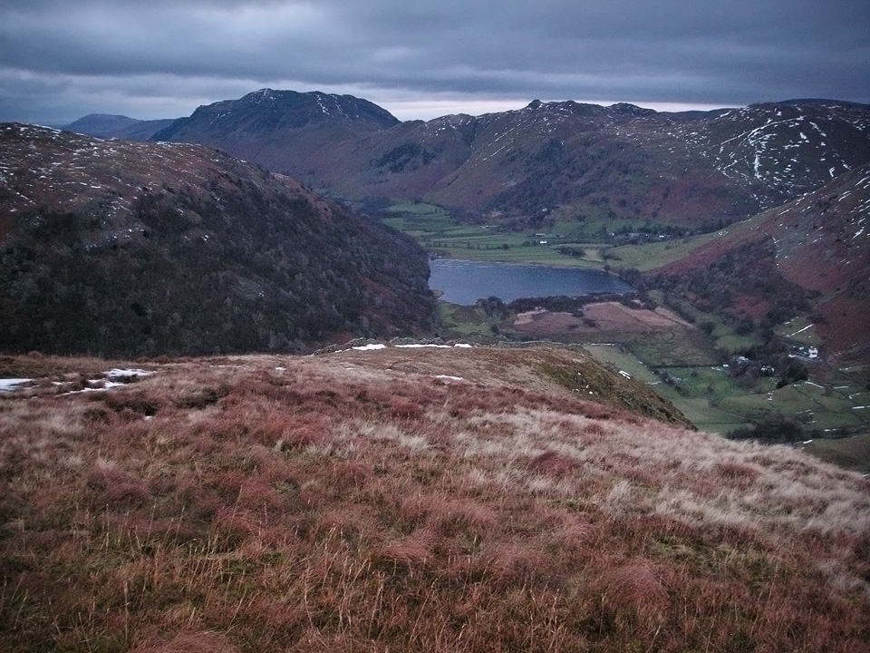
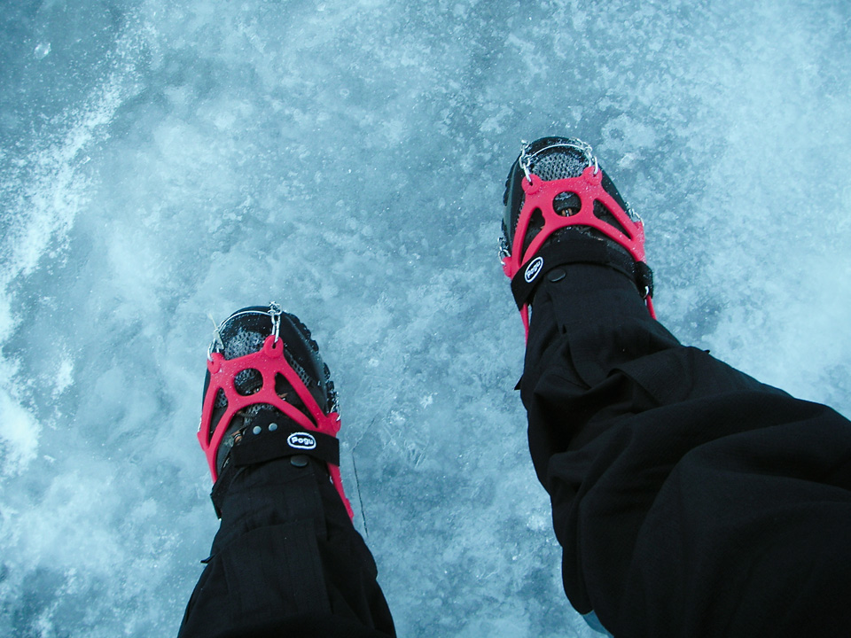

I don't know if The Dovedale Round is an official route, but it probably should be. Have a look on Google and you'll find a few references to a "Dovedale Horseshoe" and a "Dovedale Round", but several of these walk in along the valley floor. To me, this type of walk should be defined by its use of ridges, both in and out. This route fits the bill, and takes in five Wainwrights along the way.

!!!! A 13km wintery route, starting from Brother's Water. (_Wainwright Book 1: The Eastern Fells_)

===

### Map

[View Full Screen](https://map.mootparadox.com/full/dovedale) | [GPX](https://map.mootparadox.com/gpx/dovedale)  

<iframe src="https://map.mootparadox.com/embed/dovedale" height="500" width="100%" style="border:none; margin-top:-1.2em;"></iframe>

The GPX route appears to end quite abruptly, and that's because someone kindly offered me a lift back to my car! If repeating this route, I'd probably try to park at Brother's Water too.

*At the summit of Hart Crag.*

The summit of Hart Crag, Wednesday 15th December 2010. What can I say except - take a look at the view above and tell me there's something you'd rather be doing on a day like this. Apologies that I seem to be blocking part of the view! Over my right shoulder, you're looking towards St Sunday Crag.

After a month off, I finally got back to the Lakes for this 13km circuit around the Dovedale Valley, and my Wainwright count now stands at 47. It was a fantastic day, a little snow on the summits, about 6 degrees in the valley and just below freezing on the summits. Was pleased to find there were several opportunities to try out my Pogu Spikes on frozen snow and water ice.

### Route Summary

Park at the Cow Bridge car-park (free, but the sign says no overnight stays) and head towards Hartsop Above How. A good tip is to choose the path to the north-eastern side of the stone wall that encloses the top of Low Wood. This wall follows the line of the ridge as far as Gale Crag. From here, continue upwards, following the ridge to the summit of Hart Crag. You're now onto the well trodden path of the Fairfield Horseshoe and an old stone wall points the way to Dove Crag less than a mile to the South-South-East. Descend down to Bakestones Moss, following a line of broken fence posts, and descend the ridge back down to the carpark, via Little Hart Crag and High Hartsop Dodd. It's a steep climb down from the end of this ridge, but the path is easy.

*Hartsop above How ridge to Hart Crag.*

You could reverse the route, but the climb up to High Hartsop Dodd would be a bit of a dull slog and when you reach Hart Crag from that direction you'd need to take care picking out your line of descent in order to avoid an excessively rapid and terminally abrupt descent route. In summary, this is a short, easy route, simple navigation and fantastic views throughout, particularly spectacular from Hart Crag towards Rydal Head and Fairfield. Another definite route recommendation!

### Carpark to Hartsop Above How

Lying part way between Glenridding and Ambleside, along the route of the A592, the Cow Bridge carpark is a very nicely located free car park, a scarce resource in the Lakes these days! It offers easy access in the direction of Fairfield to the west, and Highstreet to the East. Aside from these well known fells, there are dozens of other summits within easy reach.

Follow the path north, parallel to the road, as if you were heading back to Patterdale. At the end of Low Wood (to your left) go another 50 metres and cross the stone stile. Follow the path across the field and over a wooden stile into the trees.

*Clouds rolling over the Fairfield Horseshoe.*

The paths are clear and you simply need to follow the line of the ridge. As you emerge from the trees you are rewarded with some excellent views towards Fairfield and Cofa Pike.

> "The ridge itself lacks interest, but there is ample compensation in a succession of splendid views which become even finer as altitude is gained."

It's a slow, easy ascent, with plenty of photo opportunities and great views throughout. The true summit of Hartsop above How is not easy to identify. There are a series of rocky crags, any of which could be the summit. Play it safe, and walk over them all - you know it makes sense!

### Hart Crag and Dove Crag

The path becomes slightly less clear as you approach Hart Crag, although without the snow cover it would probably be easier to see. The frozen ground was a welcome sight however, as this final approach from Hartsop above How looks like it would normally be very boggy.

*Frozen Grass below summit of Hart Crag.*

As you get close to Hart Crag itself, bear left slightly, and the ascent up a shallow gully to the summit becomes clear. There were some interesting ice formations on the rocks and grasses near the summit, and some strange cloud formations that for a long time seemed unable to get any further than Rydale Head.

This was the highest point on the route and the walk across to Dove Crag was easy - but the Pogu Spikes really came into their own on the descent. I can't recommend them enough!

*Dove Crag summit cairn.*

If you look closely at the Dove Crag summit cairn above, then a little to the left along the wall, you'll see an approaching fell runner - running the Fairfield Horseshoe in shorts! He said he was hoping to get some ice climbing in over the next couple of days and it looked like the weather was going to oblige him.

> "Here, in small compass, is a tangle of rough country, a maze of steep cliffs, gloomy hollows and curious foothills gnarled like the knuckles of a clenched fist."

*Dove Crag to Little Hart Crag.*

The path down to Little Hart Crag was not at all clear in these conditions, but a good tip seems to be to look for the line of broken fence posts that leave the ridge at 90 degrees.

*From below Dove Crag, towards Little Hart Crag.*

The route down was icy in places and I put the Pogus back on again.

*Looking back, with St Sunday Crag in the distance.*

From Bakestones Moss the path levels out, and it was warmer too. A rocky path zig-zags the short climb up to Little Hart Crag, and the fourth Wainwright of the day.

### High Hartsop Dodd to Carpark

As the light began to fade, the snowline was left behind, and there was a short, steep descent from High Hartsop Dodd back to the Cow Bridge car park.

> "The most striking feature ... is the exceptionally fine picture of Dovedale, which is seen in all its strong and impressive contrasts."

The summit of High Hartsop Dodd is unclear. It's certainly more grassy than pointy. The reward is in the view and you can see your entire day's route unfold before you.

*Looking over High Hartsop Dodd to Brothers Water.*

### Summary

I'm very happy with this route, and all the more so because it represents my first winter walk in the Lakes - albeit in very favourable conditions. It's a short route, but a sensible length for these short days, unless you can make an early start. In my case, the A69 might as well drop its speed limit to 30mph and be done with it! I was lucky to arrive for 10:30.

In the summer, I'd have been tempted to divert from Bakestones Moss down to the Scandale Pass and up to Red Screes and Middle Dodd. This would add about 6km and 2 Wainwrights to the route, assuming you'd then want to retrace your steps and come back to Little Hart Crag.

I can happily say the Pogu Spikes are an excellent product. What worked less well was the shock absorber in my walking pole; which is a basic model with no option to disable it. Despite a sharp steel tip, you can't jab it into icy ground because it simply bounces off.

*Pogu Spikes.*

Looking forward to the next wintery walk. Fingers crossed for some decent weather over the Christmas holidays!

> "...to those who travel alone, the solitary wanderers on the fells, who find contentment in the companionship of the mountains."
> 
> 