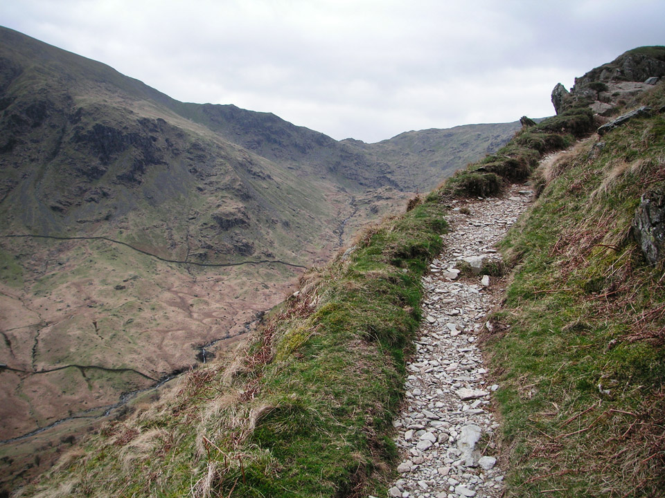
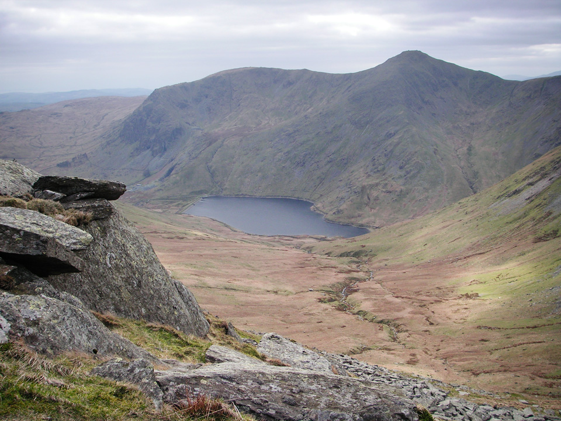
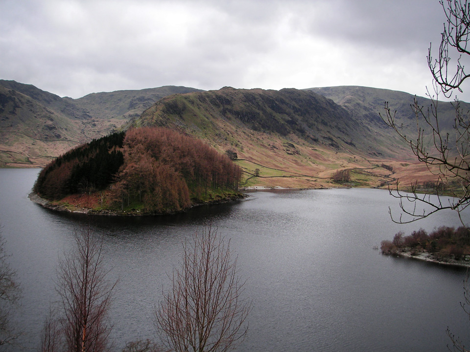
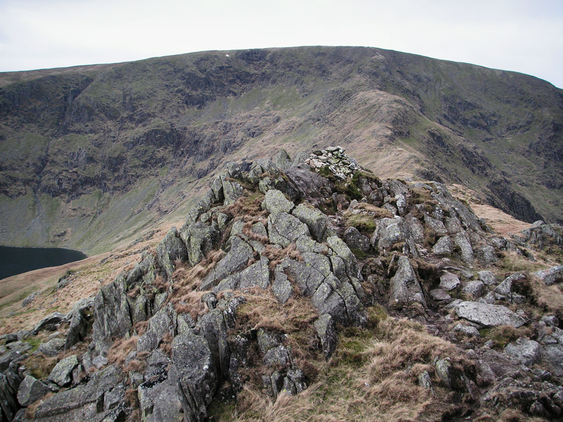
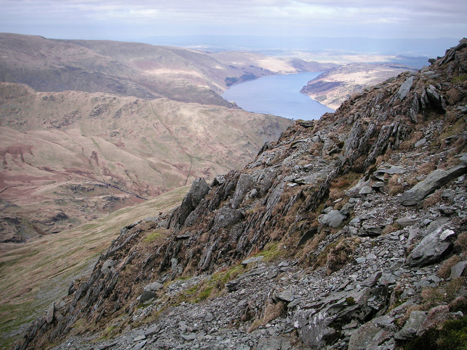
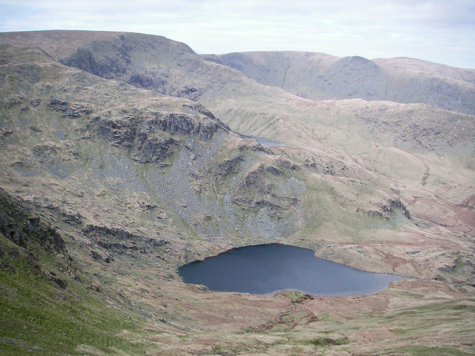
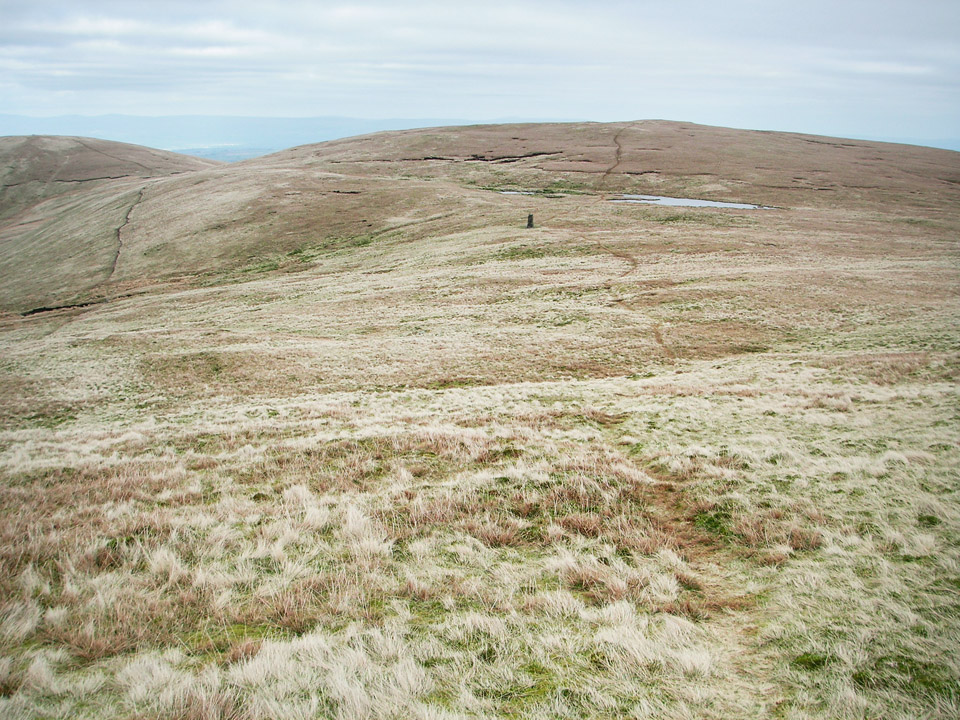
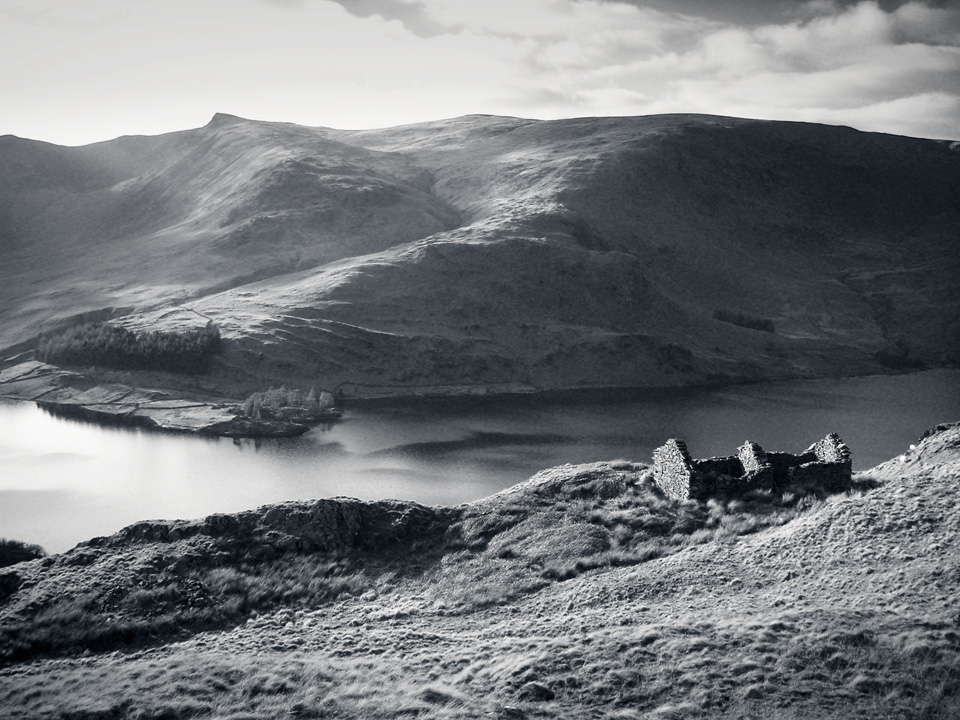
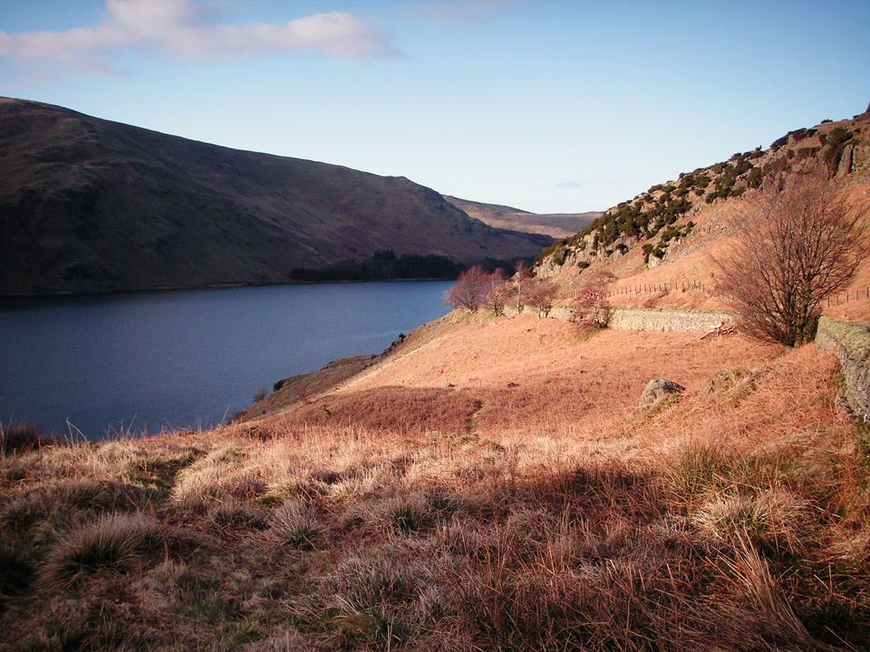
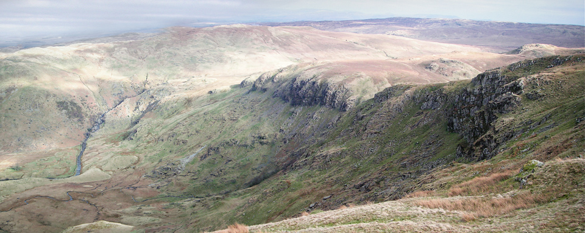

My plan was to start at Mardale Head, climbing High Street via the classic Riggindale route, then making a circuit around Mardale Ill Bell, Harter Fell, Branstree and Selside Pike. I think it would have been a really nice route, had it not been for an unexpected road closure conspiring against me; but more of that later! It was the 21st March, 2012, and a very pleasant spring day.

!!!! A 26kmkm circuit of Mardale Head. (*Waiwright Book 2: The Far Eastern Fells*)

===

[View Full Screen](https://map.mootparadox.com/full/mardale) | [GPX](https://map.mootparadox.com/gpx/mardale)  

<iframe src="https://map.mootparadox.com/embed/mardale" height="500" width="100%" style="border:none; margin-top:-1.2em;"></iframe>

The classic "Mardale Horseshoe" appears to ascend via the Riggindale ridge and descends the Gatescarth Pass. My route today was a intended as a natural extension of this, to avoid leaving a couple of stranded, un-bagged Wainwrights on the south-eastern shore of Haweswater. I think it's well worth considering, and it's pretty easy once the initial climb to High Street is behind you. With hindsight, a better alternative for me might have been to park at Burnbanks and ascend via High Raise, descending via Hare Shaw - I'd say that would be just under 30km - but the downside would have been to omit the classic ridge route above Riggindale.

*On the climb to Rough Crag, below High Street.*

> "... High Street's eastern flank falls precipitously from the flat top to enclose the splendid tarn of Blea Water in craggy arms ... a striking study in grandeur and wildness; on this side a straight narrow ridge running down to Mardale is particularly fine."

This walk took me to five "Wainwrights", including three new ones. The count is now 74 - finally passing the 1/3rd checkpoint!

#### Route Summary

Under any normal circumstances, I would have parked at the western end of Haweswater. Unfortunately, before setting out on this particular morning, I had neglected to make my routine phone-call to North West Water to see if they had decided to close off the road so that someone could bury a pipe underneath it. Makes perfect sense to me - it's not as if there might be any grass or open spaces in Cumbria. It stands to reason any sensible person would decide to dig up a road instead of trying to find space in the countless millions of acres of grass verge!! So anyway, on this occasion, I parked at Wallow Crag, about 6km from where I wanted to be.

But, if possible, park at Mardale Head. The car park is free, but there's a mountain rescue donation box next to the gate, so I put a couple of pounds into that; much better than feeding a parking meter! Follow the shoreline around to The Rigg and turn west up the long ridge to High Street. The path is straightforward, although rocky in places. In those first three km, you gain a lot of height, and the path levels off considerably when you reach the summit of High Street. Descend via Mardale Ill Bell and cross the Nan Bield Pass, before climbing the ridge to the summit of Harter Fell. Again the path levels out, before the drop across the Gatesgarth Pass and subsequent climb to the summit of Branstree.

*Blea Water tarn seen from the ascent to High Street.*

Follow the natural line of the gentle grassy ridge, across Selside Pike, and join the Old Corpse Road, heading for the eastern shores of Hawsewater. Hopefully, you will be parked in the Mardale Head carpark, but if not, trudge back along the road to whatever ridiculously distant layby you've been forced to park in!

#### Long walk-in due to road closure

Having had a really good journey as far as Burnbanks, even the ridiculous convoys of 40mph limited HGVs along the A69 were not too bad today, I could scarcely believe my eyes when I saw the "road closed" signs. An additional sign did say there was still access to the hotel, so I carried on. Unfortunately, honesty got the better of me and, on telling the foreman of the works that I wanted to park at the end of Haweswater, he said there's no access. Clearly that's not entirely true and with hindsight, my advice to any future travellers would be to lie to them and say you're on your way to the hotel. They have to keep this access open and once you're past the hotel, the road is totally clear anyway.

*The east ridge of High Street, reached via Rough Crag and Long Stile.*

As it turned out, apart from the fact it's mostly on tarmac, the walk around Haweswater is really very pleasant with excellent views to the head of Mardale and up towards High Street. If this is your 'thing', I'd be prepared to say that a circuit of Haweswater, on roads to the east and footpaths along the western shore, would make for a very nice walk in its own right; it would be about 20km.

#### High Street via Rough Crag, Riggindale Crag and Long Stile

My previous ascent of High Street was something of an afterthought when I was climbing Thornthwaite Crag and found myself well ahead of schedule. However, an ascent from the west is really not doing justice to the summit and I had always planned to return and climb it again from the east; along the Rough Crag ridge, which I'd seen in a re-run of Julia Bradbury's Wainwright Walks - Season 2. Without a doubt, this is the best approach.

> "The ridge of Rough Crag and the rocky stairway of Long Stile together form the connoisseur's route up High Street, the only route that discloses the finer characteristics of the fell."

*High Street seen from top of Rough Crag.*

The going is mostly very easy, but there are some occasional steep and rocky sections - maybe an occasional hand on the rock for support, but no actual scrambling - walking poles can remain unstowed all the way.

#### Mardale Ill Bell and Harter Fell

The climb to High Street, the descent, and the views from the edges are undeniably excellent, but the summit itself is a bit of an anti-climax. It looked like there was some sort of bus trip further along the ridge, probably planning on assembling for sandwiches near the trig-point so I promptly diverted south-east and decided I'd stop for a rest on Mardale Ill Bell. This is a great viewpoint, overlooking Blea Water and the surrounding crags.

*Haweswater seen from ascent of Harter Fell.*

It's a fairly steep descent to the Nan Bield pass (with a nice seated shelter at the col) and then a nice rocky ascent along the broad ridge towards Harter Fell. It's a gentle scramble, and never exposed. Like High Street itself, Harter Fell excels in the ascent and views, but presents a flat grassy summit. The best views are to be had from below the summit to the north-east.

"Beyond the [Nan Bield] pass, an interesting ridge rises in rocky steps to the flat top of Harter Fell."

*Looking back over Small Water and Blea Water towards High Street.*

It's worth keeping in mind that whilst Harter Fell feels like a gentle grassy hill, there are steep crags to the north, dropping down to Mardale Head. The wire fence makes for a good point of reference. Follow the path around the edge, eventually heading south-east over Little Harter Fell and across the Gatesgarth Pass.

#### Branstree and Selside to the Old Corpse Road

Branstree and Selside feel very different to the preceding hills, being far more rolling and grassy in character. The views into the upper reaches of Swindale were particularly impressive, and it looks like that would be a nice valley to explore. It seems somewhat secluded and apparently offers some good rock climbing - which might be another reason to return!

> "Branstree occupies a fine position at the head of three valleys, Mardale, Swindale and Longsleddale, and a fourth, Mosedale, runs along it's southern base."

*Walking between Banstree and Selside Pike (top left).*

There are some very distinctive cairns between Branstree and Selside, including this {source}Survey Post{/source}. If your legs are at all tired, feel rest assured, it's pretty much all downhill from here to Haweswater!

*Ruined buildings on the Old Corpse Road.*

> "Once upon a time, the Old Corpse Road was the route by which Mardale's dead were taken, by horseback, for burial at Shap; the last such journey was made in 1736."

#### Return to car

The Old Corpse Road descends from the col between Selside Pike and Hare Shaw, directly opposite the distinctive shape of The Rigg. The clearing skies and the low sun above High Street made for some spectacular views as I made my way back to the road.

It's a fairly steep descent as you approach Haweswater (I wouldn't have fancied carrying a coffin up it) but the path is clear and the going is easy.

#### Summary

Whilst this route made for a fairly easy day-walk, the walk back along the tarmac road at the end of the day was not welcome! If I'd been parked in the carpark at the head of Haweswater, it would have been a far better circuit. Assuming you do park at the head of Mardale, I also think it's a very flexible route; crossing the Nan Bield Pass and the Gatesgarth Pass, both of which would provide two early-exits directly back to the carpark.

*A beautiful summer evening over Haweswater.*

Having accepted the inconvenience of the road closure along the eastern shore of Haweswater, and thus a long walk-in/walk-out, this remained an enjoyable day walk. It started out a little chilly, and ended up a lovely summer evening with great views and mostly blue skies. Haweswater itself proved to be an easy drive from the north, good roads all the way, albeit with some potential to be stuck behind slower traffic once I joined the minor roads at Yanwath, south of Penrith. It's a great area to explore and I can certainly recommend it.

For some local accommodation (perhaps a little on the posh side!) with some reputedly very nice dining, see The Haweswater Hotel.

*Panorama from Selside Pike looking into Swindale.*

> "...to those who travel alone, the solitary wanderers on the fells, who find contentment in the companionship of the mountains."
> 
> 