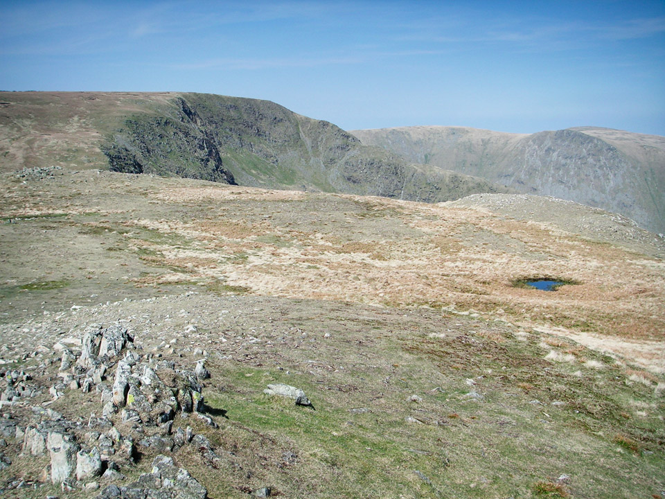
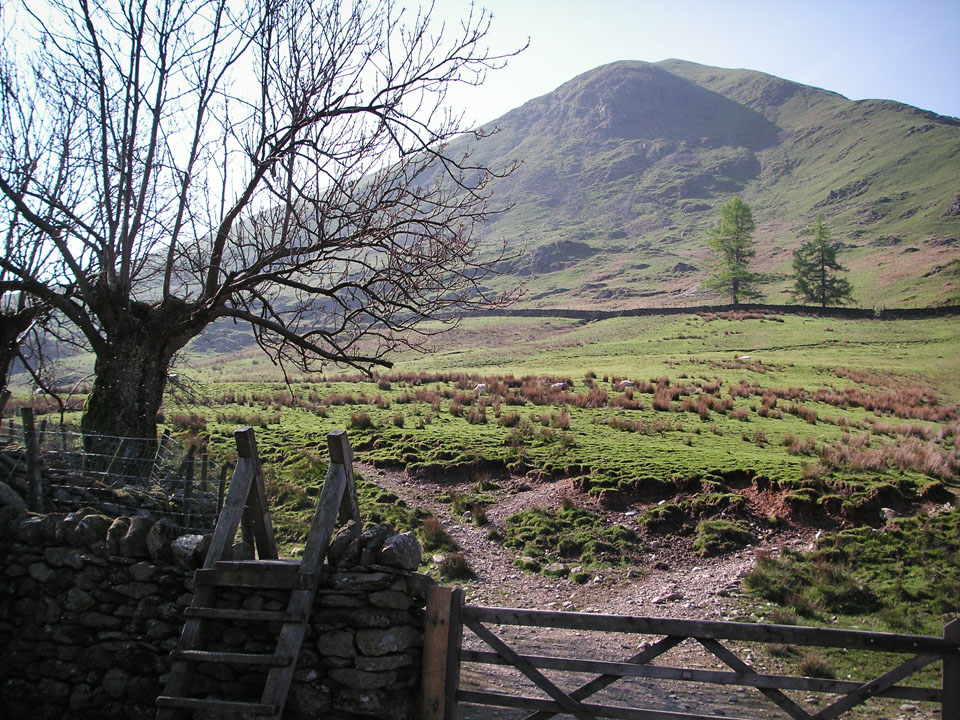
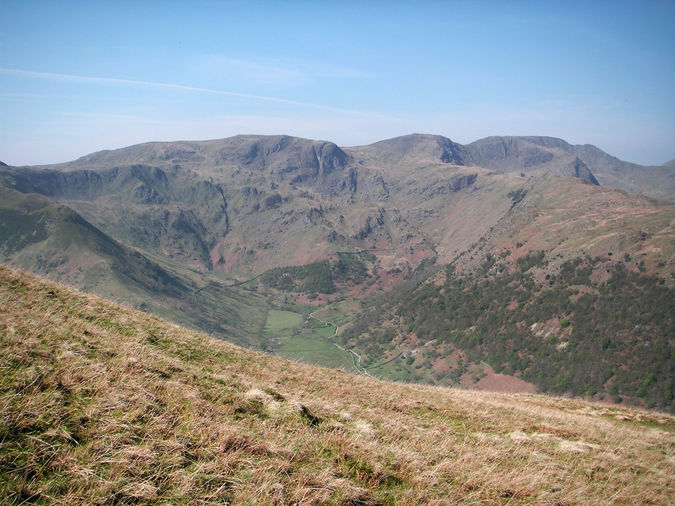
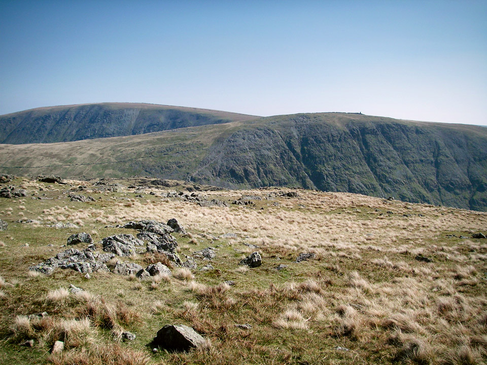
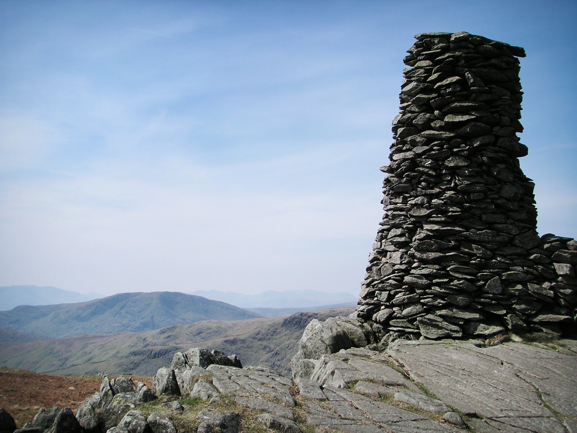
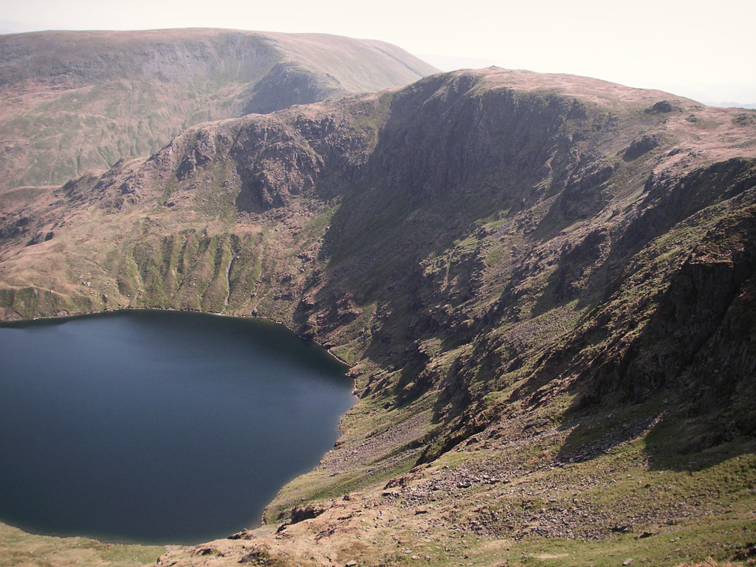
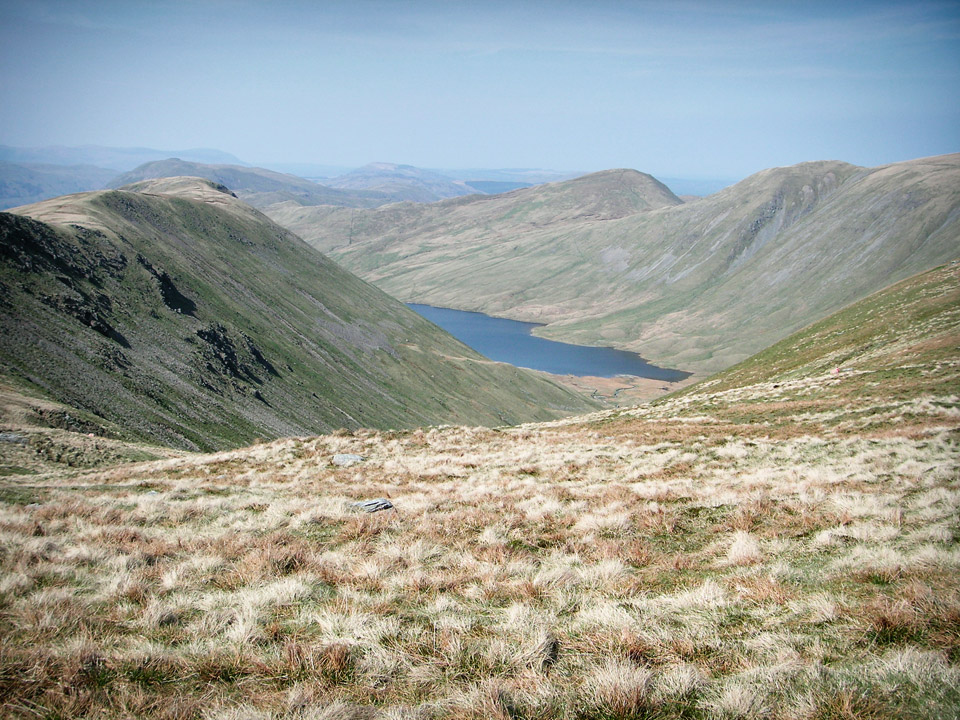

Sun tan cream was at the ready for this day of glorious sunshine in The Far Eastern Fells. It was April 20th 2011 and yes, I have been very slow to update my blog!

**Migration in progress...**

!!!! A sunny 17km route to High Street via Stony Cove Pike. (*Wainwright Book 2: The Far Eastern Fells*)

===

*High Street from path to Mardale Ill Bell.*

I hadn't originally planned the detour around Mardale Ill Bell and High Street, but was making good time and had no intention of finishing the walk in the early afternoon, so had a leisurely stroll around High Street while I made plans for future routes.

Wainwright bagging count now stands at 57...

#### Route Summary

Park at the Cow Bridge car park just to the north of Brothers Water. This was half-term and the car park was almost full by 10am; I got the last space, I think it had only been left empty because it was in an ankle deep puddle. (Wimps!!) There is also a decent looking car park in Hartsop village, but the road was being dug up when I was there.

[View Full Screen](https://map.mootparadox.com/full/stony-cove) | [GPX](https://map.mootparadox.com/gpx/stony-cove)  

<iframe src="https://map.mootparadox.com/embed/stony-cove" height="500" width="100%" style="border:none; margin-top:-1.2em;"></iframe>

Head through the village and up to Hartsop Dodd. Be prepared for a steep climb for the first mile, but once you're up onto the ridge, the rest of the day is a breeze! There's an easy scramble as you cross Threshthwaite Mouth, the rocky col between Stony Cove Pike (fell is Caudale Moor, and Stony Cove Pike is the summit) and Thornthwaite Crag. Then head for High Street via Mardale Ill Bell. This approach gives you some great views into the bowl of Blea Water tarn. High Street is the highest point on the route, so then head back to the beacon at Thornthwaite Crag and descend the ridge of Gray Crag. Again, be prepared for a steep, but easy descent, and then the pleasant stroll back to the car park. This is an easy 19km walk (except for very steep climb at the start) with just over 1000m total ascent.

Allow about 6 hours. Refer to: Wainwright Book 2: The Far Eastern Fells.

#### Car park to Stony Cove Pike

This route starts gently, a stroll through the quiet village of Hartsop, before turning south and climbing steeply to the summit of Hartsop Dodd. A useful tip is that if you cross the small wooden foot bridge at the north end of the village, turn left almost immediately afterwards and follow the river south-east. (The more obvious looking path takes you the wrong side of some farm buildings.) The second and larger bridge, at the east side of the village, is probably better.

*Looking towards Hartsop Dodd.*

The climb to the summit of Hartsop Dodd (only 618m) is very direct and fairly tough going. The beauty of it is that once you're up on the ridge, the rest of the day is nice and easy. It was a bright, clear day and the views from the summit are superb.

I met a Yorkshireman at about that point, who caught up with me while I was sitting eating a granola bar. Ever the master of understatement, I mentioned the climb was slightly steeper than I had anticipated. Without hesitation he replied, "It's a bugger and that's putting it mildly!" I think that's probably all you need to know.

> "The view of Dove Crag and Dovedale across the gulf of the Patterdale valley is exceedingly impressive, a classic amongst views."

*Looking towards Fairfield from Hartsop Dodd.*

As soon as you reach Hartsop Dodd, the path levels out considerably and reflects the rest of the day, which is easy going from here onwards. Navigation is also simple, following a wall most of the way to the summit of Stony Cove Pike. The entire route includes 1050m of ascent, but most of that is behind you by Hartsopp Dodd.

*View of Thornthwaite Crag and High Street from Stony Cove Pike.*

In the picture above, taken from Stony Cove Pike, you see the western side of Thornthwaite Crag, with High Street in the top left.

#### Stony Cove Pike to Thornthwaite Crag via Threshthwaite Mouth

The image below left, shows the steep and rocky descent from Stony Cove Pike. The image below right is looking down from Stony Cove Pike, towards the ascent of Thornthwaite Crag.

*img*?

*Thornthwaite Beacon.*

> "This walk is not as simple as it looks, because the deep gap or col (Threshthwaite Mouth) between the two fells is unsuspected from the top of Caudale Moor. The descent to the gap is steep ... and the climb from it stony and loose."

In these conditions this is an enjoyable bit of scrambling, jumping from rock to rock on the way down, then a steep climb on a path cutting across a scree slope. In the winter, I think it might feel exposed in places - would be worth taking care.

#### Mardale Ill Bell and High Street

I walked to Mardale Ill Bell and High Street as a bit of an after thought because I was well ahead of schedule and had plenty of time for a bit of exploring. On the map it might look like a peculiar diversion, but this is explained as I wanted to return via Gray Crag. A descent to Hartsop via The Knott would probably seem more sensible, but I'll save that for another day!

*Looking at Mardale Ill Bell from below summit of High Street.*

I don't know why, but for some reason I'd underestimated how impressive High Street actually is. The summit is not that impressive I suppose, but the approaches from the west are spectacular. This is definitely somewhere I'll be returning to.

#### Descent via Thornthwaite Crag and Gray Crag

From the tall stone beacon on the summit of Thornthwaite Crag, the steep sided ridge of Gray Crag leads almost directly back to Hartsop. In the photo below, Gray Crag is to the left and the small lake is Hayeswater.

*Gray Crag to left with Hayeswater in the valley.*

> "The summit is a pleasant level plateau of grass between steep cliffs, which should be visited for their striking downwards views."

The route to Gray Crag follows the top of the ridge. The path is clear, but becomes increasingly indistinct as you descend. There's no difficulty in route finding, but unless I was missing something obvious, I found myself descending unmarked grassy slopes as I dropped down to Hayeswater Gill. From here you pick up a farm track which leads right into Hartsop.

#### Summary

The weather was so good today that I'm sure any walk would have been very enjoyable, but I do think this is a fairly decent route. If I hadn't been concerned about "bagging" Gray Crag, I'd probably have continued from High Street to The Knott, and maybe also Rest Dodd and Brock Crags, before dropping back down to Hartsop.

High Street is definitely a mountain I need to explore further, and the ridge of Yoke, Ill Bell and Froswick particularly caught my eye. It also struck me as prime wild camping territory, and after my recent excursion around the Northern Fells (post coming soon!) this might be the ideal area for my next overnighter!

> "...to those who travel alone, the solitary wanderers on the fells, who find contentment in the companionship of the mountains."
> 
> 