On the eve of my 38th birthday, it would have been almost exactly 20 years since I'd spent a night under canvas - or in this case, lightweight sil nylon. After about nine months of day walks and Wainwright bagging, acquiring gear whenever I saw something that looked good value, it was finally time to take the plunge and extend a route over a couple of days.

!!!! A 30km circuit of the Northern Fells, starting at the Black Moss layby. (*Wainwright Book 5: The Northern Fells*)

===

I decided to take this opportunity to walk the final two summits of the Northern Fells; **Mungrisdale Common** and **Great Calva**, which for various reasons I'd never managed to combine into a sensible one-day route.

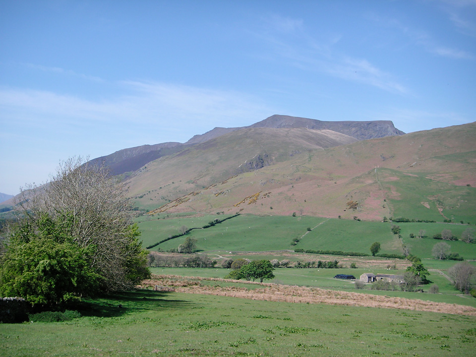
*The Northern Fells dominates the view as you approach along the A66.*

My plan was to park near Black Moss, just below Carrock Fell. I was heading for Blencathra (hopefully via Sharp Edge but keeping my options open) and I wanted to visit Bowscale Tarn on route. After that I'd cross Mungrisdale Common and head for Great Calva, camping near to Knott. As it turned out, it was a really pleasant evening and I went farther than I had originally planned, stopping closer to High Pike, somewhere just below 600m. This left a very short second day, only about 6km, but that suited me fine, as I mainly wanted to test out my gear and to see how I felt about camping after several years.

I'm happy to say it went very smoothly, and I felt like I passed a significant milestone as I completed all fells in Book 5: The Northern Fells. Wainwright bagging count now stands at 59.

> "Blencathra and Carrock Fell and the Ullock Pike ridge of Skiddaw ... would rank high in any company."

#### Route Summary

[View Full Screen](https://map.mootparadox.com/full/northern-fells-30k) | [GPX](https://map.mootparadox.com/gpx/northern-fells-30k)  

<iframe src="https://map.mootparadox.com/embed/northern-fells-30k" height="500" width="100%" style="border:none; margin-top:-1.2em;"></iframe>

**Day 1** - Park at Black Moss and follow the road through Mosedale Village and take the path to Bowscale Tarn. From the start of Tarn Sike, there's a good path up the face of Tarn Crags, heading due West. Head for Blencathra via Bowscale Fell. I headed for the base of Foule Crag and followed the contour around, towards Brunt Knott, and picked up the ridge of Sharp Edge from there. (The path is intermittent, but it's a decent route.) Ascend Sharp Edge and head for Blencathra summit. Descend to the north-west, passing across the bottom of Blue Screes and pick up the path to Mungrisdale Common. I took a fairly direct route to Great Calva ascending from the east; this was a mistake. It was heavy going off Mungrisdale Common through bogs and deep heather (even in these dry conditions) and it's the steepest possible route up Great Calva. A better option would have been to head for the Cumbria Way path and climb Great Calva from the south-west. Cross the col between Little Calva and Knott, following the Cumbria Way path below Great Lingley Hill and camping near Drygill Head.

**Day 2** - Get back onto the ridge and follow the path over Miton Hill, Round Knott and Carrock Fell. Descend the gulley of Further Gill Sike (very steep) and northwards across the crags below Scurth. This leads you directly back to Black Moss.

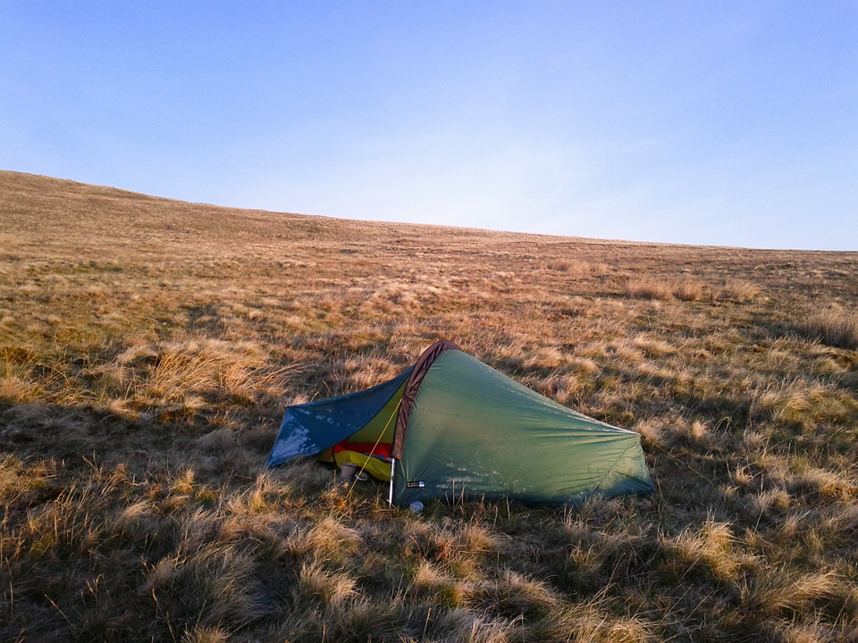
*Frosty tent at Dry Gill Head.*

#### Mosedale to Blencathra

I can understand why the path from Mosedale to Bowscale Tarn is popular. It's an easy gradient and the tarn is wonderfully hidden by a large moraine dam. Great spot for a picnic, though I fear it perhaps might be a little too popular at weekends. On this Tuesday morning is was very quiet. I sat at the water's edge for several minutes, enjoying the scenery, and it was not until I got up that I saw I had company. Two walkers lying on the grass on the far side of a small rise. It's a very tranquil spot.

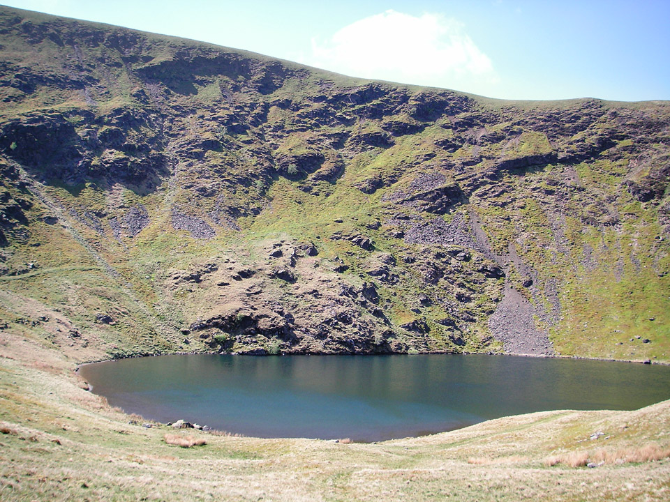
*Looking into Bowscale Tarn from the moraine dam.*

> "...tiered crags carved by ice; silent waters embanked by moraines; scattered rocks in the wake of the departed glacier..."

There's a path (not marked on OS map, but clearly visible on the ground) that climbs the headwall due west from the start of Tarn Sike. It takes you nicely onto the ridge leading to Bowscale Fell and Bannerdale Crags, and ultimately on to Blencathra.

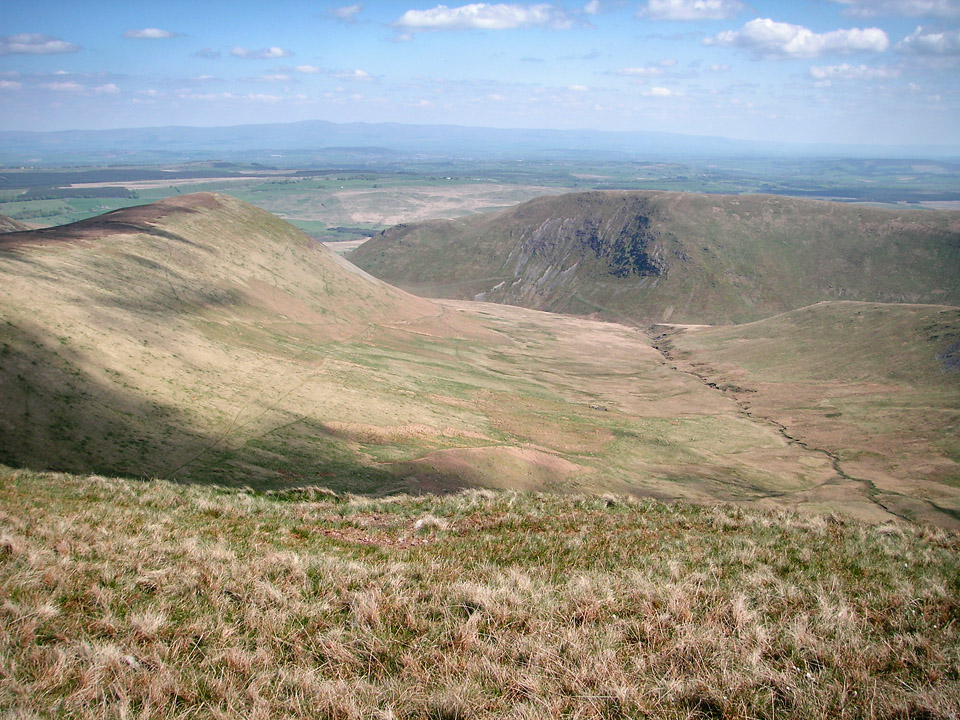
*Looking into the Bannerdale Valley.*

The picture above is from the path between Bowscale and Bannerdale Crags, looking into the Bannerdale valley, towards Souther Fell. It would have been a short detour to the summit of Bannerdale Crags, but I was keen to move onto Blencathra. There's a col between Bannerdale Crags and Atkinson Pike, near the source of the River Glenderamackin. The main path leads you to Scales Tarn, but it descends about 100m in the process. I began following this path, but at the 600m contour, I headed in towards Foule Crag. There's no path at first, but you do pick one up as you approach the north-east end of Sharp Edge. You attain the ridge just as it starts to get interesting.

I suspect this is an unconventional approach route, but suited me well, and I'd say it's definitely worth considering.

#### Blencathra via Sharp Edge

This was my first ascent of Sharp Edge and I can confirm it's a first class bit of Lakeland scrambling!

The route finding wasn't quite as obvious as I'd anticipated. I made the decision to keep to the peak of the ridge and follow it direct to the summit. To my mind, there's a moment of doubt as you drop down from the sharpest section, into a kind of hollow between two scree filled gullies, dropping away left and right. It looked like the path might divert somewhere to the right, but it didn't look very sound. I stuck with my strategy and kept going in a straight line, but this does necessitate a few metres of climbing up a steep rock slab, although there are good holds in a crack to the left. You then find yourself in what feels like a well protected gully, and by the time you've followed this, you're not far off the final push to the summit.

Easy going in dry conditions, but the rock is well polished and care would definitely be needed in the wet. Numerous crampon scratches on the rock attest to this being a serious section of winter climbing.

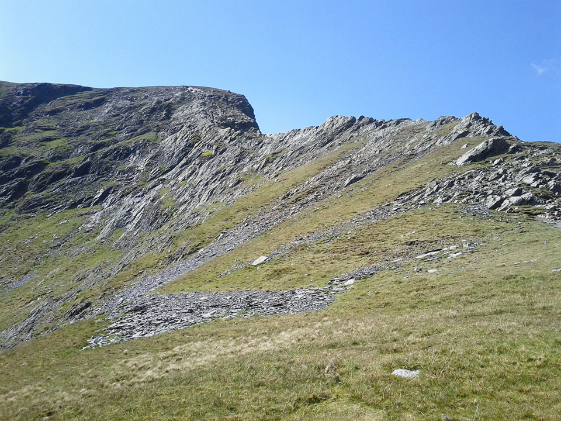
*Looking upwards along Sharp Edge.*

The picture above, shows the route along Sharp Edge, leading to the summit of Atkinson Pike. Keep in mind that the actual summit of Blencathra is a few hundred metres to the south.

> "This is a mountain that compels attention, even from those dull people whose eyes are not habitually lifted to the hills."

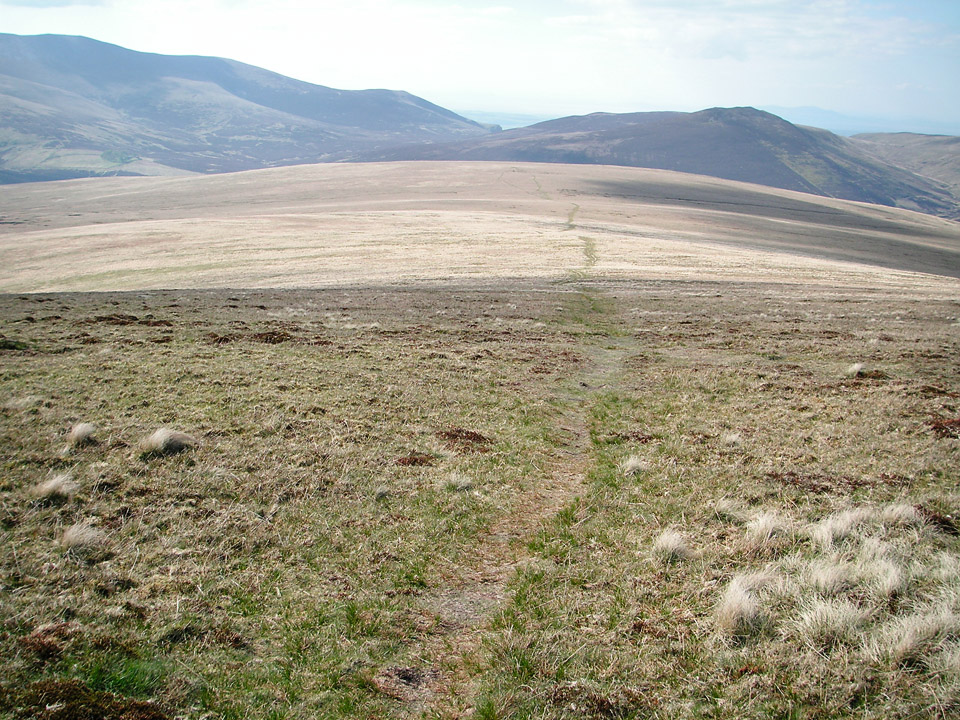
*The exciting summit of Mungrisdale Common.*

Mungrisdale Common has something of a bad rap for being boring, and some have questioned what possessed AW to designate it a Wainwright. In it's defence, it does occupy a key central location and commands views of most of the main summits in this Northern Fells group. So as you'd expect, it's not exciting, but I'll concede it is worth a visit. I think a worthwhile tip is that although it's a simple rounded hill, give some care to your route planning, as the options for crossing the River Caldew are not always straightforward. After the fact, I wish I'd descended to the south-west, picked up the Cumbria Way path and headed north past Skiddaw House.

> "Mungrisdale Common's natural attractions are of a type that appeals only to sheep."

As it was, I ended up to the south-east of Great Calva. There's a path that follows a wire fence up the east side of the fell. It's very steep in places and heavy going at the end of the day. For future reference, I'd suggest an approach from the west!

#### Great Calva to Drygill Head

Once on the summit of Great Calva, the going is easy, but by the looks of the ground, I'd say it would turn very boggy after any prolonged rain. Luckily, it was dry as a bone today, and I made good time over Knott and Great Lingly Hill. I was also on the lookout for a camp.

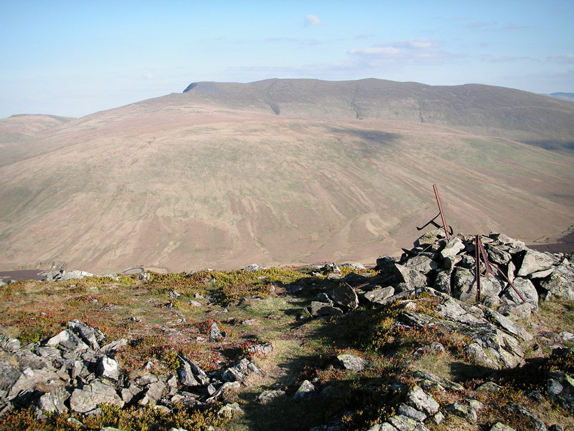
*From Great Calva, looking towards the 'back' of Blencathra.*

> "The actual top, which is stony, is a fine belvedere, but behind is an extensive plateau without an irrigation system..."

My first thought for a campsite was an area marked Coomb Height on the OS map. I think it would have made a good spot, but I was enjoying the golden light and kept going another couple of kilometres. I collected a 2 litre Platypus of water at Grainsgill Beck, which I'd noted on previous walks as a good clear, fast flowing stream. Everywhere was so dry, I wasn't confident of finding a decent stream near the appropriately named Drygill Head, and it proved to be a good decision.

#### Wildcamp

There are plenty of good wildcamp spots around here and after some fairly characteristic indecision, I settled on a spot near the head of Brandy Gill.

I got my Laser Competition pitched, and unpacked my sleeping bag to let it loft while I ate supper; a dehydrated Reiters Travel Lunch Vegetable Risotto that I picked up in GoOutdoors. It was rapidly getting a bit chilly, and after some brief star-gazing (it was a fantastic clear night) I was asleep before 10pm. For what was really feeling like a summer walk, I was a bit taken aback by the drop in temperature overnight. I woke up twice. The first time because of a cold draught and I needed to tighten up the sleeping bag hood. The second time was by some frozen condensation dropping onto my nose.

However, I have only good things to say about my gear, and I'll add a couple of notes to the summary.

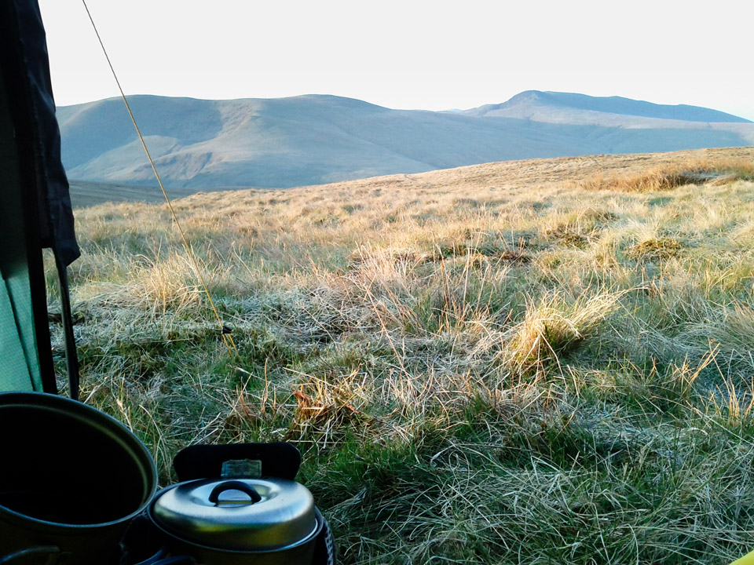
*View from my tent doorway.*

I awoke around 6am. It was fresh, but warming quickly as the sun rose. On the dawning of my 38th year, I was more than satisfied by the view from my front door; see above.

#### Drygill Head to Mosedale Moss via Carrock Fell

Day two was to be a short walk back to the car, and an early finish - with getting started at such an unearthly hour! It was a beautiful morning and it felt like I had the hills to myself; I probably did.

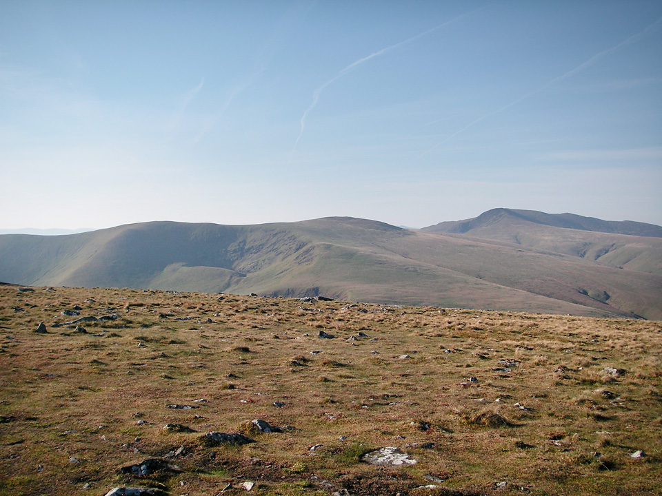
*Looking towards Bowscale and Blencathra.*

The last time I climbed Carrock Fell, it was wet and boggy underfoot, but these conditions were very different. Worth bearing this in mind though if walking here in more normal weather.

> "Amongst the igneous rocks of which the fell is formed is gabbro - the stuff the Black Coolin of Skye are made of but a rarity in Lakeland."

The Carrock Fell ridge becomes steep as you drop down towards Black Moss, and becomes very steep from Further Gill Sike to the valley floor. The summit is the site of an Iron Age hill fort, built by the Celts, destroyed by the Romans. You can see why it occupies a good position, although there's very little of it left. It's views over the Eden Valley towards the Pennine Hills are very impressive.

#### Summary

I have to say I am very happy with this first bit of backpacking after such a long absence. The improvements to the gear available today compared with the early '90s is dramatic. I kept all my old kit, apart from my LaserTrek rucksack that was damaged, so I'll write something about gear once I've written up my next trip report, a circuit to the south of Martindale.

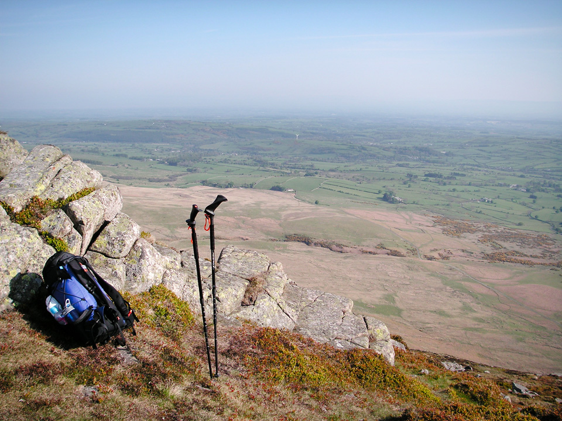
*Descending Carrock Fell, overlooking Vale of Eden.*

The quick snapshot below was taken as I unpacked - apart from the water bottle that I was still using!

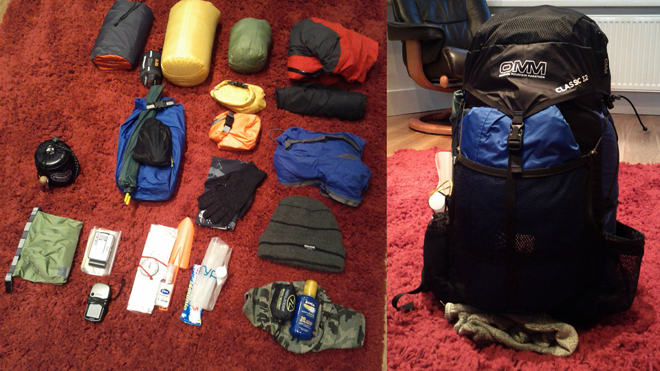
*Unpacking the OMM Classic 32.*

Everything packed OK in my 32L bag, except that the tent had to fit in the rear mesh pocket. I'd initially felt this was a bit of a compromise and it would have been nice to get everything inside, but it actually worked better to keep it there.

In summary, a definite success, and now looking forward to my next mini-expedition.

> "...to those who travel alone, the solitary wanderers on the fells, who find contentment in the companionship of the mountains."
> 
> 