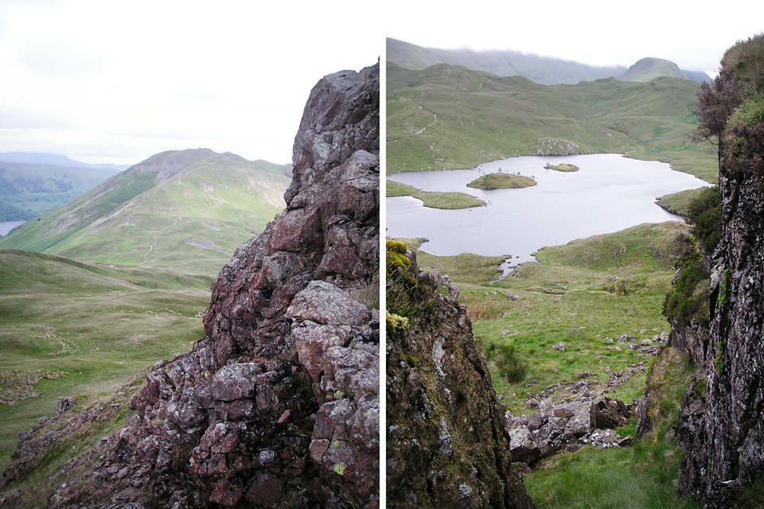
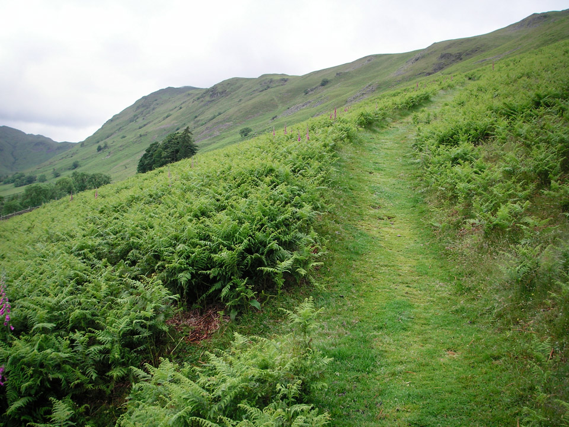
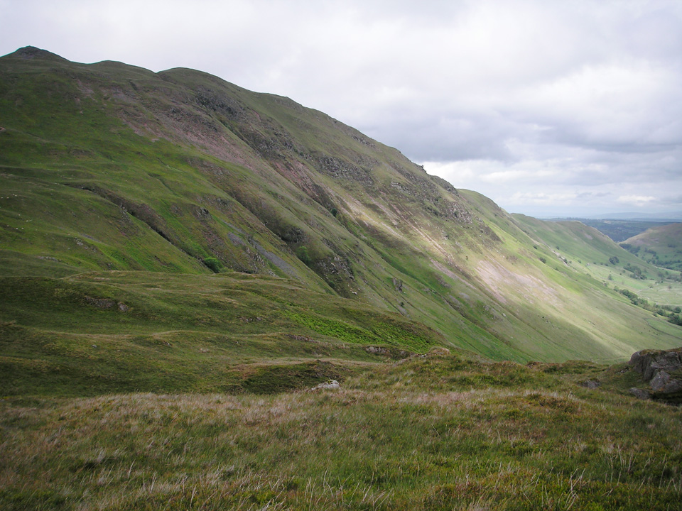
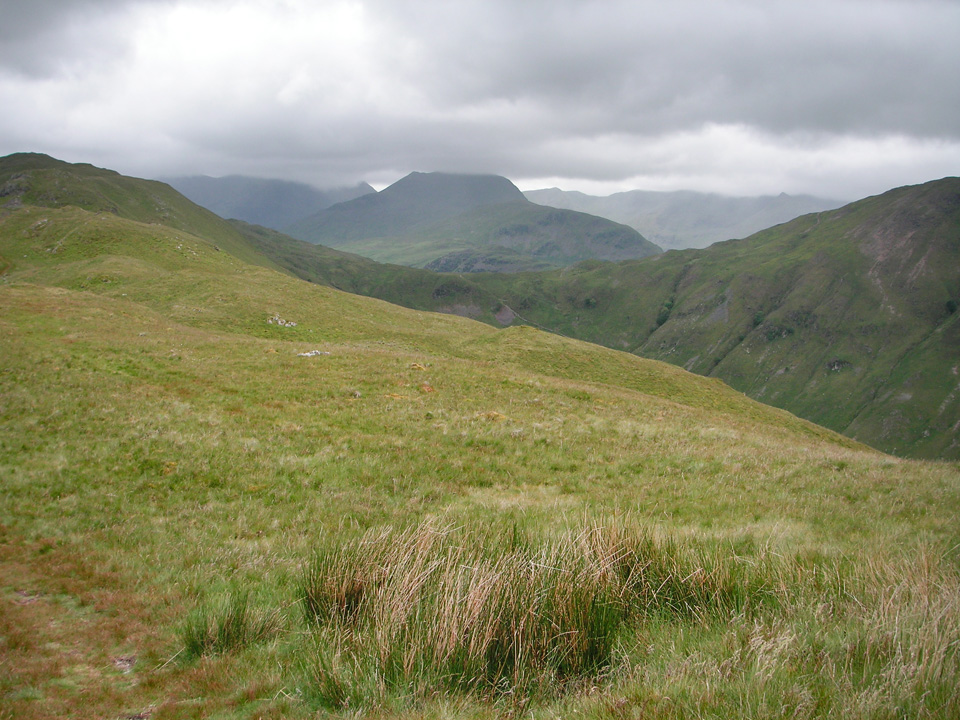
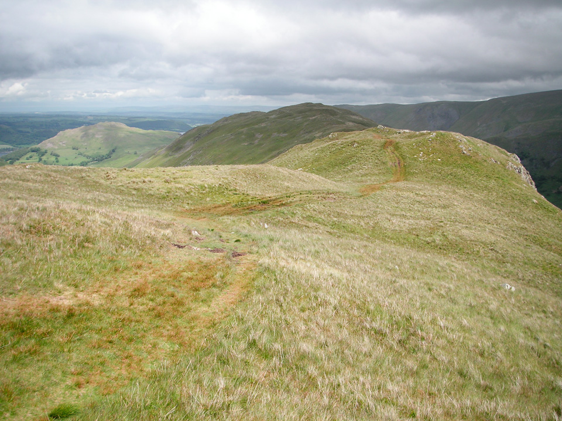
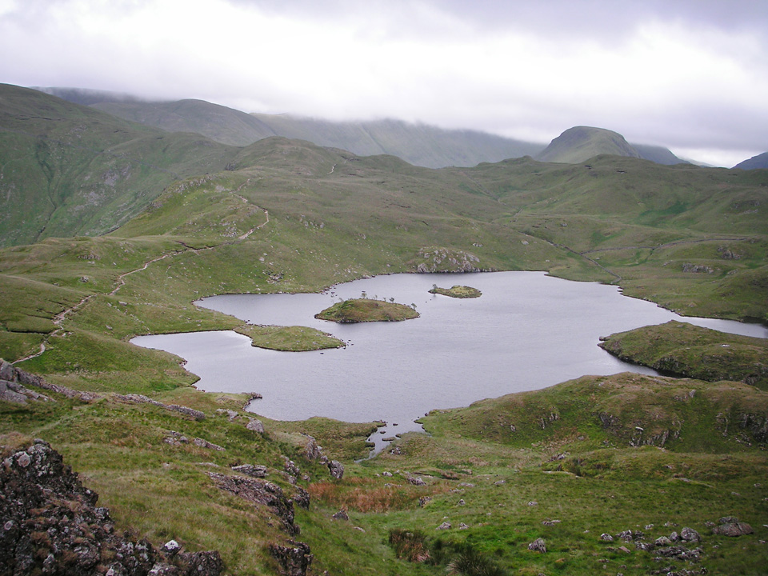
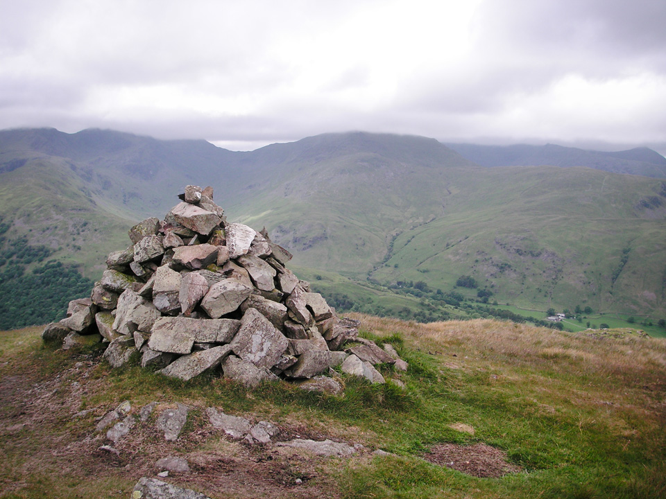
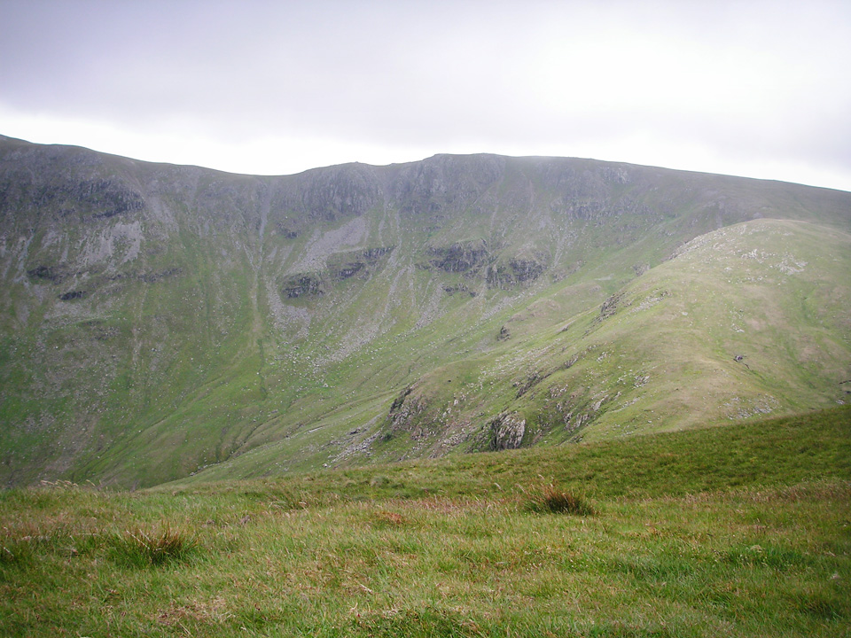
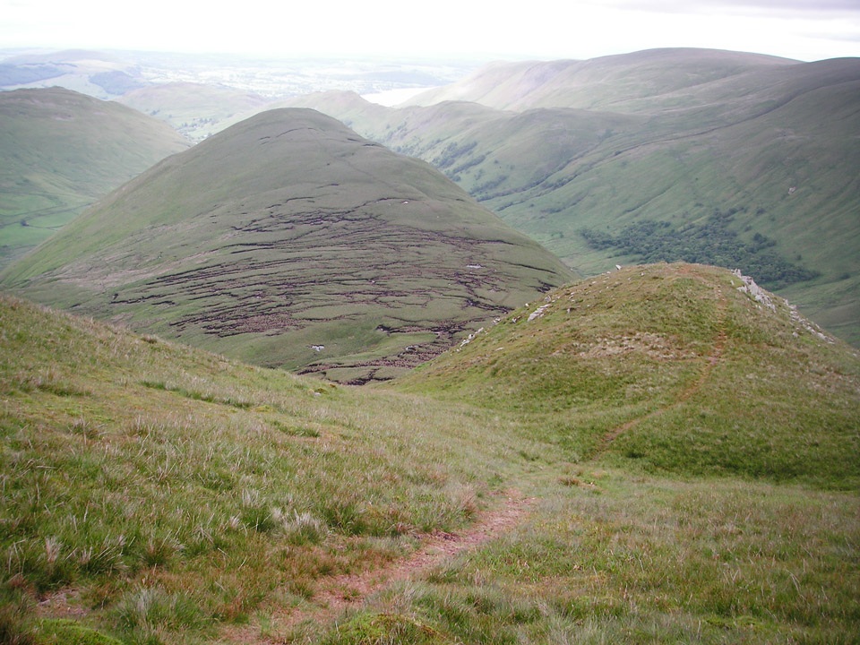
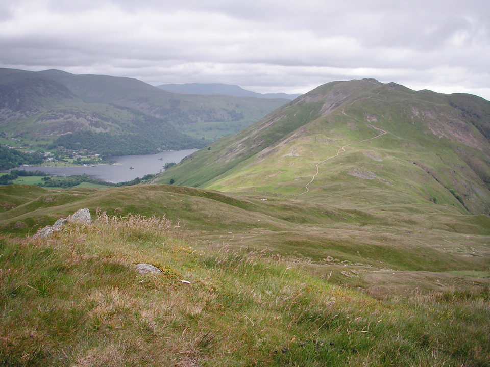

Looking at the dire weather reports on the Accuweather Mountain Forecast, the Mountain Weather Information Service, the BBC and the Met Office, I had almost come to the conclusion it wasn't worth setting off on the drive to the Lakes on this un-promising 15th June 2011. My mind was quickly changed by the Pooley Bridge Steamer Pier webcam. This showed the reality of the situation, damp but reasonably bright conditions, with summits just visible. I'm not overly concerned by rain - just so long as I'm still getting a decent view. In the words of Jerome K Jerome, "*we told ourselves that nature was beautiful, even in her tears*".

!!!! A 20km circular route, starting from the Winter Crag car park in Martindale. (_Wainwright Book 2: The Far Eastern Fells_)

===

### Map

[View Full Screen](https://map.mootparadox.com/full/martindale1) | [GPX](https://map.mootparadox.com/gpx/martindale1)  

<iframe src="https://map.mootparadox.com/embed/martindale1" height="500" width="100%" style="border:none; margin-top:-1.2em;"></iframe>

Mistrust of the weather forecast was a good decision, with a morning of light rain that cleared into a very pleasant afternoon; it was t-shirt weather by the time I got to The Nab. Living in a climate that's as unpredictable as ours, I think there's a good case to just go with your plans, carry appropriate kit so you'll be prepared for whatever the weather might throw at you, and if all else fails - then be prepared for a last minute change of plans, if conditions dictate.

*Views from the northern summit (towards Place Fell, left) and the southern summit (right) of Angletarn Pikes.*

In spite of the damp start, I added another 6 Wainwrights from Book 2: The Far Eastern Fells. Bagging count now stands at 65.

### Route Summary

Park near the church at Martindale. I accidentally parked next to the church at Christy Bridge (half a mile down the road) and it's possible this was not appreciated as, by the time I returned, someone had ostentatiously parked a silage trailer in the middle of the road. Hard to say if this was a "statement", or just the perfectly normal parking attempts of a bewildered moron.

Wherever you eventually decide to park, leave your windows closed and cross the lower portion of Housteadbrow (below Winter Crag) and head up to High Dodd via Garth Heads. Follow the ridge to the summit of Place Fell (657m). This is a pretty gentle climb. It's then a steep descent to Chapel in the Hause, and any normal person would head straight to Angletarn Pikes. Therefore, I took a lengthy diversion to Beda Fell (509m) before climbing back up to Angletarn Pikes (567m). From here the route follows a natural progression to Brock Crags (561m) and Rest Dodd (696m) with another steep descent via The Nab (576m).

### Carpark to Place Fell

I think it's probably best to play it safe, and park in the area next to Martindale Church. There's not much other parking to be found, and the roads are very narrow, so probably worth arriving early at weekends and during holiday times. Beyond the Christy Bridge chapel, there's no parking opportunities so far as I could tell. However, on this wet Wednesday in mid-June, there was plenty of space. Cross over Howsteadbrow into the Boredale valley and follow the gently angled path to High Dodd.

*Gentle climb to High Dodd.*

The rain started getting heavy as I reached the top of the ridge and I eventually donned my Paclite over-trousers. I was also struck by a long forgotten smell; wet ferns! It's funny, because it's a distinctive smell I seem to remember a lot from childhood, but hadn't noticed it in a long time. It made walking through the driving rain almost completely worthwhile!

> "Place Fell rises steeply from the curve formed by the upper and middle reaches of Ullswater and its bulky mass dominates the head of the lake."

Once you're onto High Dodd, it's an easy walk up to Place Fell, via the ridge of Hart Crag.

*Looking back to Place Fell from Beda Fell Knott.*

From Place Fell, you descend rocky paths to Round How, whereupon the path steepens considerably until you reach Chapel in the Hause. It would be a short walk from here to the northernmost summit of Angletarn Pikes (about 1km) but instead I took a 6km diversion around to Beda Fell and back. Had to be done, but took longer than I'd anticipated and it put me a bit behind schedule.

### The elongated Beda Fell diversion

For the summit bagger, Beda Fell is awkwardly placed. It's easy to fit into a couple of shortened horseshoe walks, either the combination of Place Fell & Beda Fell, or the Beda Fell, Angletarn, Brock, Rest Dodd, Nab side of the valley. Both would make for good routes, but just a tad too short at around 13-14km each, and hence my "W" shaped horseshoe approach!

From Chapel in the Hause, head to Beda Fell Knott, then along ridge to cairn at Beda Head. The clouds were lifting to some extent and I was able to switch from full waterproofs to a Lightspeed over my microfleece top.

*St Sunday Crag, viewed over col at Chapel in the Hause.*

There are nice views throughout. In the photo above St Sunday Crag is almost visible in the cloud, although Fairfield (to the left) and the Helvellyn range (to the right) are a bit more clouded in.

> "The fell is best climbed along its north ridge, over the serrated crest of Winter Crag."

*The view towards Beda Head.*

Beda Head turned out to be a very nice spot for a stop, with great views over Martindale and Ullswater. After the mandatory Granola bar, retrace footsteps, climbing along the line of Heckbeck Head towards Angletarn Pikes.

### Angletarn Pikes to Brock Crags

This was my first visit to Angletarn Pikes, but will be very happy to return. There would be plenty to explore, some decent scrambling to be had - or go the whole hog and bring your bouldering mat! Would also make a great spot for a wildcamp, but I get the feeling it might be a little too popular. There are two distinct summits to Angletarn Pikes, the northern one being a couple of metres higher.

> "Twin upthrusts of rock, 200 yards apart, give individuality to this unusual summit; the northerly is the higher."

*Angle Tarn seen from below the southern summit of Angletarn Pikes.*

It might be advisable to descend south-west from the southern summit as I ran into some very boggy ground on the north-east side, but either way, it's a short walk back to the main path that leads you around the Tarn below the ridge of Buck Crag. The natural line of this route would take you up Satura Crag to Rest Dodd, but I took a short diversion up to the summit of Brock Crags.

> "It is as a viewpoint that the summit merits the most respect."

Summit cairn at Brock Crags, with Dove Crag and Hart Crag in the background

Brock Crags is perhaps not the most exciting summit in the world, but well worth a visit for its (potentially) superb views of the surrounding hills, not least St Sunday Crag and the Fairfield range, as well as some great views towards Stony Cove Pike and High Street.

### Rest Dodd and descent via The Nab

The climb to Rest Dodd, although only about 150m above the col leading to Satura Crag, is a bit of a pull at the end of the day, but once at the summit, it's pretty much all downhill from there! Notably, descending across the aptly named Deer Forest.

*Rampsgill Head seen from summit of Rest Dodd.*

> "Rest Dodd stands at an angle on the undulating grassy ridge coming down from the main watershed to the shores of Ullswater, and its south-west slope, which drains into Hayeswater Gill, is crossed by the track from Patterdale to High Street."

It's particularly worth noting the bogs between Rest Dodd and The Nab. In fact, you can't miss them, and it does tend to slow your progress somewhat. I caught a few glimpses of red deer, and noted a sign which asked walkers to keep a distance and avoid causing any disturbance to the herd. My plan had been to descend to Rampsgill Beck and follow the farm track back to the road, but that would have taken me through the middle of dozens of them. I decided to simply follow the line of the ridge, descending Nab End, and thus avoiding the deer entirely.

*The Nab seen from the descent of Rest Dodd.*

There are a couple of points worth bearing in mind with this. Nab End is extremely steep and makes for a tricky descent. Dropping 150m in about 300m sounds ok, but short sections of it are steeper than this might suggest. Dig in your walking poles and take it steady! Also, I joined a farm track near Rampsgill Beck, had to climb a fence into an adjacent field to avoid an angry bull, and once back on the road I saw various signs saying private, and further on - an electric fence. It was only later that I realised the reasons for this, the area around The Nab being home to the oldest native herd of red deer in England. This is another good reason to read your Wainwright guide before the walk, rather than after you've finished your blog post! (And note the second edition contains much additional info on this point.)

### Summary

This is an enjoyable route, but I'd hesitate to recommend the fairly drastic diversion I took to Beda Fell. It's an inevitable consequence of trying to combine Beda Fell and Place Fell into a longer circular route. The ascent of Beda Fell from Housesteadbrow would have been nice, but then you either have to descend the same way, or carry on and undertake a pretty tiring ascent and descent of Place Fell from Chapel in the Hause. To anyone not concerned with Wainwright Bagging, I'd definitely suggest doing one or the other, but not both, then carrying on with the route to Angletarn Pikes. (Personally, I think I'd be quite tempted to climb Beda Fell from Housesteadbrow, via Winter Crag...) Also, as I now realise, The Nab should probably be avoided, particularly in the summer.

*Place Fell and the south end of Ullswater.*

Perhaps surprisingly, this was only the third time I'd needed full waterproofs since August 2010. Oh the joys of the English summer! For me, this is a Rab Latok Alpine jacket, which I've been very pleased with - and love the hood, and some Berghaus GoreTex Paclite pants. Again, I've found them great, even in these warm and damp conditions.

Next posting on this blog will either be my ascent of Great End from Seathwaite, or some new baby photos... whichever comes first. But, with a due date of 8th August, personally I wouldn't bet on Great End!

> "...to those who travel alone, the solitary wanderers on the fells, who find contentment in the companionship of the mountains."
> 
> 