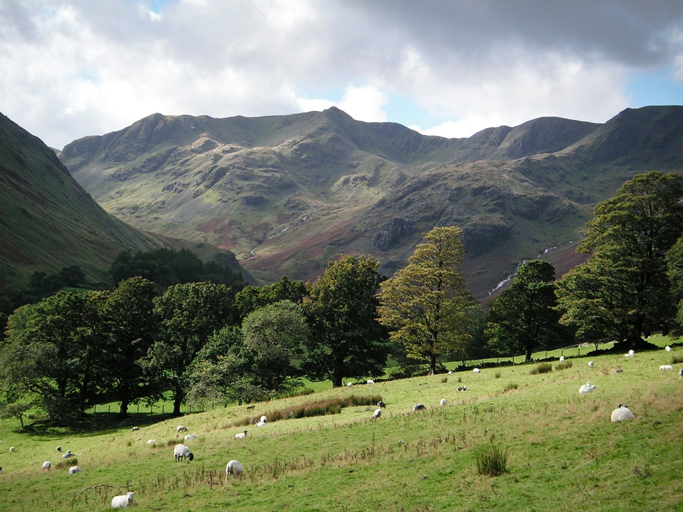
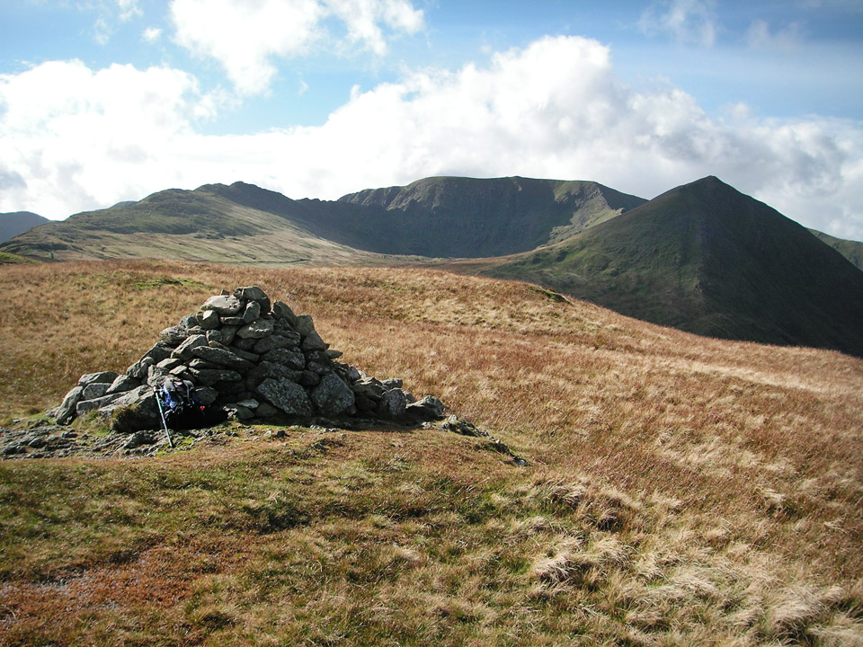
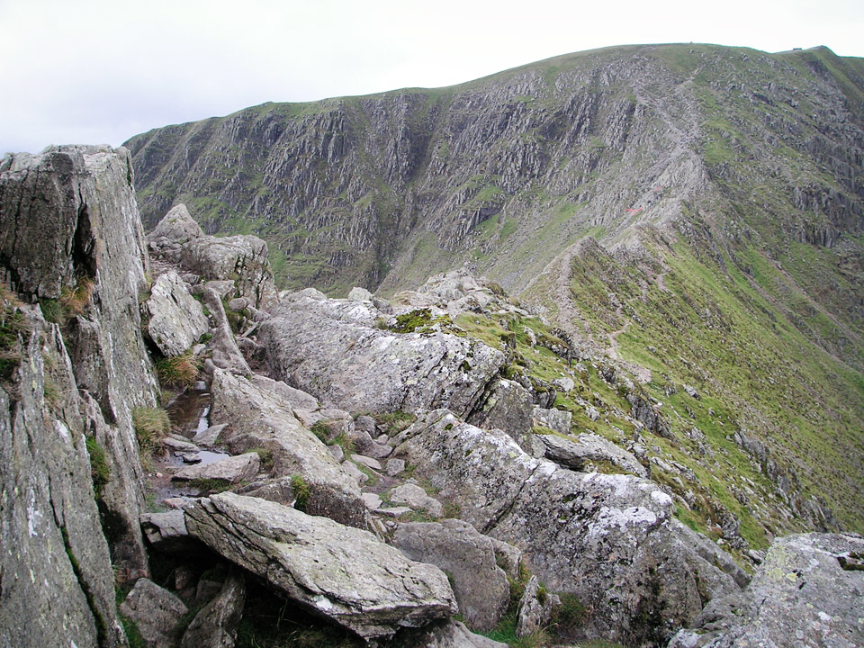
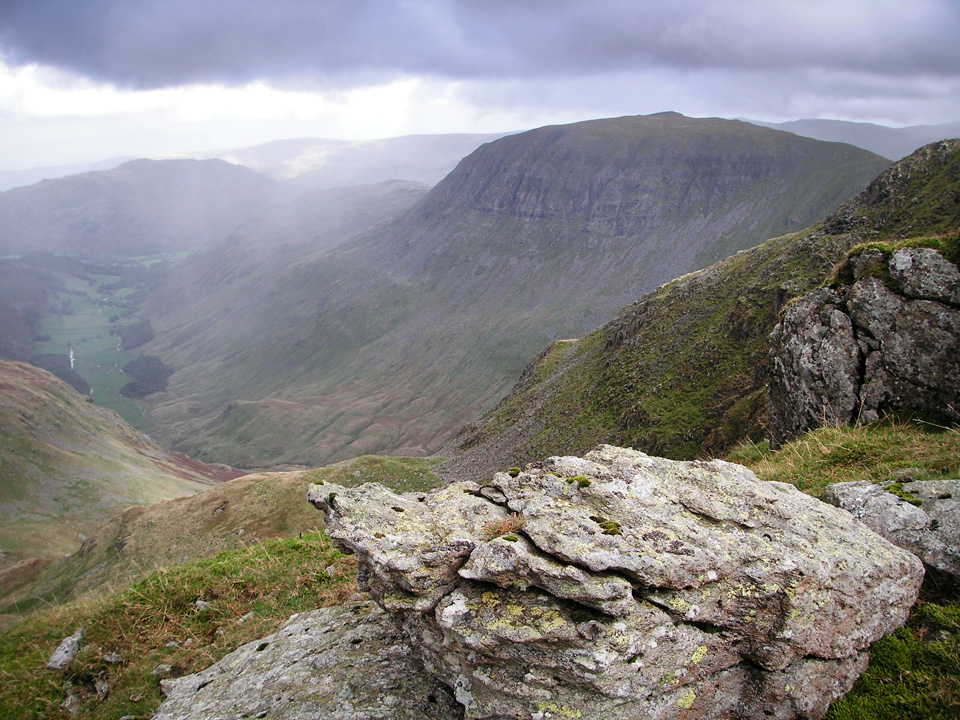
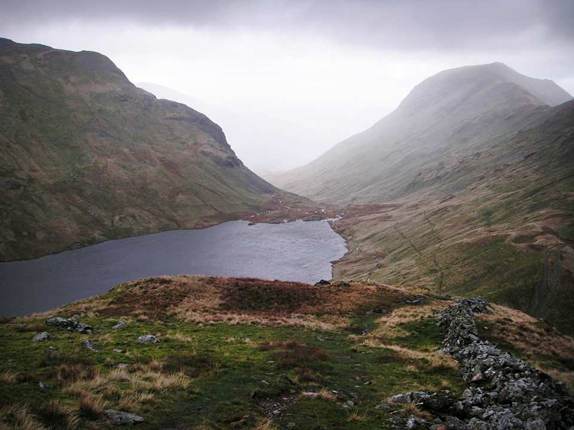
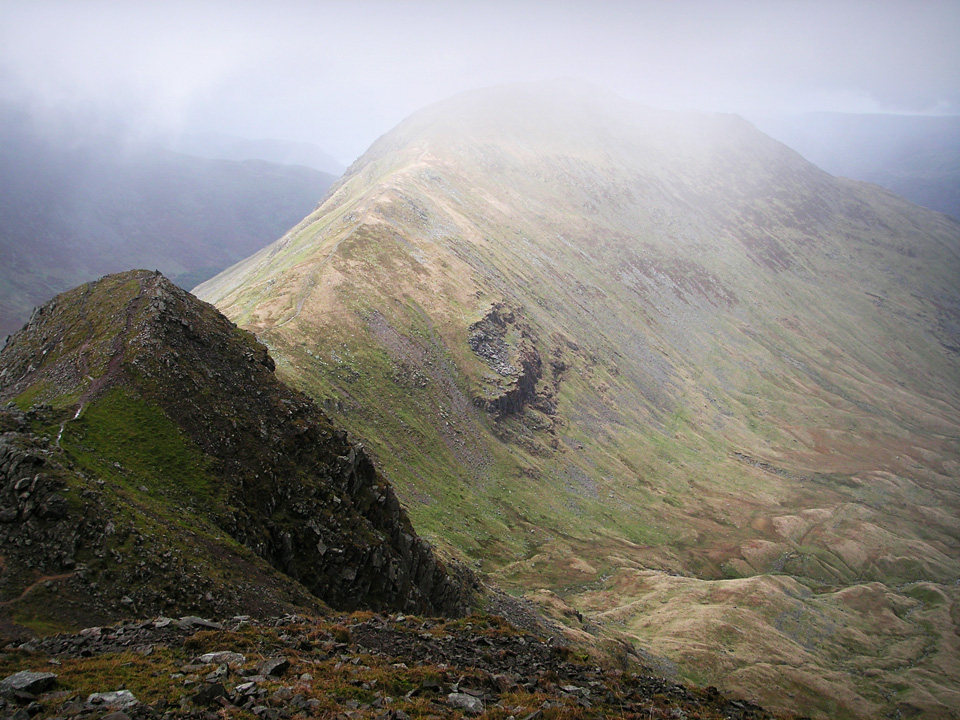
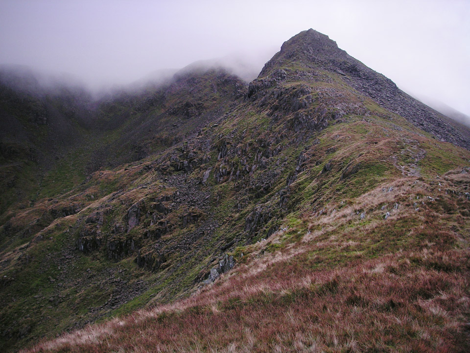
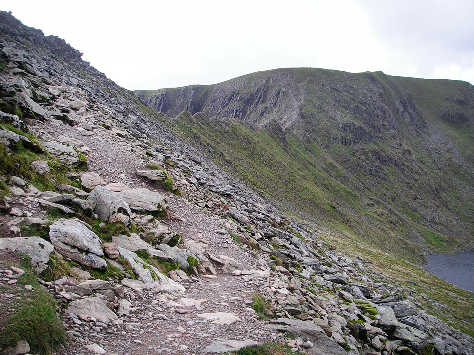

It was the scene below, from near Grisedale Beck, that reminded me what I have always looked for in a Lakeland walk. The high, craggy fells - not the sheep! The day was destined to end in darkness and fog, navigating off Arniston Crag with a headtorch. Not my original plan, but a lesson in always being prepared.

!!!! A 23km circular route with 3300m of ascent, starting in Patterdale. (_Wainwright Book 1: The Eastern Fells_)

===

I began this project of Wainwright Bagging in August 2010 with a clean slate; I can't remember which summits I visited 20 years ago. I began with the Northern Fells. Blencathra will always be a personal favourite, and I'm sure I'm not alone in that, but Helvellyn was probably the first mountain I ever wanted to climb. For many, it's probably the first (or only!) summit they would think about.

*View towards Helvellyn.*

And so it was on Wednesday, 6th October, that I found myself back in Glenridding and Patterdale for the first time in many years, to tackle a modified Grisedale Horseshoe. I believe the classic route would be structured around Catstycam, Helvellyn and St Sunday Crag. In this walk, I wanted to include Striding Edge, and some additional Wainwrights, so the horseshoe became extended; nine Wainwrights to be precise. It also added up to around 8000 feet of ascent, and a fairly tough daywalk.

### Route Summary

Park in Patterdale. I was lucky and managed to get into the road-layby near the White Lion Inn, but otherwise go to the Patterdale Hotel and hand them the shirt off your back. (Or £3.50 at 2010 pricing if you think you might be needing your shirt later.) There's a public toilet in the White Lion car park, which is a welcome sight after a 90 minute drive! From there, head directly to Hole in the Wall via the path that takes you through the Patterdale Hotel car park. I followed the Striding Edge path, but only after a short detour to Birkhouse Moor. 

The Helvellyn summit is the beginning of a route along the edge of the crags that takes you to Nethermost Pike and then Dollywaggon Pike. Drop down to Grisedale Tarn, and climb Seat Sandal from the north and descend to the east, down to Grisedale Hause. Climb the scree/path up to Fairfield. Head down the ridge, over Cofa Pike to Deepdale Hause (some care is needed here) and then on to the summit of St Sunday Crag. This is now well into the homeward stretch! Head back towards the Patterdale Hotel, via Birks and Arniston Crag.

### Map

[View Full Screen](https://map.mootparadox.com/full/grisedale) | [GPX](https://map.mootparadox.com/gpx/grisedale)  

<iframe src="https://map.mootparadox.com/embed/grisedale" height="500" width="100%" style="border:none; margin-top:-1.2em;"></iframe>

### Route to Helvellyn

From the road, a good checkpoint is the Patterdale Hotel car park. The path exits the back of the car park and, whilst the route is a little indistinct in places, you are basically following a stone wall all the way to below Thornhow Crag. From here on the path is unmissable and you drop down to Grisedale Back and begin the gently graded walk up to Hole in the Wall. It's worth the short detour to Birkhouse Moor, and not just to 'bag' the Wainwright, because there are fantastic views over Ullswater and beyond.

*Birkhouse Moor to Helvellyn.*

It was windy on Striding Edge and I kept slightly below the ridge to the northern side for most of the route.

*Striding Edge towards Helvellyn.*

I also noticed an inordinate number of discarded banana skins along the way. I can only assume this is the result of some kind of misguided tribute to the late Norman Wisdom, but whoever thinks this is a good idea must be positively loopy!

Aside from the dangers posed by hordes of banana wielding cretins, I'm fairly sure Striding Edge should be the route of choice in most ordinary conditions. Enjoyable and I suspect slightly in ascent, there's a school of thought that the steep dropoff from the summit and climbing up the short chimney to attain the ridge, could be more the more pleasing direction.

### Helvellyn to Grisedale Tarn

Never underestimate the change in climate from lower slopes to summit. This was brought home to me yet again as I reached the summit of Helvellyn to be greeted by a cloud of hailstones hitting me in the face at 60 mph! I took shelter on Helvellyn for a while and chatted to a fellrunner who was out for a short 20 mile stroll! He'd been running in shorts, but the hailstones had brought him into the summit shelter for a costume change.

I also swapped my Montane Lightspeed for a Rab Latok Alpine, which offered rather more protection against the deteriorating weather. The wind didn't start to calm down until after Fairfield, but thankfully the high speed hailstones were fairly short lived.

If you follow this route, keep in mind that the most obvious path from the Helvellyn summit takes you below the summits of Nethermost Pike and Dollywaggon Pike, so be prepared to take a couple of short detours if you want to visit the true summit of each. This view is from the route up to Dollywaggon Pike, looking towards St Sunday Crag. Note the ridge route to the summit of Dollywaggon that cuts diagonally left to right in the picture below, known as "the Tongue". A nice looking route for another occasion.

*Below Dollywaggon Pike looking towards St Sunday Crag.*

There are a couple of options for the route down to Seat Sandal. I took the steeper and more direct route. There's a zig-zag path further east, but it was longer, and didn't look like it was going to be any easier.

### Seat Sandal

I think it's fair to say, not the highlight of the route. Seat Sandal is a low, rounded summit, and was not improved by the driving horizontal rain! The route down to Grisedale Hause is a mix of broken paths and scree, with a couple of fairly steep sections.

*Grisedale Tarn from Seat Sandal.*

The images above show the view from the summit of Seat Sandal, looking across towards St Sunday Crag and Fairfield, and on the right, the view on the descent, looking over Grisedale tarn. In the second image, the grass flattens out in a sheltered spot below a rocky outcrop and I found myself thinking it would be quite a view to wake up to! Probably space for a small tent... another "note to self" there!

### Fairfield to St Sunday Crag

The path on the Seat Sandal side of Fairfield is not great, being little more than a slightly flattened route up a scree slope. Easy enough, but a bit of a trudge and the summit was completely clouded in by the time I got there. However, the views down into Deepdale were amazing as the fog began to lift; a definite highlight of the days route. Sadly the photograph below cannot come close to doing it justice.

*From Fairfield, overlooking Cofa Pike and St Sunday Crag.*

I think it was all the more impressive because of the broken fog. One minute I was staring at a wall of whiteness, and then suddenly I was staring down into the Deepdale valley. Unfortunately I was now somewhat behind schedule, and needed to press on.

There might be multiple routes from Fairfield to St Sunday Crag. The one I found myself on required several scrambles down rocky outcrops. Not difficult, but also not to be rushed. It felt like a long way to St Sunday Crag.

*Looking back towards Cofa Pike, on path to St Sunday Crag.*

Above is the view back to Cofa Pik, Fairfield is in the background.

### Birks and Arniston Crag

I'm sure some would agree it's good to see the Lakeland fells at all different times of day. I experienced Birks at dusk, and Arniston Crag in darkness. Seeing the lights around Ullswater was interesting, but apart from this, the views were limited. No photos unfortunately as the compact camera I was carrying is not good in low light. Arniston Crag looked like the more interesting of the two; good spot for a picnic and perhaps some amateur bouldering! Birks would probably have had some decent views, but personally I'd probably like to combine it with some loftier fells.

### Summary

This is a route that felt somewhat longer than I'd anticipated. This was partly due to the mixed weather, but mainly due to the significant ascent (a tad under 8000 feet) and a couple of sections requiring slow, cautious descent. The finish in darkness further added to the time - about 8 hours in total.

*Striding Edge, with Red Tarn visible below Helvellyn.*

The views from Fairfield are magnificent, and I'm pretty sure this was my first visit. I'll look forward to returning, probably mid-week though, as I get the impression it would be busy at weekends, and the Fairfield Horseshoe is a true Lakeland classic. The rapid transition from dusk to darkness shows that carrying a headtorch is invaluable. Mine is a Petzl e'Lite weighing just 24g, and packs into a tiny waterproof case. I think it's safe to say that everybody should have one!

> "...to those who travel alone, the solitary wanderers on the fells, who find contentment in the companionship of the mountains."
> 
> 