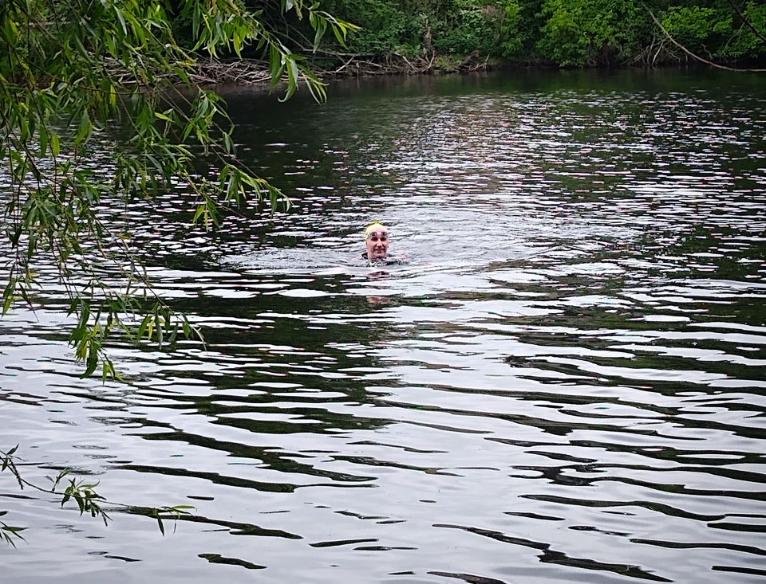
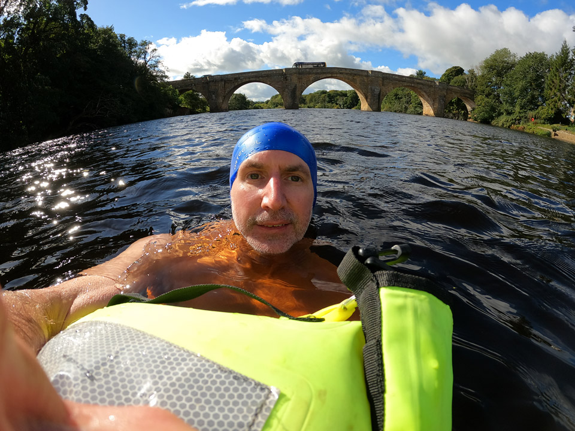
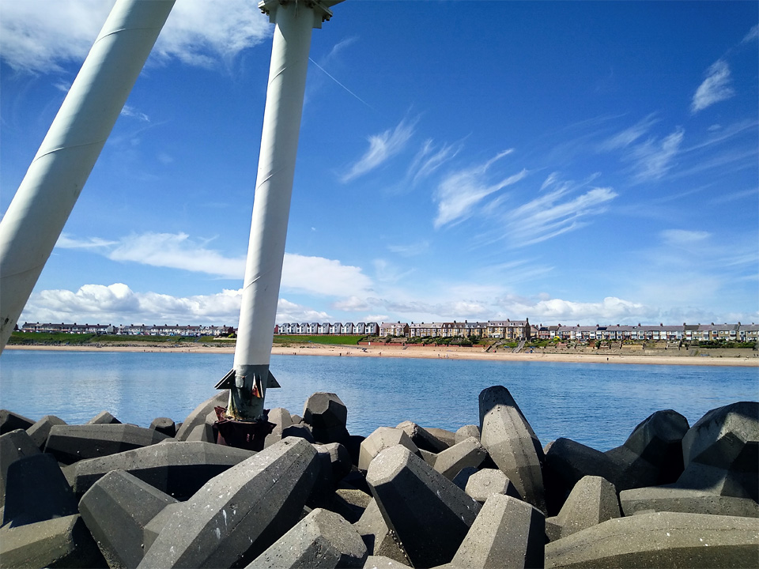
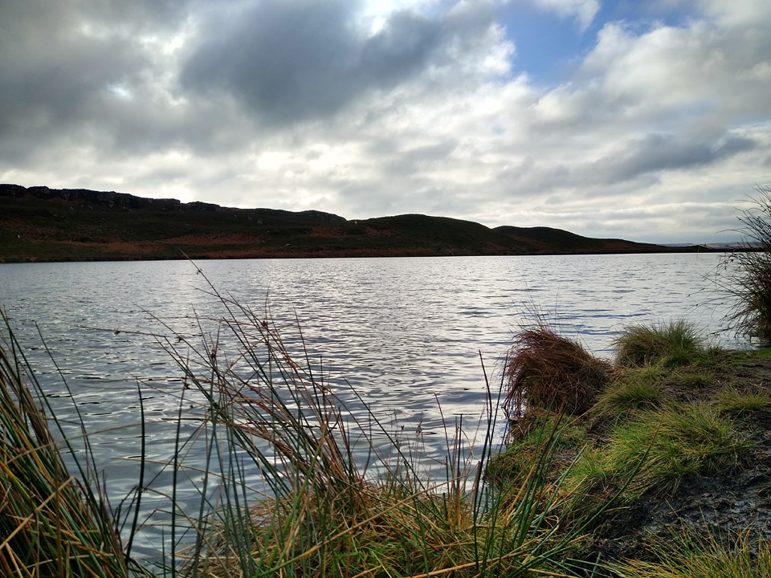
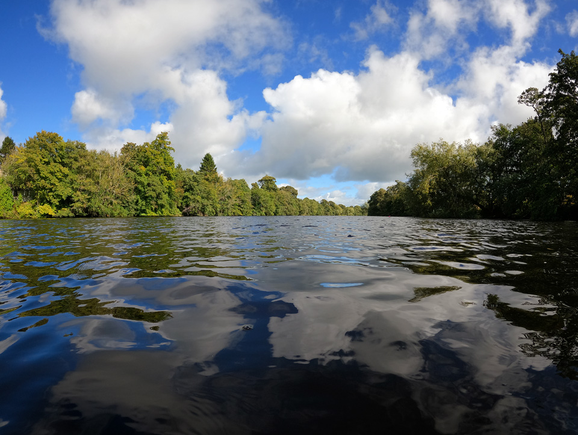
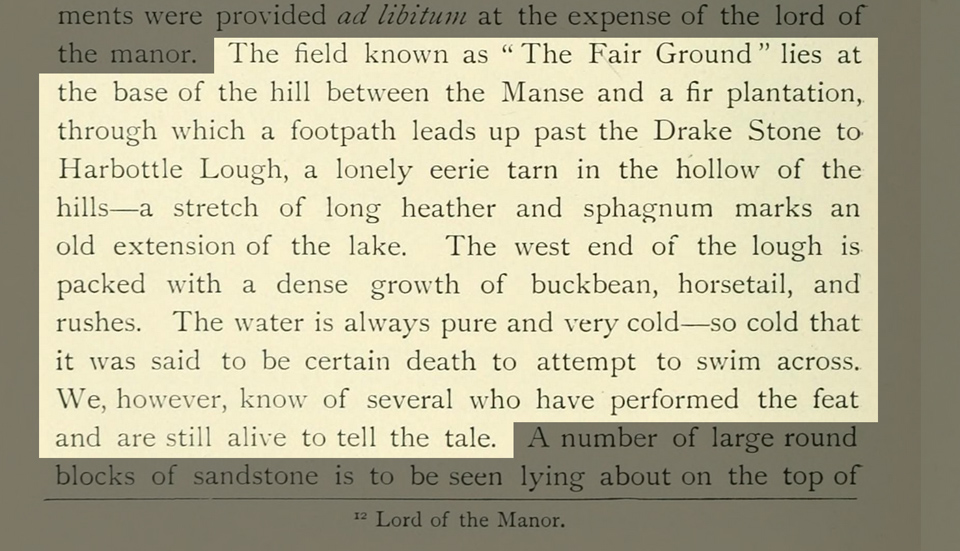
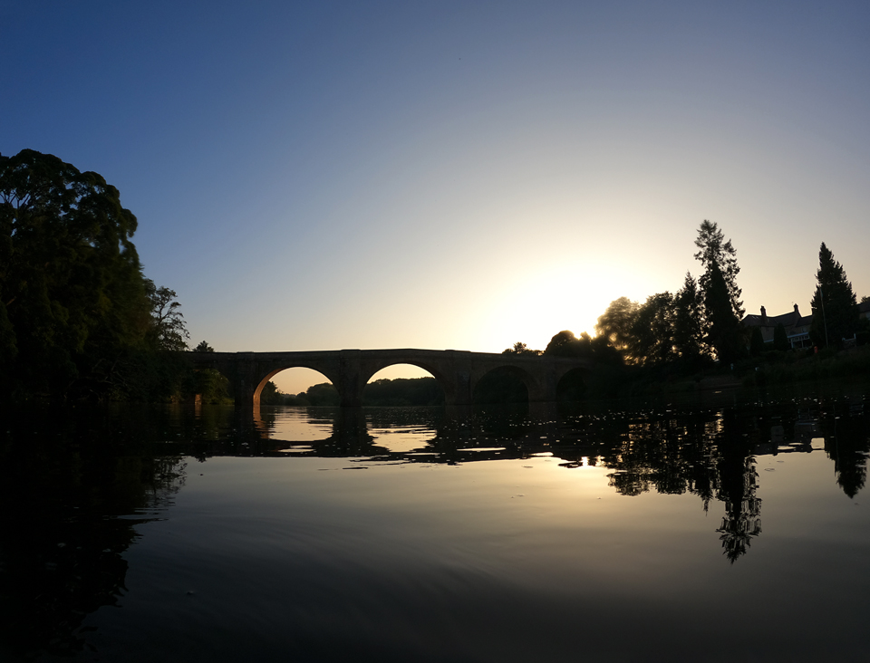

Open water swimming has been making a splash in the last few years. Lockdown related pool closures may have been a spring-board, but there's also increasing awareness of the health benefits. You will find two camps. The "you must be joking" camp, and the "evangelists". Having made this transition personally I can empathise with both parties, even though the first lot have got it wrong!

===

In May of 2020, with swimming pools closed and missing my weekly fix, I bought an [Alpkit Lotic](https://alpkit.com/products/lotic-mens) wetsuit and embarked on my first outdoor swim. The UK spring of 2020 was the fifth warmest on record, with more sunshine hours than a typical summer. It was soon to be followed by a summer heatwave, so the North Tyne was almost tropical, or at least, well into the upper teens.

You can expect to pay at least £100 for a decent wetsuit, and the Lotic floats around £150, although I was lucky and found it on sale for £125. Other *name* brands (you might think Roka, C-Skins, Zone3, Orca) are probably going to cost somewhat more. But, as a confident (but non-racing) swimmer happy to embark on a steady couple of miles freestyle, I had no complaints with my Lotic. My only tip would be, ensure it's a *swimming* wetsuit, as wetsuits for sailing, kayaking, surfing, and other sports, will have a different balance or a different range of mobility through the shoulders, and so on.

*First dip*

If you have never swum in a wetsuit before, you're probably going to be surprised by how buoyant they are. You have the twin benefits of staying comfortable in the water for longer, plus you can lay in the water and float with almost no effort. Remember that wetsuits work by trapping a layer of water against your skin. Don't be surprised by the rush of cold water when you enter the water, typically through the zip in the small of your back ("Oooooh!") and again when you start swimming ("Eeeeep!") when more water enters around your neck. Just get moving - you'll be fine!

On my first swim I borrowed a swim hat (yellow) and quickly bought my own (blue). It's worth it. Not only does it help keep your head slightly warmer but also it's great for your visibility in the water. Get one that covers your ears. The water still gets in, but it cuts out the discomfort of cold wind into damp ears.

*Resting on an ULU Tow Float in the North Tyne*

And that seems like a neat segue into tow floats which serve multiple purposes too; visibility being just one. I chose the "Guardian" by [Ulu Drybags](https://uludrybags.com/), but there's plenty of choice. This model has several nice features, including high-visibility reflecting panels, an emergency whistle, convenient grab-handles, and it's a decent size. It works as a drybag, but it's almost impossible to avoid some dampness, particularly if you need to get something out of it while you're still in the water; your GoPro camera, for example. Being a cautious chap, I double-up by putting my mobile phone, car keys and wallet, inside a second drybag, and so far so good.

Space inside is fairly limited, depending on how much you inflate the upper and lower compartments. There's some advantages to this. If you stuff your small dry-bag of valuables to the bottom of the float and then inflate it, they won't be coming back out until you deflate it.

*Newbiggin Breakwater with "Couple" statue*

Once you've decided to take the plunge, you'll need to find some water and it will surprise nobody that England and Wales trail behind Scotland and Europe in terms of public access rights to water. The sea and navigable waterways are probably ok, but not if it's a canal. Lakes and tarns are probably ok, but not if it's a reservoir - unless you're in Scotland. Confused? Finding some swimming friends and sharing information is ideal, but there are some additional resources included below. 

* https://www.swimming.org/openwater/open-water-swimming-venues/  
^- *searchable list of organised open water swimming venues*

* https://www.wildswimming.co.uk/access-and-law/  
^- *brief intro to access rights, and highlights some specific problems you may face in England vs the civilised world!*

* https://www.gov.uk/government/publications/swim-healthy-leaflet/swim-healthy  
^- *safety information from Public Health England, including a map of bathing water quality*

* https://www.lakedistrict.gov.uk/visiting/things-to-do/water/swimming  
^- *swimming in the Lake District, safety tips, and lakes that permit swimming*

I began in a wetsuit, and for longer swims I would absolutely use it, but having apprehensively dipped my toe into the world of wild swimming, I can confirm the buzz!

Communing with nature in picturesque surroundings, feeling the water's chill embrace, pushing out across the shadowy unknown depths, observing the wide-eyed amazement of passing anoraks who silently wonder what those crazy nutters are up to!

*Harbottle Lough in Northumberland*

I spent twelve months declining all invitations to lose the wetsuit. Then, in the summer of 2021, I arrived back to river bank. Thoroughly warmed up after a couple of kilometres of river swimming, I decided I should probably give this a go. There were three guys out in mid-stream, not really swimming, just chilling out. I didn't know them, but the one with the most impressive beard (who may have been their leader!) offered me some advice that I've suck with ever since.

"Wade into the water until you're waist deep. Splash water on your face, neck and chest, then exhale as you lean forward into the water."

It's sound advice that I've been able to pass onto a couple of other since. Go waist deep, do the face and neck splashing. That part's easy, even when it's chilly. I've been adding some additional splashing into the mix. Just those few seconds of acclimatisation, at least for me, seems to ease the entry into the water.

Exhaling is advice I've seen many times since. You don't want a surprised gasp from leaping into the water too quick.

There's a rule of thumb that suggests one minute per degree. It's a useful guide, but treat it as a starting point - not a target. With temperatures in the mid teens you can stretch it out a bit. In colder temperatures, keeping an eye on your watch may be wise, because the cold can creep up fast.

*Upstream, in the North Tyne*

You'll need to accept that it's not like getting into a swimming pool. The thing is, you'll soon learn to embrace that chill, and then start to enjoy the buzz. After a few dips, you'll be forced to admit that all the nutcases who were banging on about wild swimming were actually onto something!

> The water is always pure and very cold -- so cold that it was said to be certain death to attempt to cross. We, however, know of several who have performed the feat and are still alive to tell the tale."

Temperatures in the Tyne at Hexham has been 8 degrees the week before, and Horbottle Lough in mid November must have been the same, if not colder. I'm no hardened ice-man, but with a 7 minute countdown, and a cup of tea waiting, there were no ill effects - and a whole lot of exhilaration!

Step away from the pool and give it a try. Combine it with a hike and get yourself out into some truly wild spots.

*Swimming off into the sunset*

After two full seasons of outdoor swimming (one in a wetsuit and one without) and now well into the third (so far, without) I'll summarise the kit I've found useful.

* Try Speedo Endurance+ or similar costumes; personally I like their aqua-shorts, but they're available in various cuts, both men's and women's. The fabric is tougher than other trunks and snug fitting. If you normally swim in baggy swim shorts you won't appreciate quite how horrific loose fabric shorts are until you've swum in decent trunks.
* Buy a wetsuit. Cold water swimming is amazing and you should try it, but if you live in the north of England and enjoy longer swims, realistically you are going to be a whole lot more comfortable in a wetsuit.
* Find a bright coloured silicone hat that covers your ears.
* Consider a tow-float. They're reassuring, and mandatory at many organised events and venues. Weigh up whether you want more storage vs a lighter, compact model.
* I've found microfibre changing robes to be excellent. Don't worry about sizes - just buy XL - the more space the better. Compared to a regular towel they pack very small and dry faster. Mine is a "Fit-Flip" which sell on Amazon for around £25, and they have a press-stud loop which can be used to hang it from a tree branch.
* If it's a short walk to your swim spot, [Dry Robes](https://dryrobe.com/), or a half-priced Alpkit version like the [Haven](https://alpkit.com/products/haven-changing-robe), are super cosy after a cold swim.
* If you're swimming during a hike or other outdoorsy activity and need to travel light, I've found a thermal base-layer (I bought a set at GoOutdoors for £10 and they serve this purpose fine) combined with a fleece and down jacket are great too - just dry off quickly and layer up.
* Hot drink in a thermos, and a chocolate bar... no further explanation necessary! ;-)