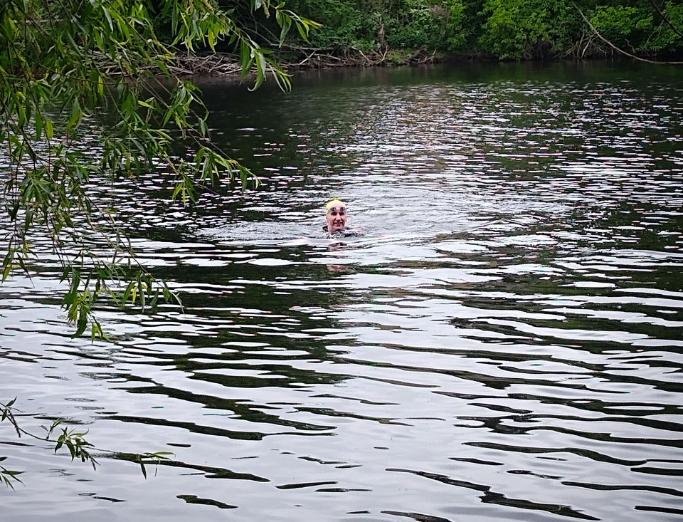
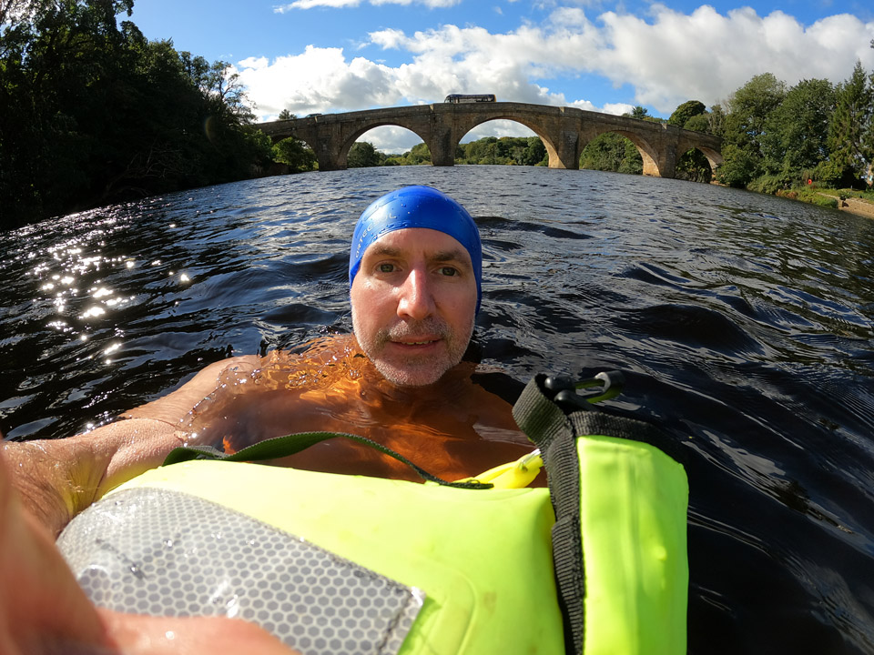
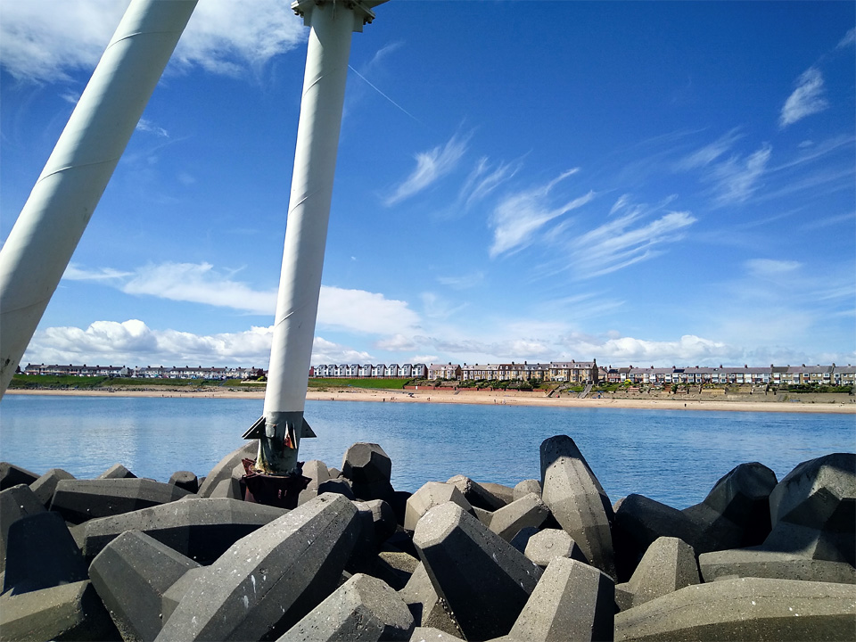
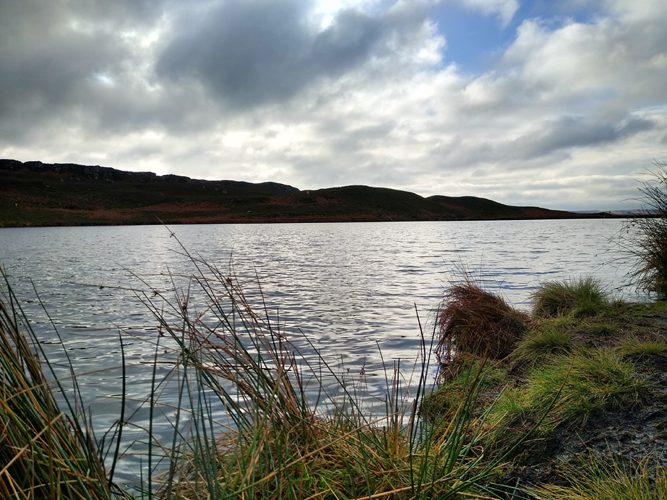
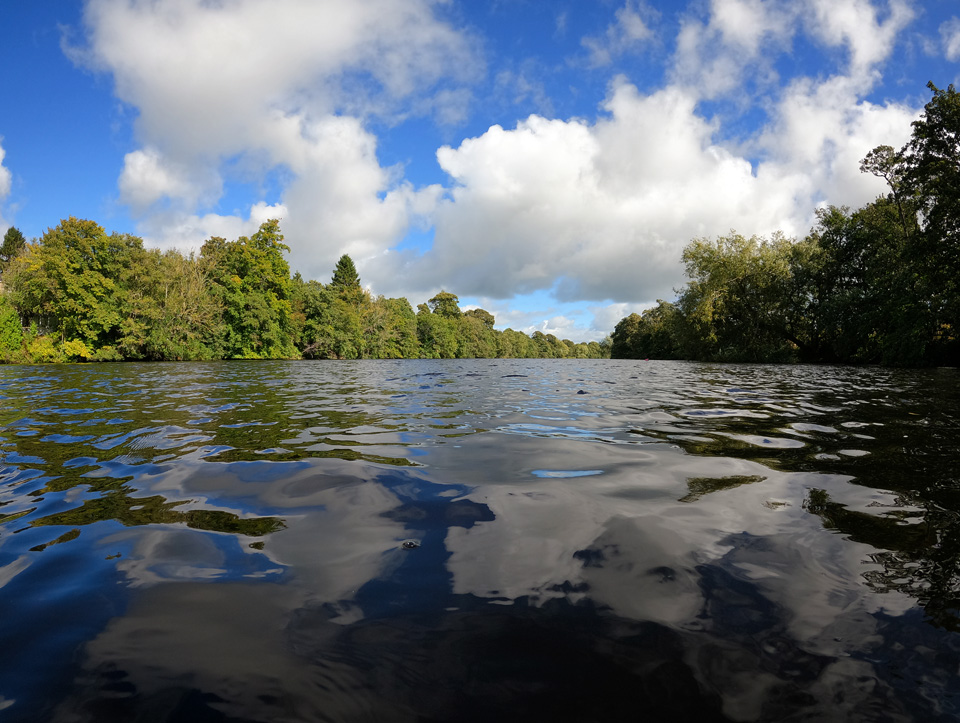
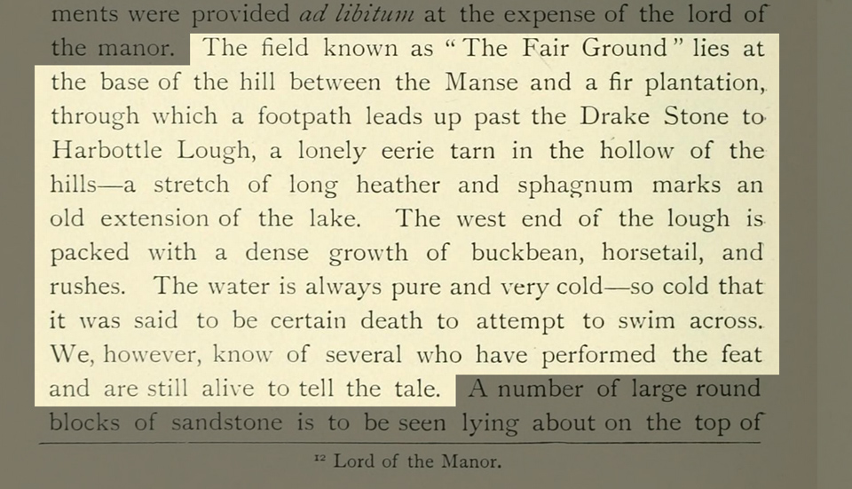
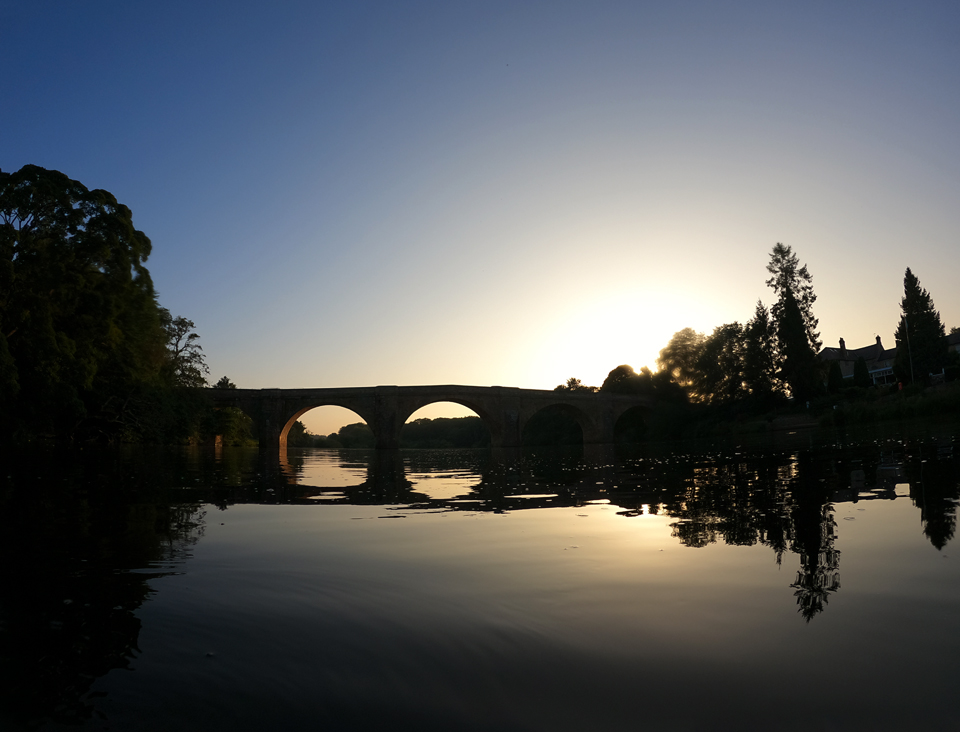

Open water swimming has been making a splash in the last few years. Lockdown related pool closures created the spring-board. After that, there has been an increasing awareness of the health benefits. You'll find two camps. The "you must be joking" camp, and the "evangelists". Having made this transition, I can empathise with both parties, but the first lot have got it wrong!

===

In May of 2020, with swimming pools closed and missing my weekly fix, I bought an [Alpkit Lotic](https://alpkit.com/products/lotic-mens) wetsuit and embarked on my first outdoor swim. The UK spring of 2020 was the fifth warmest on record, with more sunshine hours than a typical summer. It was soon followed by a summer heatwave. The North Tyne was almost tropical, or at least, well into the upper teens.

You can expect to pay at least £100 for a decent wetsuit, and the Lotic floats-in around £150. I was lucky and found it on sale for £125. Other *name* brands (and you might think Roka, C-Skins, Zone3, Orca) will cost a bit more. As a confident (non-racing) swimmer, I have no complaints with my Lotic. My only tip would be, choose a *swimming* wetsuit. Ones for sailing, kayaking, surfing, and other sports, have a different balance. Swimming suits give you a better range of mobility through the shoulders.

*First ever dip in the outdoors, May 2020.*

If you have never swum in a wetsuit before, their buoyancy will surprise you. You can stay comfortable in the water for longer, or you can lay in the water and float with almost no effort. But, remember that wetsuits work by trapping a layer of water against your skin. There's a rush of cold water when you first get in. It comes in through the zip in the small of your back. ("Oooooh!") And when you start swimming more water comes in around your neck. ("Eeeeep!") Get moving - you'll be fine!

On my first swim I borrowed a swim hat (yellow) and then bought my own (blue). It's worth it. Not only does it help keep your head warmer, they're also great for visibility in the water. Get one that covers your ears! The water still gets in, but it cuts out the discomfort of cold wind into damp ears.

*Resting on an ULU Tow Float in the North Tyne.*

And that leads into tow floats, which also serve several purposes. Visibility is the first. I chose the "Guardian" by [Ulu Drybags](https://uludrybags.com/), but there's plenty of choice. This model has several nice features. High-visibility reflecting panels, an emergency whistle, convenient grab-handles, and it's a decent size. It works as a drybag, but it's almost impossible to avoid some dampness. Be careful if you need to get something out of it while you're still in the water; your GoPro camera, for example. Being a cautious chap, I keep my mobile phone, car keys and wallet, inside a second drybag. So far so good.

There's limited space, depending on how much you inflate its two compartments. There's some advantages to this. If you stuff your dry-bag of valuables to the bottom before inflating, they won't fall out. But, in summer weather, I can stuff everything into it. That includes trainers, clothes, a mini-thermos, snacks, and a towel.

*Newbiggin breakwater with "Couple" statue, July 2021.*

Once you've decided to take the plunge, you'll need to find some water. It's no surprise that England trails behind Scotland and Europe for public access rights to water. The sea and navigable waterways are probably ok, but not if it's a canal. Lakes and tarns are probably ok too, but not if it's a reservoir - unless you're in Scotland. Confused yet? Finding some local swimming friends and sharing information is ideal. If that's not an option, there are some more resources below.

* [swimming.org/openwater/open-water-swimming-venues](https://www.swimming.org/openwater/open-water-swimming-venues/)  
^- *searchable list of organised open water swimming venues*

* [wildswimming.co.uk/access-and-law](https://www.wildswimming.co.uk/access-and-law/)  
^- *brief intro to access rights, and highlights some specific problems you may face in England vs the civilised world!*

* [www.gov.uk/government/publications/swim-healthy-leaflet/swim-healthy](https://www.gov.uk/government/publications/swim-healthy-leaflet/swim-healthy)  
^- *safety information from Public Health England, including a map of bathing water quality*

* [https://www.lakedistrict.gov.uk/visiting/things-to-do/water/swimming](https://www.lakedistrict.gov.uk/visiting/things-to-do/water/swimming)  
^- *swimming in the Lake District, safety tips, and lakes that permit swimming*

I began in a wetsuit, and for longer swims I would still use it. But, having dipped my toe into the world of wild swimming, I can confirm the buzz! Communing with nature in picturesque surroundings. Feeling the water's chill embrace. Pushing out across the shadowy unknown depths. Observing the wide-eyed amazement of passersby wondering what you nutters are up to!

*Harbottle Lough, in Northumberland, November 2021.*

I'd spent twelve months declining all invitations to lose the wetsuit. Then, in the summer of 2021, I arrived back to the river bank. Warmed up after a couple of kilometres of river swimming, I decided I should give this a go. There were three guys out in mid-stream, not swimming, just chilling out. I didn't know them, but the one with the most impressive beard (who may have been their leader!) offered me some advice that I've stuck with ever since.

"Wade into the water until you're waist deep. Splash water on your face, neck and chest, then exhale as you lean forward into the water."

It's sound advice, that I've passed onto a couple of others since. Go waist deep, do the face and neck splashing. That part's easy, even when it's chilly. I've been adding some extra splashing into the mix; arms and shoulders. Those few extra seconds of acclimatisation, at least for me, seems to ease your entry into the water.

Exhaling is advice I've seen many times. You don't want a surprised gasp from leaping into cold water too quick.

Timing-wise, there's a rule of thumb suggesting one minute per degree Celsius. It's a useful guide, but treat it as a starting point - not a target. If you're too cold, get out! With temperatures in the mid teens you can stretch it out quite a bit. In colder temperatures, keeping an eye on your watch is wise, because the cold can creep up fast.

*Upstream, in the North Tyne.*

You'll need to accept that outdoor swimming is not like getting into a swimming pool. The thing is, you soon learn to embrace that chill, and then you can start to enjoy the buzz. After a few dips, you'll have to admit that all those nutcases who were banging on about the merits of wild swimming were actually onto something!

> The water is always pure and very cold -- so cold that it was said to be certain death to attempt to swim across. We, however, know of several who have performed the feat and are still alive to tell the tale."

My coldest dip so far came in November 2021. Temperatures in the Tyne at Hexham were 8 degrees the week before. Harbottle Lough would have been similar, I suppose, and perhaps colder. I'm no hardened ice-man, but with a 7 minute watch countdown, and a hot cup of tea waiting, there were no ill effects. And there's a whole lot of exhilarating fun!

If you're still harbouring doubt, step away from the pool and give it a try. Combine it with a hike, and get yourself out into some wild spots.

*Swimming off into the sunset*

To wrap this up, after two and a half seasons of outdoor swimming, I'll summarise the kit I've found useful.

* Try Speedo Endurance+ or similar costumes. I like their aqua-shorts, but they're available in various cuts, both men's and women's. The fabric is tougher than other trunks and snug fitting. If you normally swim in baggy swim shorts you won't appreciate how horrific loose fabric shorts are until you've swum in decent trunks.
* Buy a wetsuit. Cold water swimming is amazing and you should try it, but if you live in the north of England and sometimes enjoy longer swims, realistically you are going to be a whole lot more comfortable in a wetsuit.
* Find a bright coloured silicone hat that covers your ears.
* Consider a tow-float. They're reassuring, and mandatory at many organised events and venues. Weigh up whether you want more storage versus a lighter, compact model.
* I've found microfibre changing robes to be excellent. Don't worry about sizes - just buy XL - the more space the better. Compared to a regular towel they pack very small and dry faster. Mine is a "Fit-Flip" which sell on Amazon for around £25, and they have a press-stud loop which can be used to hang it from a tree branch.
* If it's a short walk to your swim spot, [Dry Robes](https://dryrobe.com/), or a half-priced Alpkit version like the [Haven](https://alpkit.com/products/haven-changing-robe), are super cosy after a cold swim.
* If you're swimming during a hike, or other outdoorsy activity, and need to travel light, I've found a thermal base-layer (I bought a cheap set at GoOutdoors for £10) combined with a fleece and down jacket are great too - dry off and layer up.
* Hot drink in a thermos, and a chocolate bar... no further explanation necessary! ;-)