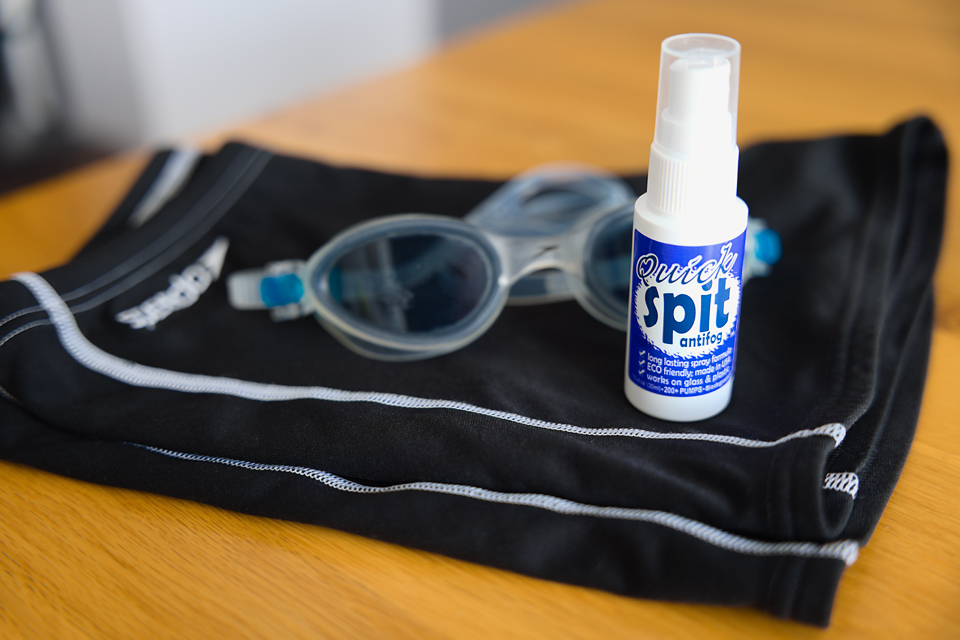

I began swimming outdoors in June 2020. To put this in context, summer began well and the water temperatures in the North Tyne were around 15 degrees. But, when your goggles steam up after less than 30 seconds, it does put rather a dampener on your swim!

===

The fogging was so rapid, I had basically no visibility. These goggles were never great, even in a pool, but I used to manage half a dozen lengths before having to sort them out. During the COVID-19 lockdown it has been difficult to try on new goggles, so knowing that these Speedos were a good fit, it seemed worth trying an antifog spray before taking a chance on an unfamiliar pair.

### Where's It From?

I found it via Amazon -> [Jaws Quick Spit Anti Fog Spray SLO003 30ml](https://www.amazon.co.uk/dp/B0012Q2S4W)

### Experience

Looking internally at my goggles, they are a couple of years old, very well used, and you can see where the old antifog coating has rubbed away. I would also add that I don't think it was any good even when they were brand new!

At home, packing my wetsuit before heading to the river (about 25 minutes drive) I washed the goggles, gave each lens one spray, rubbed it in well with a finger, and rinsed it under a cold tap. It rubs in with the look of slightly foamy soap, but after a quick rinse it looked perfectly clear.

I was very careful not to touch the lens after that, packed them, and just before getting into the water I repeated the process, one spary each, rub it in, rinse in the river. After my experiences a few days earlier I was ready to be disappointed, but it was literally amazing. ***No steaming up at all - they stayed totally clear!***

This is the North Tyne, reasonably warm conditions, and they stayed clear for about an hour. Indoor pools are currently all closed for social distancing reasons, so I can't comment on how this would perform in a heated pool.

### Summary

In classic tradition I suppose there has to be a "your mileage my vary" disclaimer to this, but my first impressions are that it's an outstanding product. The packaging claims 200 applications, the bottle certainly isn't massive, but that estimate seems reasonable.

I'll update this post if there's any change, but this definitely gets my seal of approval. :-)