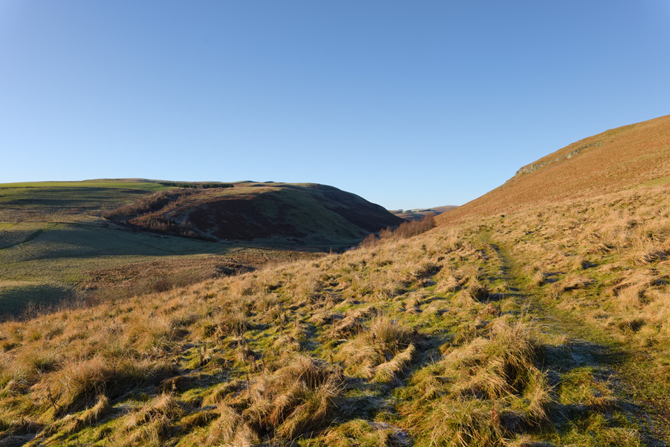

Route description to follow.

===

[View Full Screen](https://map.mootparadox.com/full/coquet-valley-1) | [GPX](https://map.mootparadox.com/gpx/coquet-valley-1)  

<iframe src="https://map.mootparadox.com/embed/coquet-valley-1" height="500" width="100%" style="border:none; margin-top:-1.2em;"></iframe>

Pic...

*In the Coquet valley, close to The Knock.*

Abc...
