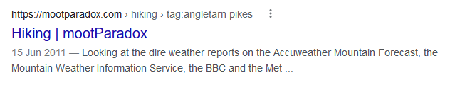

While introducing a combination of categories and tags to this [Grav](https://getgrav.org/) website, I noticed that Google had been happily indexing a variety of valid URLs that were either internal search results, or lists based on taxonomy categories or tags. By their nature, these results are transient, and I decided to exclude them.

===

By way of an example, the Google result below is an internal list, generated on the fly, for any post tagged with the string `angletarn pikes`.


*Example of a Google 'tag' result.*

Enter `robots.txt` and a couple of additional entries.

```bash
Disallow: *tag:
Disallow: *cat:
Disallow: *query:
```

Some example URLs excluded by these rules include:

* `Disallow: *tag:` -> [https://mootparadox.com/outdoors/tag:helvellyn](https://mootparadox.com/outdoors/tag:helvellyn)
* `Disallow: *cat:` -> [https://mootparadox.com/outdoors/outdoors-cat:wainwrights](https://mootparadox.com/outdoors/outdoors-cat:wainwrights)
* `Disallow: *query:` -> [https://mootparadox.com/search/query:skiddaw,longside](https://mootparadox.com/search/query:skiddaw,longside)

The use of a colon is common to all three scenarios, and you might want to be cautious if you're the type of person who would include a colon in a page title. (Personally I wouldn't, so it's fine.)

I first became aware of this on 10th December 2021 and made the changes the same day. As of 1st January 2022, there are a couple of them left behind, but at the beginning of December, Google had pages of these search results based on page tags and categories.

I've no idea if this is good practice or not, but it's satisfied my sense of index orderliness for the time being!